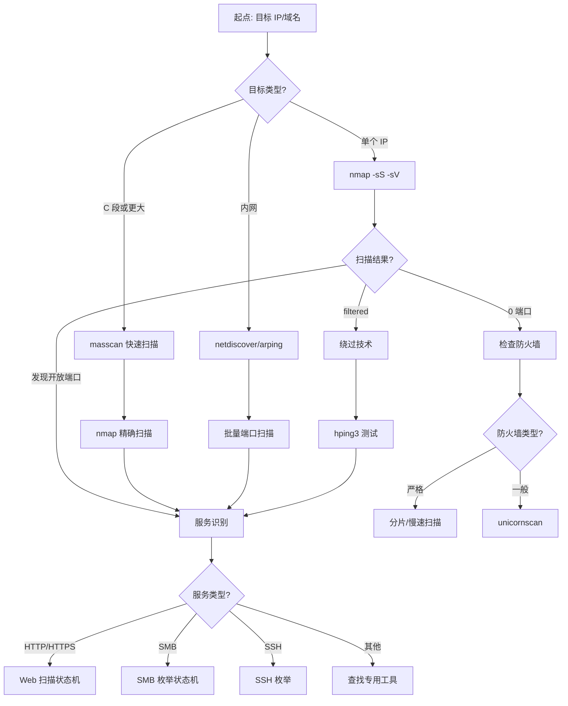

# 网络服务枚举状态机 (Network Service Enumeration State Machine)

## 状态机概述

这是渗透测试的第一步，从零信息到完整的服务拓扑图。

## 原子工具状态映射 (Atomic Tool-State Mapping)

### 1. nmap - 端口扫描与服务识别

**触发状态 (Trigger)**：
- 输入：目标 IP/域名/CIDR
- 前置条件：无（这是起点）

**核心命令人话版**：
```bash
# 快速扫描常用端口
nmap -sS -sV -T4 <target>

# 全端口扫描 + 服务版本
nmap -sS -sV -p- -T4 <target>

# 激进扫描（OS + 脚本 + traceroute）
nmap -A -T4 <target>
```

**状态转移 (State Transition)**：
- **如果输出包含开放端口** → 转移到：服务指纹识别（根据端口号选择专用工具）
  - 21 (FTP) → ftp 客户端枚举
  - 22 (SSH) → ssh 版本检测
  - 80/443 (HTTP/HTTPS) → Web 扫描状态机
  - 139/445 (SMB) → SMB 枚举状态机
  - 3306 (MySQL) → 数据库枚举
  - 3389 (RDP) → RDP 连接测试

- **如果输出 0 开放端口** → 转移到：
  - 检查防火墙/IDS（使用 hping3 测试）
  - 尝试 UDP 扫描（nmap -sU）
  - 尝试其他 IP 段

- **如果输出包含 filtered 端口** → 转移到：
  - 防火墙绕过技术（分片、慢速扫描）
  - 使用 masscan 快速确认

---

### 2. masscan - 超高速端口扫描

**触发状态 (Trigger)**：
- 输入：大量 IP 或全端口扫描需求
- 前置条件：需要快速覆盖大范围

**核心命令人话版**：
```bash
# 扫描整个 C 段的常用端口
masscan 192.168.1.0/24 -p80,443,22,21,3389 --rate 10000

# 全端口扫描
masscan <target> -p1-65535 --rate 10000
```

**状态转移 (State Transition)**：
- **如果发现开放端口** → 转移到：nmap 精确扫描（masscan 只确认端口开放，不识别服务）
- **如果输出 0 结果** → 转移到：降低速率重试或更换扫描方式

---

### 3. unicornscan - 异步扫描

**触发状态 (Trigger)**：
- 输入：nmap 被 IDS/防火墙拦截
- 前置条件：常规扫描失败

**核心命令人话版**：
```bash
# TCP 扫描
unicornscan -mT <target>:1-65535

# UDP 扫描
unicornscan -mU <target>:1-1024
```

**状态转移 (State Transition)**：
- **如果发现开放端口** → 转移到：nmap 精确扫描
- **如果仍然失败** → 转移到：应用层探测（直接访问已知服务）

---

### 4. hping3 - 防火墙测试与隐蔽扫描

**触发状态 (Trigger)**：
- 输入：怀疑有防火墙/IDS
- 前置条件：常规扫描被拦截

**核心命令人话版**：
```bash
# 测试端口是否开放（SYN 扫描）
hping3 -S -p 80 <target>

# 测试防火墙规则
hping3 -S -p 80 -c 1 <target>

# 分片扫描绕过防火墙
hping3 -S -p 80 -f <target>
```

**状态转移 (State Transition)**：
- **如果收到 SYN-ACK** → 端口开放，转移到：服务识别
- **如果收到 RST** → 端口关闭，尝试其他端口
- **如果无响应** → 可能被过滤，转移到：其他绕过技术

---

### 5. netdiscover - 本地网络主机发现

**触发状态 (Trigger)**：
- 输入：在内网中，需要发现存活主机
- 前置条件：已获得内网访问权限

**核心命令人话版**：
```bash
# 主动扫描
netdiscover -r 192.168.1.0/24

# 被动模式（嗅探 ARP）
netdiscover -p
```

**状态转移 (State Transition)**：
- **如果发现主机** → 转移到：nmap 端口扫描
- **如果 0 结果** → 转移到：检查网络配置或使用其他发现方法

---

### 6. arping - ARP 层主机发现

**触发状态 (Trigger)**：
- 输入：ICMP 被禁用，需要发现本地网络主机
- 前置条件：在同一广播域

**核心命令人话版**：
```bash
# 发送 ARP 请求
arping -c 4 192.168.1.1
```

**状态转移 (State Transition)**：
- **如果收到 ARP 响应** → 主机存活，转移到：端口扫描
- **如果无响应** → 主机不存在或不在同一网段

---

### 7. fping - 批量 ICMP 探测

**触发状态 (Trigger)**：
- 输入：需要快速发现大量 IP 的存活状态
- 前置条件：ICMP 未被禁用

**核心命令人话版**：
```bash
# 扫描 C 段
fping -a -g 192.168.1.0/24

# 从文件读取 IP 列表
fping -a -f targets.txt
```

**状态转移 (State Transition)**：
- **如果主机响应** → 转移到：端口扫描
- **如果无响应** → 可能 ICMP 被禁用，转移到：TCP/ARP 探测

---

## 聚类攻击状态机 (Clustered Attack State Machine)

### 网络服务枚举完整流程

```
[起点：目标 IP/域名]
    ↓
[步骤 1：主机发现]
    ├─ IF 本地网络 → netdiscover/arping
    ├─ IF 远程网络 → fping/nmap -sn
    └─ IF ICMP 被禁 → TCP SYN ping (nmap -PS)
    ↓
[步骤 2：端口扫描]
    ├─ IF 小范围目标 → nmap -sS -sV
    ├─ IF 大范围目标 → masscan → nmap 精确扫描
    └─ IF 被 IDS 拦截 → unicornscan/hping3
    ↓
[步骤 3：服务识别]
    ├─ nmap -sV（版本探测）
    ├─ nmap -A（激进扫描）
    └─ nmap --script（NSE 脚本）
    ↓
[步骤 4：根据服务类型分流]
    ├─ IF 21 (FTP) → FTP 枚举状态机
    ├─ IF 22 (SSH) → SSH 枚举
    ├─ IF 80/443 (HTTP/HTTPS) → Web 扫描状态机
    ├─ IF 139/445 (SMB) → SMB 枚举状态机
    ├─ IF 3306 (MySQL) → 数据库枚举
    ├─ IF 3389 (RDP) → RDP 枚举
    └─ IF 其他 → 查找对应工具
```

### If-Then-Else 决策逻辑

```
IF 目标是单个 IP:
    THEN 使用 nmap -A 全面扫描
    IF 扫描被拦截:
        THEN 使用 hping3 测试防火墙
        IF 防火墙严格:
            THEN 使用分片/慢速扫描
        ELSE:
            THEN 使用 unicornscan
    ELSE:
        THEN 继续服务识别

ELSE IF 目标是 C 段或更大:
    THEN 使用 masscan 快速扫描
    IF 发现开放端口:
        THEN 使用 nmap 精确扫描这些端口
    ELSE:
        THEN 检查是否全部被过滤

ELSE IF 目标是内网:
    THEN 使用 netdiscover 发现主机
    IF ICMP 被禁:
        THEN 使用 arping (ARP 层)
    ELSE:
        THEN 使用 fping (ICMP 层)
    THEN 对发现的主机进行端口扫描
```

---

## 场景决策链路 (Scenario Decision Path)

### 场景 1：HTB 靶机初始扫描

**场景还原**：
```
目标：10.10.10.123（HTB 靶机）
初始信息：无
```

**状态机运行路径**：

1. **第一步：快速端口扫描**
   ```bash
   nmap -sS -sV -T4 10.10.10.123
   ```
   **输出**：
   ```
   22/tcp  open  ssh     OpenSSH 8.2p1
   80/tcp  open  http    Apache httpd 2.4.41
   ```

2. **状态机判定**：发现 SSH 和 HTTP 服务
   - 转移到：Web 扫描状态机（80 端口）
   - 同时记录：SSH 版本（可能存在已知漏洞）

3. **第二步：全端口扫描（后台运行）**
   ```bash
   nmap -sS -p- -T4 10.10.10.123
   ```
   **输出**：
   ```
   22/tcp    open  ssh
   80/tcp    open  http
   8080/tcp  open  http-proxy
   ```

4. **状态机判定**：发现额外的 8080 端口
   - 转移到：Web 扫描状态机（8080 端口）

5. **第三步：服务版本详细探测**
   ```bash
   nmap -sV -sC -p 22,80,8080 10.10.10.123
   ```
   **输出**：
   ```
   8080/tcp  open  http    Werkzeug httpd 1.0.1 (Python 3.8.5)
   ```

6. **状态机判定**：识别出 Python Web 框架
   - 转移到：Python Web 应用漏洞扫描
   - 可能存在：Flask/Django 漏洞、SSTI、反序列化

**内化点 (Internalization)**：
- **为什么先快速扫描再全端口扫描？**
  - 快速扫描（常用端口）能在 1-2 分钟内给出初步结果
  - 全端口扫描需要 10-20 分钟，但可能发现隐藏服务
  - 并行执行：快速扫描完成后立即开始 Web 扫描，同时后台运行全端口扫描

- **为什么选择 nmap 而不是 masscan？**
  - 单个目标，不需要 masscan 的高速扫描
  - nmap 能直接识别服务版本，减少步骤
  - masscan 适合大范围扫描，单目标反而更慢

---

### 场景 2：内网渗透 - 发现内网主机

**场景还原**：
```
已获得：内网 shell（192.168.10.50）
目标：发现内网其他主机
网络：192.168.10.0/24
```

**状态机运行路径**：

1. **第一步：被动 ARP 嗅探**
   ```bash
   netdiscover -p -i eth0
   ```
   **输出**：
   ```
   192.168.10.1    00:0c:29:xx:xx:xx  (网关)
   192.168.10.10   00:0c:29:xx:xx:xx
   192.168.10.20   00:0c:29:xx:xx:xx
   ```

2. **状态机判定**：发现 3 台主机
   - 转移到：端口扫描（对每台主机）

3. **第二步：主动 ARP 扫描（补充）**
   ```bash
   netdiscover -r 192.168.10.0/24
   ```
   **输出**：
   ```
   发现额外 2 台主机：192.168.10.30, 192.168.10.40
   ```

4. **状态机判定**：共 5 台主机
   - 转移到：批量端口扫描

5. **第三步：批量端口扫描**
   ```bash
   nmap -sS -sV -p 22,80,139,445,3389 192.168.10.1,10,20,30,40
   ```
   **输出**：
   ```
   192.168.10.10: 445/tcp open (SMB)
   192.168.10.20: 80/tcp open (HTTP)
   192.168.10.30: 3389/tcp open (RDP)
   ```

6. **状态机判定**：根据服务分流
   - 192.168.10.10 → SMB 枚举状态机
   - 192.168.10.20 → Web 扫描状态机
   - 192.168.10.30 → RDP 暴力破解

**内化点 (Internalization)**：
- **为什么先被动再主动？**
  - 被动嗅探不产生流量，更隐蔽
  - 主动扫描补充被动扫描遗漏的主机
  - 在红队演练中，隐蔽性优先

- **为什么只扫描常用端口？**
  - 内网环境，时间有限
  - 常用端口覆盖 90% 的攻击面
  - 发现目标后可以针对性全端口扫描

---

## 思维判定流程图 (Decision Flowchart)



---

## 工具选择决策表

| 场景 | 首选工具 | 备选工具 | 原因 |
|------|---------|---------|------|
| 单个目标，快速扫描 | nmap -sS -sV | unicornscan | nmap 功能全面，一步到位 |
| 大范围扫描 | masscan | nmap | masscan 速度快 100 倍 |
| 内网主机发现 | netdiscover | arping/fping | netdiscover 被动+主动 |
| ICMP 被禁 | arping | nmap -PS | ARP 层无法被禁用 |
| 防火墙严格 | hping3 | unicornscan | 自定义包，绕过检测 |
| 全端口扫描 | nmap -p- | masscan | nmap 更准确 |

---

## 下一步状态机

完成网络服务枚举后，根据发现的服务类型，转移到：
1. **Web 扫描状态机**（80/443/8080 端口）
2. **SMB 枚举状态机**（139/445 端口）
3. **数据库枚举状态机**（3306/1433/5432 端口）
4. **Active Directory 状态机**（88/389/636 端口）

---

*文档生成时间：2026-03-22*
*状态机类型：网络服务枚举*
